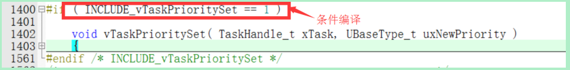
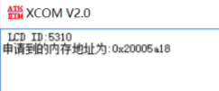
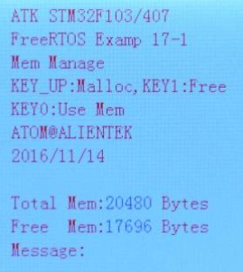

# 第一章 FreeRTOS 简介  

RTOS 全称是 Real Time Operating System， 中文名就是实时操作系统。  操作系统允许多个任务同时运行， 这个叫做多任务， 实际上， 一个处理器核心在某一时刻只能运行一个任务。 操作系统中任务调度器的责任就是决定在某一时刻究竟运行哪个任务， 任务调度在各个任务之间的切换非常快！这就给人们造成了同一时刻有多个任务同时运行的错觉。  

FreeRTOS 这种传统的 RTOS 类操作系统是由用户给每个任务分配一个任务优先级， 任务调度器就可以根据此优先级来决定下一刻应该运行哪个任务。  

# 第三章 FreeRTOS 系统配置  

## 3.1 FreeRTOSConfig.h 文件  

FreeRTOS 的配置基本是通过在 FreeRTOSConfig.h 中使用“#define” 这样的语句来定义宏定义实现的。   


## 3.2 “INCLUDE_”开始的宏  

使用“INCLUDE_”开头的宏用来表示**使能或除能 FreeRTOS 中相应的 API 函数**， 作用就是用来**配置 FreeRTOS 中的可选 API 函数**的。比如当宏 INCLUDE_vTaskPrioritySet 设置为 0 的时候 表示不能 使用函数 vTaskPrioritySet() ， 当设置 为 1 的时候就表示可 以使用函数vTaskPrioritySet()。这个功能其实就是条件编译。



从 图可 以 看 出 当 满 足 条 件 ： INCLUDE_vTaskPrioritySet == 1 的 时 候 ，函 数vTaskPrioritySet()才会被编译。FreeRTOS 中的**裁剪和配置**就是这种用条件编译的方法来实现的。

条件编译的好处就是**节省空间，不需要的功能就不用编译**，这样就可以根据实际需求来减少系统占用的 ROM 和 RAM 大小，根据自己所使用的 MCU 来调整系统消耗，降低成本。  


## 3.3 “config”开始的宏  

“config”开始的宏和“INCLUDE_”开始的宏一样，都是用来完成 FreeRTOS 的配置和裁剪的  


# 第四章 FreeRTOS 中断配置和临界段  

## 4.1 Cortex-M 中断 

### 4.1.1 中断简介  

中断是微控制器一个很常见的特性，中断由硬件产生，当中断产生以后 CPU 就会中断当前的流程转而去处理中断服务， Cortex-M 内核的 MCU 提供了一个用于中断管理的嵌套向量中断控制器(NVIC)。
Cotex-M3 的 NVIC 最多支持 240 个 IRQ(中断请求)、1 个不可屏蔽中断(NMI)、1 个 Systick(滴答定时器)定时器中断和多个系统异常。  

### 4.1.3 优先级分组定义  

当多个中断来临的时候处理器应该响应哪一个中断是由中断的优先级来决定的，高优先级的中断(**优先级编号小**)肯定是首先得到响应，而且高优先级的中断可以抢占低优先级的中断，这个就是**中断嵌套**。Cortex-M 处理器的有些中断是具有固定的优先级的，比如复位、NMI、HardFault，这些中断的优先级都是负数，优先级也是最高的。  

STM32 就选择了 4 位作为优先级

为了使抢占机能变得更可控， Cortex-M 处理器还把 256 个优先级按位分为高低两段：抢占优先级(分组优先级)和亚优先级(子优先级)  

STM32 使用了 4 位，因此最多有 5 组优先级分组设置，这 5 个分组在 msic.h 中有定义，如下：  

```c
#define NVIC_PriorityGroup_0 ((uint32_t)0x700) /*!< 0 bits for pre-emption priority 4 bits for subpriority */
#define NVIC_PriorityGroup_1 ((uint32_t)0x600) /*!< 1 bits for pre-emption priority 3 bits for subpriority */
#define NVIC_PriorityGroup_2 ((uint32_t)0x500) /*!< 2 bits for pre-emption priority 2 bits for subpriority */
#define NVIC_PriorityGroup_3 ((uint32_t)0x400) /*!< 3 bits for pre-emption priority 1 bits for subpriority */
#define NVIC_PriorityGroup_4 ((uint32_t)0x300) /*!< 4 bits for pre-emption priority 0 bits for subpriority */
```

可以看出 STM32 有 5 个分组，但是一定要注意！ STM32 中定义的分组 0 对应的值是 7！如果我们选择分组 4，即 NVIC_PriorityGroup_4 的话，那 4 位优先级就都全是抢占优先级了，没有亚优先级，那么就有 0~15 共 16 个优先级。而**移植 FreeRTOS 的时候我们配置的就是组 4**  


如果使用 ALIENTEK 的基础例程的话默认配置的组 2，**所以在将基础例程中的外设驱动移植到 FreeRTOS 下面的时候需要修改优先级配置**。 主要是 FreeRTOS 的中断配置**没有处理亚优先级**这种情况，所以**只能配置为组 4**，直接就 16 个优先级，使用起来也简单！  

### 4.1.5 用于中断屏蔽的特殊寄存器  

#### 1、 PRIMASK 和 FAULTMASK 寄存器  

PRIMASK 用于禁止除 NMI 和 HardFalut 外的所有异常和中断。

FAULTMASK 比 PRIMASK 更狠， 它可以连 HardFault 都屏蔽掉。

#### 2、 BASEPRI 寄存器  

只屏蔽优先级低于某 一个阈值的中断(向 BASEPRI 写 0 的话就会停止屏蔽中断)


## 4.2 FreeRTOS 中断配置宏

### 4.2.1 configPRIO_BITS  

此宏用来设置 MCU 使用**几位优先级**， STM32 使用的是 4 位，因此此宏为 4！  

### 4.2.2 configLIBRARY_LOWEST_INTERRUPT_PRIORITY  

此宏是用来设置**最低优先级**，前面说了， STM32 优先级使用了 4 位，而且 STM32 配置的使用组 4，也就是 4 位都是抢占优先级。 因此优先级数就是 16 个，最低优先级那就是 15。 所以此宏就是 **15**  

### 4.2.3 configKERNEL_INTERRUPT_PRIORITY  

此宏用来设置内核中断优先级  

```c
#define configKERNEL_INTERRUPT_PRIORITY
( configLIBRARY_LOWEST_INTERRUPT_PRIORITY << (8 - configPRIO_BITS) )
```

宏configKERNEL_INTERRUPT_PRIORITY为 ，宏configLIBRARY_LOWEST_INTERRUPT_PRIORITY 左移 8-configPRIO_BITS 位，也就是左移 4位。为什么要左移 4 位呢？前面我们说了， STM32 使用了 4 位作为优先级，而这 4 位是高 4 位，因 此 要 左 移 4 位 才 是 真 正 的 优 先 级 。  

### 4.2.4 configLIBRARY_MAX_SYSCALL_INTERRUPT_PRIORITY  

此宏用来设置 FreeRTOS 系统可管理的**最大优先级**，也就是我们在 4.1.5 小节中讲解BASEPRI 寄存器说的那个阈值优先级，这个大家可以自由设置，这里我设置为了 5。也就是**高于 5 的优先级(优先级数小于 5)不归 FreeRTOS 管理**！  

### 4.2.5 configMAX_SYSCALL_INTERRUPT_PRIORITY  

此宏是 configLIBRARY_MAX_SYSCALL_INTERRUPT_PRIORITY 左移 4 位而来的。

此宏设置好以后，低于此优先级的中断可以安全的调用 FreeRTOS 的 API 函数，**高于**此优先级的中断 FreeRTOS 是**不能禁止**的，**中断服务函数也不能调用 FreeRTOS 的 API 函数**！  

以 STM32 为例，有 16 个优先级， 0 为最高优先级， 15 为最低优先级，配置如下：
● configMAX_SYSCALL_INTERRUPT_PRIORITY == 5
● configKERNEL_INTERRUPT_PRIORITY == 15 


由于高于 configMAX_SYSCALL_INTERRUPT_PRIORITY 的优先级不会被 FreeRTOS **内核屏蔽**，因此那些对实时性要求严格的任务就可以使用这些优先级，比如四轴飞行器中的壁障检测。  


## 4.3 FreeRTOS 开关中断  

FreeRTOS 开关中断函数为 portENABLE_INTERRUPTS ()和 portDISABLE_INTERRUPTS()，这两个函数其实是宏定义，在 portmacro.h 中有定义  

```c
#define portDISABLE_INTERRUPTS() vPortRaiseBASEPRI()
#define portENABLE_INTERRUPTS() vPortSetBASEPRI(0)
```


## 4.4 临界段代码  

临界段代码也叫做临界区，是指那些**必须完整运行，不能被打断的代码段**，比如有的外设的初始化需要严格的时序，初始化过程中不能被打断。 FreeRTOS 在进入临界段代码的时候需要关闭中断，当处理完临界段代码以后再打开中断。   

FreeRTOS 与 临 界 段 代 码 保 护 有 关 的 函 数 有 4 个 ： 

-   taskENTER_CRITICAL() 

-   taskEXIT_CRITICAL() 

-   taskENTER_CRITICAL_FROM_ISR()

-   taskEXIT_CRITICAL_FROM_ISR()

这四个函数其实是宏定义，在 task.h 文件中有定义。 这四个函数的区别是前两个是任务级的临界段代码保护，后两个是中断级的临界段代码保护。  

### 4.4.1 任务级临界段代码保护  

taskENTER_CRITICAL()和 taskEXIT_CRITICAL()是任务级的临界代码保护，一个是进入临界段，一个是退出临界段， 这两个函数是成对使用的  

```c
#define taskENTER_CRITICAL() portENTER_CRITICAL()
#define taskEXIT_CRITICAL() portEXIT_CRITICAL()

//portENTER_CRITICAL()和 portEXIT_CRITICAL()也是宏定义，在文件 portmacro.h 中有定义
#define portENTER_CRITICAL() vPortEnterCritical()
#define portEXIT_CRITICAL() vPortExitCritical()
```

任务级临界代码保护使用方法如下：  

```c
void taskcritical_test(void)
{
    while(1)
    {
        taskENTER_CRITICAL(); (1)	//进入临界区
        total_num+=0.01f;
        printf("total_num 的值为: %.4f\r\n",total_num);
        taskEXIT_CRITICAL(); (2)	//退出临界区
        vTaskDelay(1000);
    }
}
```

(1)和(2)中间的代码就是临界区代码

>   注意临界区代码一定要精简！因为进入临界区会关闭中断，这样会导致优先级**低于** configMAX_SYSCALL_INTERRUPT_PRIORITY 的中断得不到及时的响应！  

### 4.4.2 中断级临界段代码保护  

函数 `taskENTER_CRITICAL_FROM_ISR`()和 `taskEXIT_CRITICAL_FROM_ISR()`中断级别临界段代码保护 ， 是 用 在 中 断 服 务 程 序 中 的 ， 而 且 **这 个 中 断 的 优 先 级 一 定 要 低 于`configMAX_SYSCALL_INTERRUPT_PRIORITY`**  

这两个函数在文件 task.h中有如下定义：  

```c
#define taskENTER_CRITICAL_FROM_ISR() portSET_INTERRUPT_MASK_FROM_ISR()
#define taskEXIT_CRITICAL_FROM_ISR( x ) portCLEAR_INTERRUPT_MASK_FROM_ISR( x )

//portSET_INTERRUPT_MASK_FROM_ISR() 和portCLEAR_INTERRUPT_MASK_FROM_ISR()，这两个在文件 portmacro.h 中有如下定义：
#define portSET_INTERRUPT_MASK_FROM_ISR() ulPortRaiseBASEPRI()
#define portCLEAR_INTERRUPT_MASK_FROM_ISR(x) vPortSetBASEPRI(x)
```

中断级临界代码保护使用方法如下：  

```c
//定时器 3 中断服务函数
void TIM3_IRQHandler(void)
{
    if(TIM_GetITStatus(TIM3,TIM_IT_Update)==SET) //溢出中断
    {
        status_value=taskENTER_CRITICAL_FROM_ISR(); (1)		//进入临界区
        total_num+=1;
        printf("float_num 的值为: %d\r\n",total_num);
        taskEXIT_CRITICAL_FROM_ISR(status_value); (2)		//退出临界区
    }
    TIM_ClearITPendingBit(TIM3,TIM_IT_Update); //清除中断标志位
}
```


## 4.5 FreeRTOS 中断测试实验  

FreeRTOS 实验 4-1 FreeRTOS 中断测试实验。  

**任务设置**  

```c
#define START_TASK_PRIO 1 //任务优先级
#define START_STK_SIZE 256 //任务堆栈大小
TaskHandle_t StartTask_Handler; //任务句柄
void start_task(void *pvParameters); //任务函数

#define INTERRUPT_TASK_PRIO 2 //任务优先级
#define INTERRUPT_STK_SIZE 256 //任务堆栈大小
TaskHandle_t INTERRUPTTask_Handler; //任务句柄
void interrupt_task(void *p_arg); //任务函数
```

**main()函数**

```c
int main(void)
{
    NVIC_PriorityGroupConfig(NVIC_PriorityGroup_4);//设置系统中断优先级分组 4
    delay_init(); //延时函数初始化
    uart_init(115200); //初始化串口
    LED_Init(); //初始化 LED
    TIM3_Int_Init(10000-1,7200-1); //初始化定时器 3，定时器周期 1S
    TIM5_Int_Init(10000-1,7200-1); //初始化定时器 5，定时器周期 1S
    
    //创建开始任务
    xTaskCreate((TaskFunction_t )start_task, //任务函数
            (const char* )"start_task", //任务名称
            (uint16_t )START_STK_SIZE, //任务堆栈大小
            (void* )NULL, //传递给任务函数的参数
            (UBaseType_t )START_TASK_PRIO, //任务优先级
            (TaskHandle_t* )&StartTask_Handler); //任务句柄
    vTaskStartScheduler(); //开启任务调度
}
```

**任务函数**  

```c
//开始任务任务函数
void start_task(void *pvParameters)
{
    taskENTER_CRITICAL(); //进入临界区
    //创建中断测试任务
    xTaskCreate((TaskFunction_t )interrupt_task, //任务函数 (1)	
            (const char* )"interrupt_task", //任务名称
            (uint16_t )INTERRUPT_STK_SIZE, //任务堆栈大小
            (void* )NULL, //传递给任务函数的参数
            (UBaseType_t )INTERRUPT_TASK_PRIO, //任务优先级
            (TaskHandle_t* )&INTERRUPTTask_Handler); //任务句柄
    vTaskDelete(StartTask_Handler); //删除开始任务
    taskEXIT_CRITICAL(); //退出临界区
}

//中断测试任务函数
void interrupt_task(void *pvParameters)
{
    static u32 total_num=0;
    while(1)
    {
        total_num+=1;
        if(total_num==5) (2)
        {
            printf("关闭中断.............\r\n");
            portDISABLE_INTERRUPTS(); //关闭中断 (3)
            delay_xms(5000); //延时 5s (4)
            printf("打开中断.............\r\n"); //打开中断
            portENABLE_INTERRUPTS(); (5)
        }
        LED0=~LED0;
        vTaskDelay(1000);
    }
}
```

(1)、创建一个任务来执行开关中断的动作，任务函数为 interrupt_task()。
(2)、当任务 interrupt_task()运行 5 次以后关闭中断。
(3) 、 调 用 函 数 portDISABLE_INTERRUPTS() 关 闭 中 断 。 优 先 级 **低 于**configMAX_SYSCALL_INTERRUPT_PRIORITY 的中断都会被关闭，**高于的不会受任何影响**。
(4)、调用函数 delay_xms()延时 5S，此函数是对 delay_us()的简单封装， delay_xms()会用来模拟关闭中断一段时间，此函数不会引起任务调度！
(5)、调用函数 portENABLE_INTERRUPTS()重新打开中断。  

**中断初始化及处理过程**  

```c
//通用定时器3中断初始化
//这里时钟选择为APB1的2倍，而APB1为36M
//arr：自动重装值。
//psc：时钟预分频数
//这里使用的是定时器3!
void TIM3_Int_Init(u16 arr,u16 psc)
{
    TIM_TimeBaseInitTypeDef  TIM_TimeBaseStructure;
	NVIC_InitTypeDef NVIC_InitStructure;

	RCC_APB1PeriphClockCmd(RCC_APB1Periph_TIM3, ENABLE); //时钟使能
	
	//定时器TIM3初始化
	TIM_TimeBaseStructure.TIM_Period = arr; //设置在下一个更新事件装入活动的自动重装载寄存器周期的值	
	TIM_TimeBaseStructure.TIM_Prescaler =psc; //设置用来作为TIMx时钟频率除数的预分频值
	TIM_TimeBaseStructure.TIM_ClockDivision = TIM_CKD_DIV1; //设置时钟分割:TDTS = Tck_tim
	TIM_TimeBaseStructure.TIM_CounterMode = TIM_CounterMode_Up;  //TIM向上计数模式
	TIM_TimeBaseInit(TIM3, &TIM_TimeBaseStructure); //根据指定的参数初始化TIMx的时间基数单位
 
	TIM_ITConfig(TIM3,TIM_IT_Update,ENABLE ); //使能指定的TIM3中断,允许更新中断

	//中断优先级NVIC设置
	NVIC_InitStructure.NVIC_IRQChannel = TIM3_IRQn;  //TIM3中断
	NVIC_InitStructure.NVIC_IRQChannelPreemptionPriority = 4;  //先占优先级4级
	NVIC_InitStructure.NVIC_IRQChannelSubPriority = 0;  //从优先级0级
	NVIC_InitStructure.NVIC_IRQChannelCmd = ENABLE; //IRQ通道被使能
	NVIC_Init(&NVIC_InitStructure);  //初始化NVIC寄存器

	TIM_Cmd(TIM3, ENABLE);  //使能TIMx					 
}

//通用定时器5中断初始化
//这里时钟选择为APB1的2倍，而APB1为36M
//arr：自动重装值。
//psc：时钟预分频数
//这里使用的是定时器5!
void TIM5_Int_Init(u16 arr,u16 psc)
{
    TIM_TimeBaseInitTypeDef  TIM_TimeBaseStructure;
	NVIC_InitTypeDef NVIC_InitStructure;

	RCC_APB1PeriphClockCmd(RCC_APB1Periph_TIM5, ENABLE); //时钟使能
	
	//定时器TIM5初始化
	TIM_TimeBaseStructure.TIM_Period = arr; 					//设置在下一个更新事件装入活动的自动重装载寄存器周期的值	
	TIM_TimeBaseStructure.TIM_Prescaler =psc; 					//设置用来作为TIMx时钟频率除数的预分频值
	TIM_TimeBaseStructure.TIM_ClockDivision = TIM_CKD_DIV1; 	//设置时钟分割:TDTS = Tck_tim
	TIM_TimeBaseStructure.TIM_CounterMode = TIM_CounterMode_Up; //TIM向上计数模式
	TIM_TimeBaseInit(TIM5, &TIM_TimeBaseStructure); 			//根据指定的参数初始化TIMx的时间基数单位
 
	TIM_ITConfig(TIM5,TIM_IT_Update,ENABLE ); 					//使能指定的TIM5中断,允许更新中断

	//中断优先级NVIC设置
	NVIC_InitStructure.NVIC_IRQChannel = TIM5_IRQn;  			//TIM5中断
	NVIC_InitStructure.NVIC_IRQChannelPreemptionPriority = 5;  	//先占优先级5级
	NVIC_InitStructure.NVIC_IRQChannelSubPriority = 0;  		//从优先级0级
	NVIC_InitStructure.NVIC_IRQChannelCmd = ENABLE; 			//IRQ通道被使能
	NVIC_Init(&NVIC_InitStructure);  							//初始化NVIC寄存器

	TIM_Cmd(TIM5, ENABLE);  									//使能TIM5					 
}

//定时器3中断服务函数
void TIM3_IRQHandler(void)
{
	if(TIM_GetITStatus(TIM3,TIM_IT_Update)==SET) //溢出中断
	{
		printf("TIM3输出.......\r\n");
	}
	TIM_ClearITPendingBit(TIM3,TIM_IT_Update);  //清除中断标志位
}

//定时器5中断服务函数
void TIM5_IRQHandler(void)
{
	if(TIM_GetITStatus(TIM5,TIM_IT_Update)==SET) //溢出中断
	{
		printf("TIM5输出.......\r\n");
	}
	TIM_ClearITPendingBit(TIM5,TIM_IT_Update);  //清除中断标志位
}
```

(1)、设置定时器 3 的抢占优先级为 4，**高于** configMAX_SYSCALL_INTERRUPT_PRIORITY，因此在调用函数 portDISABLE_INTERRUPTS()关闭中断的时候定时器 3 是**不会受影响**的。

(2)、设置定时器 5 的抢占优先级为 5，**等于** configMAX_SYSCALL_INTERRUPT_PRIORITY，因此在调用函数 portDISABLE_INTERRUPTS()关闭中断的时候定时器 5 中断肯定会**被关闭**的。

(3)和(4)、定时器 3 和定时 5 串口输出信息。  

**运行结果  **


可以看出，一开始没有关闭中断，所以 TIM3 和 TIM5 都正常运行，红框所示部分。

当任务 interrupt_task()运行了 5 次以后就关闭了中断，此时由于 TIM5 的中断优先级为 5，等于configMAX_SYSCALL_INTERRUPT_PRIORITY，因此 TIM5 被关闭。

但是，TIM3 的中断优先级高于 configMAX_SYSCALL_INTERRUPT_PRIORITY，不会被关闭，所以 TIM3 正常运行，绿框所示部分。 

中断关闭 5S 以后就会调用函数 portENABLE_INTERRUPTS()重新打开中断，重新打开中断以后 TIM5 恢复运行， 蓝框所示部分。

# 第五章 FreeRTOS 任务基础知识  

RTOS 系统的核心就是任务管理， FreeRTOS 也不例外。

## 5.1 什么是多任务系统  

我们以前在使用 51、 AVR、 STM32 单片机裸机(未使用系统)的时候一般都是在main 函数里面用 **while(1)做一个大循环来完成所有的处理**， 即应用程序是一个无限的循环，循环中调用相应的函数完成所需的处理。 有时候我们也需要中断中完成一些处理。相对于多任务系统而言，这个就是单任务系统，也称作**前后台系统**，中断服务函数作为**前台程序**，大循环while(1)作为**后台程序**  


前后台系统的**实时性差**，前后台系统各个任务(应用程序)都是**排队等着轮流执行，不管你这个程序现在有多紧急， 没轮到你就只能等着！** 相当于所有任务(应用程序)的优先级都是一样的。 但是前后台系统简单啊，资源消耗也少啊！在稍微大一点的嵌入式应用中前后台系统就明显力不从心了，此时就需要多任务系统出马了。  

多任务系统会把一个大问题(应用)“分而治之”，把大问题划分成很多个小问题，逐步的把小问题解决掉，大问题也就随之解决了，这些小问题可以单独的作为一个小任务来处理。这些小任务是并发处理的，注意，**并不是说同一时刻一起执行很多个任务，而是由于每个任务执行的时间很短，导致看起来像是同一时刻执行了很多个任务一样**。 多个任务带来了一个新的问题，究竟哪个任务先运行，哪个任务后运行呢？完成这个功能的东西在 RTOS 系统中叫做**任务调度器**。不同的系统其任务调度器的实现方法也不同，比如 FreeRTOS 是一个抢占式的实时多任务系统， 那么其任务调度器也是抢占式的，运行过程如图 5.1.2 所示：  


## 5.2 FreeRTOS 任务与协程  

### 5.2.1 任务(Task)的特性  

使用 RTOS 的时候一个实时应用可以作为一个独立的任务。每个任务都有自己的运行环境， 不依赖于系统中其他的任务或者 RTOS 调度器。 任何一个时间点只能有一个任务运行，具体运行哪个任务是由 RTOS 调度器来决定的， RTOS 调度器因此就会重复的开启、关闭每个任务。任务不需要了解 RTOS 调度器的具体行为， **RTOS 调度器的职责是确保当一个任务开始执行的时候其上下文环境(寄存器值，堆栈内容等)和任务上一次退出的时候相同**。 为了做到这一点，**每个任务都必须有个堆栈，当任务切换的时候将上下文环境保存在堆栈中，这样当任务再次执行的时候就可以从堆栈中取出上下文环境， 任务恢复运行。**  

任务特性：
1、简单。
2、没有使用限制。
3、支持抢占
4、支持优先级
5、每个任务都拥有堆栈导致了 RAM 使用量增大。
6、如果使用抢占的话的必须仔细的考虑重入的问题。  


## 5.3 任务状态

FreeRTOS中的任务永远处于下面几个状态中的某一个：  

● 运行态
当一个任务正在运行时， 那么就说这个任务处于运行态， 处于运行态的任务就是**当前正在使用处理器的任务**。 如果使用的是单核处理器的话那么不管在任何时刻永远都只有一个任务处于运行态。

● 就绪态
处于就绪态的任务是那些已经准备就绪(这些任务没有被阻塞或者挂起)， 可以运行的任务，但是处于就绪态的任务还没有运行，因为**有一个同优先级或者更高优先级的任务正在运行**！

● 阻塞态
如果一个任务当前正在等待某个外部事件的话就说它处于阻塞态， 比如说如果某个任务调用了函数 vTaskDelay()的话就会进入阻塞态， 直到延时周期完成。任务在等待队列、信号量、事件组、通知或互斥信号量的时候也会进入阻塞态。任务进入阻塞态会有一个超时时间，当超过这个超时时间任务就会退出阻塞态，即使所等待的事件还没有来临！

● 挂起态
像阻塞态一样，任务进入挂起态以后也不能被调度器调用进入运行态， 但是进入挂起态的任务没有超时时间。任务进入和退出挂起态通过调用函数 vTaskSuspend()和 xTaskResume()。  


## 5.4 任务优先级  

每 个 任 务 都 可 以 分 配 一 个 从 0~(configMAX_PRIORITIES-1) 的 优先级  

优先级数字越低表示任务的优先级越低， **0 的优先级最低**， **configMAX_PRIORITIES-1 的优先级最高**。**空闲任务的优先级最低，为 0**。  

FreeRTOS 调度器确保处于就绪态或运行态的高优先级的任务获取处理器使用权，换句话说就是**处于就绪态的最高优先级的任务才会运行**。 

**当宏 configUSE_TIME_SLICING 定义为 1 的时候多个任务可以共用一个优先级，数量不限。**默认情况下宏 configUSE_TIME_SLICING 在文件FreeRTOS.h 中已经定义为 1。此时处于就绪态的优先级相同的任务就会使用时间片轮转调度器获取运行时间。


## 5.5 任务实现  

在使用 FreeRTOS 的过程中，我们要使用函数 **xTaskCreate()**或 **xTaskCreateStatic()**来创建任务，这两个函数的第一个参数 pxTaskCode，就是这个任务的**任务函数**。  

什么是任务函数？任务函数就是完成本任务工作的函数。我这个任务要干嘛？要做什么？要完成什么样的功能都是在这个任务函数中实现的。 比如我要做个任务，这个任务要点个流水灯，那么这个流水灯的程序就是任务函数中实现的。   

FreeRTOS 官方给出的任务函数模板如下：  

```c
void vATaskFunction(void *pvParameters) (1)
{
    for( ; ; ) (2)
    {
        --任务应用程序-- (3)
        vTaskDelay(); (4)
    }
    /* 不 能 从 任 务 函 数 中 返 回 或 者 退 出 ， 从 任 务 函 数 中 返 回 或 退 出 的 话 就 会 调 用
    configASSERT()，前提是你定义了 configASSERT()。如果一定要从任务函数中退出的话那一定
    要调用函数 vTaskDelete(NULL)来删除此任务。 */
    
	vTaskDelete(NULL); (5)
}
```

(1)、任务函数本质也是函数，所以肯定有任务名什么的，不过这里我们要注意：**任务函数的返回类型一定要为 void 类型，也就是无返回值，而且任务的参数也是 void 指针类型的**！任务函数名可以根据实际情况定义。

(2)、 任务的具体执行过程是一个大循环， for(; ; )就代表一个循环，作用和 while(1)一样，笔者习惯用 while(1)。

(3)、循环里面就是真正的任务代码了，此任务具体要干的活就在这里实现！

(4)、 FreeRTOS 的延时函数，此处不一定要用延时函数，其他只要能让 FreeRTOS 发生任务切换的 API 函数都可以，比如请求信号量、队列等，甚至直接调用任务调度器。 只不过最常用的就是 FreeRTOS 的延时函数。

(5)、 **任务函数一般不允许跳出循环，如果一定要跳出循环的话在跳出循环以后一定要调用函数 vTaskDelete(NULL)删除此任务**！

FreeRTOS 的任务函数和 UCOS 的任务函数模式基本相同的，不止 FreeRTOS，其他 RTOS的任务函数基本也是这种方式的。  


## 5.6 任务控制块 

FreeRTOS 的每个任务都有一些属性需要存储， FreeRTOS 把这些属性集合到一起用一个结构体来表示， 这个结构体叫做**任务控制块： TCB_t** ，在使用函数 xTaskCreate()创建任务的时候就会自动的给每个任务分配一个任务控制块。在老版本的 FreeRTOS 中任务控制块叫做 **tskTCB**，新版本重命名为 TCB_t，但是本质上还是 tskTCB。  


## 5.7 任务堆栈  

FreeRTOS 之所以能正确的恢复一个任务的运行就是因为有任务堆栈在保驾护航，**任务调度器在进行任务切换的时候会将当前任务的现场(CPU 寄存器值等)保存在此任务的任务堆栈中，等到此任务下次运行的时候就会先用堆栈中保存的值来恢复现场**，恢复现场以后任务就会接着从上次中断的地方开始运行。  

创建任务的时候需要给任务指定堆栈，如果使用的函数 **xTaskCreate()**创建任务(**动态方法**)的话那么任务堆栈就会由函数 xTaskCreate()**自动创建**。

如果使用函数**xTaskCreateStatic()**创建任务(**静态方法**)的话就需要程序员自行定义任务堆栈，然后堆栈首地址作为函数的参数 puxStackBuffer 传递给函数  

```c
TaskHandle_t xTaskCreateStatic( TaskFunction_t pxTaskCode,
const char * const pcName,
const uint32_t ulStackDepth,
void * const pvParameters,
UBaseType_t uxPriority,
StackType_t * const puxStackBuffer, (1)
StaticTask_t * const pxTaskBuffer )
```

(1)、任务堆栈，需要用户定义，然后将堆栈首地址传递给这个参数。  

**堆栈大小：**  

我们不管是使用函数 xTaskCreate()还是 xTaskCreateStatic()创建任务**都需要指定任务堆栈大小**。

任务堆栈的数据类型为 StackType_t， StackType_t 本质上是 **uint32_t**，在 portmacro.h 中有定义，如下：  

```c
#define portSTACK_TYPE uint32_t
#define portBASE_TYPE long

typedef portSTACK_TYPE StackType_t;
typedef long BaseType_t;
typedef unsigned long UBaseType_t;
```

可以看出 StackType_t 类型的变量为 4 个字节，那么任务的实际堆栈大小就应该是我们所定义的 4 倍  


# 第六章 FreeRTOS 任务相关 API 函数  

## 6.1 任务创建和删除 API 函数  

FreeRTOS 最基本的功能就是任务管理，而任务管理最基本的操作就是**创建和删除任务**，FreeRTOS 的任务创建和删除 API 函数如图  


### 1、 函数 xTaxkCreate()  

创建一个任务，任务需要 RAM 来保存与任务有关的状态信息(任务控制块)，任务也需要一定的 RAM 来作为任务堆栈。

如果使用函数 xTaskCreate()来创建任务的话那么这些所需的 RAM 就会**自动**的从 FreeRTOS 的堆中分配， 因此必须提供内存管理文件，默认我们使用heap_4.c 这个内存管理文件，而且**宏 configSUPPORT_DYNAMIC_ALLOCATION 必须为 1**。   

如果使用函数 xTaskCreateStatic()创建的话这些 RAM 就需要**用户来提供**了。  

新创建的任务默认就是**就绪态**的，如果当前没有比它更高优先级的任务运行那么此任务就会**立即进入运行态开始运行**，不管在任务调度器启动前还是启动后，都可以创建任务。  

```c
BaseType_t xTaskCreate( TaskFunction_t pxTaskCode,
                        const char * const pcName,
                        const uint16_t usStackDepth,
                        void * const pvParameters,
                        UBaseType_t uxPriority,
                        TaskHandle_t * const pxCreatedTask )
/*
参数：
pxTaskCode： 任务函数。
pcName： 任务名字，一般用于追踪和调试，任务名字长度不能超过。
configMAX_TASK_NAME_LEN。
usStackDepth： 任务堆栈大小，注意实际申请到的堆栈是 usStackDepth 的 4 倍。其中空闲任务的任务堆栈大小为 configMINIMAL_STACK_SIZE。
pvParameters: 传递给任务函数的参数。
uxPriotiry: 任务优先级，范围 0~ configMAX_PRIORITIES-1。
pxCreatedTask: 任务句柄，任务创建成功以后会返回此任务的任务句柄， 这个句柄其实就是任务的任务堆栈。 此参数就用来保存这个任务句柄。其他 API 函数可能会使用到这个句柄。

返回值：
pdPASS: 任务创建成功。
errCOULD_NOT_ALLOCATE_REQUIRED_MEMORY： 任务创建失败，因为堆内存不足！
*/
```

### 2、 函数 xTaskCreateStatic()  

此函数和 xTaskCreate()的功能相同， 也是用来创建任务的，但是使用此函数创建的任务所需 的 **RAM 需 要 用 用 户 来 提 供** 。如 果 要 使 用 此 函 数 的 话 需 要 将 宏**configSUPPORT_STATIC_ALLOCATION** 定义为 1。  

```c
TaskHandle_t xTaskCreateStatic( TaskFunction_t pxTaskCode,
                                const char * const pcName,
                                const uint32_t ulStackDepth,
                                void * const pvParameters,
                                UBaseType_t uxPriority,
                                StackType_t * const puxStackBuffer,
                                StaticTask_t * const pxTaskBuffer )

/*
参数：
pxTaskCode： 任务函数。
pcName： 任务名字，一般用于追踪和调试，任务名字长度不能超过。
configMAX_TASK_NAME_LEN。
usStackDepth： 任务堆栈大小，由于本函数是静态方法创建任务，所以任务堆栈由用户给出，一般是个数组，此参数就是这个数组的大小。
pvParameters: 传递给任务函数的参数。
uxPriotiry: 任务优先级，范围 0~ configMAX_PRIORITIES-1。
puxStackBuffer: 任务堆栈，一般为数组，数组类型要为 StackType_t 类型。
pxTaskBuffer: 任务控制块。

返回值：
NULL： 任务创建失败， puxStackBuffer 或 pxTaskBuffer 为 NULL 的时候会导致这个错误的发生。
其他值: 任务创建成功，返回任务的任务句柄。
*/
```

### 3、 函数 xTaskCreateRestricted()  

此函数也是用来创建任务的， 只不过此函数要求所使用的 MCU 有 MPU(内存保护单元)，用此函数创建的任务会受到 MPU 的保护。 其他的功能和函数 xTaxkCreate()一样。  

```c
BaseType_t xTaskCreateRestricted( const TaskParameters_t * const pxTaskDefinition,
								TaskHandle_t * pxCreatedTask )
/*
参数：
pxTaskDefinition: 指向一个结构体 TaskParameters_t，这个结构体描述了任务的任务函数、堆栈大小、优先级等。此结构体在文件 task.h 中有定义。
pxCreatedTask: 任务句柄。

返回值：
pdPASS: 任务创建成功。
其他值: 任务未创建成功， 很有可能是因为 FreeRTOS 的堆太小了。
*/
```

### 4、 函数 vTaskDelete()  

删除一个用函数 xTaskCreate()或者 xTaskCreateStatic()创建的任务，**被删除了的任务不再存在，也就是说再也不会进入运行态**。 任务被删除以后就不能再使用此任务的句柄！如果此任务是使用动态方法创建的，也就是使用函数 xTaskCreate()创建的，那么在此任务被删除以后此任务**之前申请的堆栈和控制块内存会在空闲任务中被释放掉**，因此当调用函数 vTaskDelete()删除任务以后必须**给空闲任务一定的运行时间。**  

**只有那些由内核分配给任务的内存才会在任务被删除以后自动的释放掉，用户分配给任务的内存需要用户自行释放掉**，比如某个任务中用户调用函数 pvPortMalloc()分配了 500 字节的内存，那么在此任务被删除以后用户也必须调用函数 vPortFree()将这 500 字节的内存释放掉，否则会导致内存泄露。此函数原型如下：

```c
vTaskDelete( TaskHandle_t xTaskToDelete )

/*
参数：
xTaskToDelete: 要删除的任务的任务句柄。

返回值:
无  
*/
```


## 6.2 任务创建和删除实验(动态方法)  

FreeRTOS 实验 6-1 FreeRTOS 任务创建和删除实验(动态方法)。  

**任务设置  **

```c
//任务优先级
#define START_TASK_PRIO		1
//任务堆栈大小
#define START_STK_SIZE 		128  
//任务句柄
TaskHandle_t StartTask_Handler;
//任务函数
void start_task(void *pvParameters);

//任务优先级
#define TASK1_TASK_PRIO		2
//任务堆栈大小	
#define TASK1_STK_SIZE 		128  
//任务句柄
TaskHandle_t Task1Task_Handler;
//任务函数
void task1_task(void *pvParameters);

//任务优先级
#define TASK2_TASK_PRIO		3
//任务堆栈大小	
#define TASK2_STK_SIZE 		128  
//任务句柄
TaskHandle_t Task2Task_Handler;
//任务函数
void task2_task(void *pvParameters);

//LCD刷屏时使用的颜色
int lcd_discolor[14]={	WHITE, BLACK, BLUE,  BRED,      
						GRED,  GBLUE, RED,   MAGENTA,       	 
						GREEN, CYAN,  YELLOW,BROWN, 			
						BRRED, GRAY };
```

**main()函数  **

```c
int main(void)
{
	NVIC_PriorityGroupConfig(NVIC_PriorityGroup_4);//设置系统中断优先级分组4	 
	delay_init();	    				//延时函数初始化	 
	uart_init(115200);					//初始化串口
	LED_Init();		  					//初始化LED
	LCD_Init();							//初始化LCD
	
	POINT_COLOR = RED;
	LCD_ShowString(30,10,200,16,16,"ATK STM32F103/F407");	
	LCD_ShowString(30,30,200,16,16,"FreeRTOS Examp 6-1");
	LCD_ShowString(30,50,200,16,16,"Task Creat and Del");
	LCD_ShowString(30,70,200,16,16,"ATOM@ALIENTEK");
	LCD_ShowString(30,90,200,16,16,"2016/11/25");
	
	//创建开始任务
    xTaskCreate((TaskFunction_t )start_task,            //任务函数
                (const char*    )"start_task",          //任务名称
                (uint16_t       )START_STK_SIZE,        //任务堆栈大小
                (void*          )NULL,                  //传递给任务函数的参数
                (UBaseType_t    )START_TASK_PRIO,       //任务优先级
                (TaskHandle_t*  )&StartTask_Handler);   //任务句柄              
    vTaskStartScheduler();          //开启任务调度
}
```

(1)、调用函数 xTaskCreate()创建 start_task 任务，函数中的各个参数就是上面的任务设置中定义的，其他任务的创建也用这种方法。
(2)、调用函数 vTaskStartScheduler()开启 FreeRTOS 的任务调度器， FreeRTOS 开始运行。  

**任务函数**  

```c
//开始任务任务函数
void start_task(void *pvParameters)
{
    taskENTER_CRITICAL();           //进入临界区
    //创建TASK1任务
    xTaskCreate((TaskFunction_t )task1_task,             
                (const char*    )"task1_task",           
                (uint16_t       )TASK1_STK_SIZE,        
                (void*          )NULL,                  
                (UBaseType_t    )TASK1_TASK_PRIO,        
                (TaskHandle_t*  )&Task1Task_Handler);   
    //创建TASK2任务
    xTaskCreate((TaskFunction_t )task2_task,     
                (const char*    )"task2_task",   
                (uint16_t       )TASK2_STK_SIZE,
                (void*          )NULL,
                (UBaseType_t    )TASK2_TASK_PRIO,
                (TaskHandle_t*  )&Task2Task_Handler); 
    vTaskDelete(StartTask_Handler); //删除开始任务
    taskEXIT_CRITICAL();            //退出临界区
}

//task1任务函数
void task1_task(void *pvParameters)
{
	u8 task1_num=0;
	
	POINT_COLOR = BLACK;

	LCD_DrawRectangle(5,110,115,314); 	//画一个矩形	
	LCD_DrawLine(5,130,115,130);		//画线
	POINT_COLOR = BLUE;
	LCD_ShowString(6,111,110,16,16,"Task1 Run:000");
	while(1)
	{
		task1_num++;	//任务执1行次数加1 注意task1_num1加到255的时候会清零！！
		LED0=!LED0;
		printf("任务1已经执行：%d次\r\n",task1_num);
		if(task1_num==5) 
		{
            vTaskDelete(Task2Task_Handler);//任务1执行5次删除任务2
			printf("任务1删除了任务2!\r\n");
		}
		LCD_Fill(6,131,114,313,lcd_discolor[task1_num%14]); //填充区域
		LCD_ShowxNum(86,111,task1_num,3,16,0x80);	//显示任务执行次数
        vTaskDelay(1000);                           //延时1s，也就是1000个时钟节拍	
	}
}

//task2任务函数
void task2_task(void *pvParameters)
{
	u8 task2_num=0;
	
	POINT_COLOR = BLACK;

	LCD_DrawRectangle(125,110,234,314); //画一个矩形	
	LCD_DrawLine(125,130,234,130);		//画线
	POINT_COLOR = BLUE;
	LCD_ShowString(126,111,110,16,16,"Task2 Run:000");
	while(1)
	{
		task2_num++;	//任务2执行次数加1 注意task1_num2加到255的时候会清零！！
        LED1=!LED1;
		printf("任务2已经执行：%d次\r\n",task2_num);
		LCD_ShowxNum(206,111,task2_num,3,16,0x80);  //显示任务执行次数
		LCD_Fill(126,131,233,313,lcd_discolor[13-task2_num%14]); //填充区域
        vTaskDelay(1000);                           //延时1s，也就是1000个时钟节拍	
	}
}
```

(1)、 start_task 任务的任务函数，在此任务函数中我们创建了另外两个任务 task1_task 和task2_task。 start_task 任务的职责就是用来创建其他的任务或者信号量、 消息队列等的，当创建完成以后就可以删除掉 start_task 任务。

(2)、删除 start_task 任务，注意函数 vTaskDelete()的参数就是 start_task 任务的任务句柄StartTask_Handler。

(3)、 task1_task 任务函数(任务 1)，任务比较简单，每隔 1 秒钟 task1_num 加一并且 LED0反转，串口输出任务运行的次数，其实就是 task1_num 的值。当 task1_task 运行 5 次以后就调用函数 vTaskDelete()删除任务 task2_task。

(4)、任务 task1_task 运行了 5 次，调用函数 vTaskDelete()删除任务 task2_task。

(5)、 task2_task 任务函数(任务 2)，和 task1_task 差不多。  

**程序运行结果分析  **


图中左边的框为任务 1 的运行区域，右边的框为任务 2 的运行区域，可以看出任务 2 运行了 5 次就停止了，而任务 1 运行了 12 次了。打开串口调试助手  


从图 6.2.2.2 中可以看出，一开始任务 1 和任务 2 是同时运行的，由于任务 2 的优先级比任务 1 的优先级高，所以任务 2 先输出信息。当任务 1 运行了 5 次以后任务 1 就删除了任务 2，最后只剩下了任务 1 在运行了。  


## 6.3 任务创建和删除实验(静态方法)  

FreeRTOS 实验 6-2 FreeRTOS 任务创建和删除实验(动态方法)。  

**系统设置  **

使用静态方法创建任务的时候需要将宏 configSUPPORT_STATIC_ALLOCATION 设置为 1，在文件 FreeRTOSConfig.h 中设置，如下所示：

```c
#define configSUPPORT_STATIC_ALLOCATION 1 //静态内存
```


宏 configSUPPORT_STATIC_ALLOCATION 定义为 1 以后编译一次，会提示我们有两个函数未定义，如图 6.3.1.1 所示：  


这个在我们讲 FreeRTOS 的配置文件 FreeRTOSConfig.h 的时候就说过了，如果使用静态方法 的话需要用户实现两个函数vApplicationGetIdleTaskMemory() 和vApplicationGetTimerTaskMemory()。 通过这两个函数来给空闲任务和定时器服务任务的任务堆栈和任务控制块分配内存，这两个函数我们在 main.c 中定义  

```c
//空闲任务任务堆栈
static StackType_t IdleTaskStack[configMINIMAL_STACK_SIZE];
//空闲任务控制块
static StaticTask_t IdleTaskTCB;

//定时器服务任务堆栈
static StackType_t TimerTaskStack[configTIMER_TASK_STACK_DEPTH];
//定时器服务任务控制块
static StaticTask_t TimerTaskTCB;

//获取空闲任务地任务堆栈和任务控制块内存，因为本例程使用的
//静态内存，因此空闲任务的任务堆栈和任务控制块的内存就应该
//有用户来提供，FreeRTOS提供了接口函数vApplicationGetIdleTaskMemory()
//实现此函数即可。
//ppxIdleTaskTCBBuffer:任务控制块内存
//ppxIdleTaskStackBuffer:任务堆栈内存
//pulIdleTaskStackSize:任务堆栈大小
void vApplicationGetIdleTaskMemory(StaticTask_t **ppxIdleTaskTCBBuffer, 
								   StackType_t **ppxIdleTaskStackBuffer, 
								   uint32_t *pulIdleTaskStackSize)
{
	*ppxIdleTaskTCBBuffer=&IdleTaskTCB;
	*ppxIdleTaskStackBuffer=IdleTaskStack;
	*pulIdleTaskStackSize=configMINIMAL_STACK_SIZE;
}

//获取定时器服务任务的任务堆栈和任务控制块内存
//ppxTimerTaskTCBBuffer:任务控制块内存
//ppxTimerTaskStackBuffer:任务堆栈内存
//pulTimerTaskStackSize:任务堆栈大小
void vApplicationGetTimerTaskMemory(StaticTask_t **ppxTimerTaskTCBBuffer, 
									StackType_t **ppxTimerTaskStackBuffer, 
									uint32_t *pulTimerTaskStackSize)
{
	*ppxTimerTaskTCBBuffer=&TimerTaskTCB;
	*ppxTimerTaskStackBuffer=TimerTaskStack;
	*pulTimerTaskStackSize=configTIMER_TASK_STACK_DEPTH;
}
```

可以看出这两个函数很简单，用户定义静态的任务堆栈和任务控制块内存，然后将这些内存传 递 给 函 数 参 数 。 最 后 创 建 空 闲 任 务 和 定 时 器 服 务 任 务 的 API 函 数 会 调 用vApplicationGetIdleTaskMemory()和 vApplicationGetTimerTaskMemory()来获取这些内存。  

**任务设置  **

```c
//任务优先级
#define START_TASK_PRIO		1
//任务堆栈大小	
#define START_STK_SIZE 		128  
//任务堆栈
StackType_t StartTaskStack[START_STK_SIZE];
//任务控制块
StaticTask_t StartTaskTCB;
//任务句柄
TaskHandle_t StartTask_Handler;
//任务函数
void start_task(void *pvParameters);

//任务优先级
#define TASK1_TASK_PRIO		2
//任务堆栈大小	
#define TASK1_STK_SIZE 		128  
//任务堆栈
StackType_t Task1TaskStack[TASK1_STK_SIZE];
//任务控制块
StaticTask_t Task1TaskTCB;
//任务句柄
TaskHandle_t Task1Task_Handler;
//任务函数
void task1_task(void *pvParameters);

//任务优先级
#define TASK2_TASK_PRIO		3
//任务堆栈大小	
#define TASK2_STK_SIZE 		128 
//任务堆栈
StackType_t Task2TaskStack[TASK2_STK_SIZE];
//任务控制块
StaticTask_t Task2TaskTCB;
//任务句柄
TaskHandle_t Task2Task_Handler;
//任务函数
void task2_task(void *pvParameters);

//LCD刷屏时使用的颜色
int lcd_discolor[14]={	WHITE, BLACK, BLUE,  BRED,      
						GRED,  GBLUE, RED,   MAGENTA,       	 
						GREEN, CYAN,  YELLOW,BROWN, 			
						BRRED, GRAY };
```

(1)、静态创建任务需要用户提供任务堆栈，这里定义一个数组作为任务堆栈，堆栈数组为StackType_t 类型。
(2)、定义任务控制块，注意任务控制块类型要用 StaticTask_t，而不是 TCB_t 或 tskTCB！这里已经要切记！  

**main()函数  **

```c
int main(void)
{
	NVIC_PriorityGroupConfig(NVIC_PriorityGroup_4);//设置系统中断优先级分组4	 
	delay_init();	    				//延时函数初始化	 
	uart_init(115200);					//初始化串口
	LED_Init();		  					//初始化LED
	LCD_Init();							//初始化LCD
	
    POINT_COLOR = RED;
	LCD_ShowString(30,10,200,16,16,"ATK STM32F103/407");	
	LCD_ShowString(30,30,200,16,16,"FreeRTOS Examp 6-2");
	LCD_ShowString(30,50,200,16,16,"Task Creat and Del");
	LCD_ShowString(30,70,200,16,16,"ATOM@ALIENTEK");
	LCD_ShowString(30,90,200,16,16,"2016/11/25");
	
    //创建开始任务
	StartTask_Handler=xTaskCreateStatic((TaskFunction_t	)start_task,		//任务函数
									(const char* 	)"start_task",		//任务名称
									(uint32_t 		)START_STK_SIZE,	//任务堆栈大小
									(void* 		  	)NULL,				//传递给任务函数的参数
									(UBaseType_t 	)START_TASK_PRIO, 	//任务优先级
									(StackType_t*   )StartTaskStack,	//任务堆栈
									(StaticTask_t*  )&StartTaskTCB);	//任务控制块              
    vTaskStartScheduler();          //开启任务调度
}
```

(1)、调用函数 xTaskCreateStatic()创建任务。
(2)、将定义的任务堆栈数组传递给函数。
(3)、将定义的任务控制块传递给函数。

可以看出在用法上 xTaskCreateStatic()和 xTaskCreate()没有太大的区别，大多数的参数都相同。学习过 UCOS 的同学应该会对函数 xTaskCreateStatic()感到熟悉，因为 UCOS 中创建任务的函数和 xTaskCreateStatic()类似，也需要用户来指定任务堆栈和任务控制块的内存的，然后将其作为参数传递给任务创建函数。 不过我们后面所有的例程不管是创建任务、信号量还是队列都使用动态方法。  

**任务函数  **

```c
//开始任务任务函数
void start_task(void *pvParameters)
{
    taskENTER_CRITICAL();           //进入临界区
    //创建TASK1任务
	Task1Task_Handler=xTaskCreateStatic((TaskFunction_t	)task1_task,		
										(const char* 	)"task1_task",		
										(uint32_t 		)TASK1_STK_SIZE,	
										(void* 		  	)NULL,				
										(UBaseType_t 	)TASK1_TASK_PRIO, 	
										(StackType_t*   )Task1TaskStack,	
										(StaticTask_t*  )&Task1TaskTCB);	
    //创建TASK2任务
	Task2Task_Handler=xTaskCreateStatic((TaskFunction_t	)task2_task,		
										(const char* 	)"task2_task",		
										(uint32_t 		)TASK2_STK_SIZE,	
										(void* 		  	)NULL,				
										(UBaseType_t 	)TASK2_TASK_PRIO, 	
										(StackType_t*   )Task2TaskStack,	
										(StaticTask_t*  )&Task2TaskTCB);
    vTaskDelete(StartTask_Handler); //删除开始任务
    taskEXIT_CRITICAL();            //退出临界区
}

//task1任务函数
void task1_task(void *pvParameters)
{
	u8 task1_num=0;
	
	POINT_COLOR = BLACK;

	LCD_DrawRectangle(5,110,115,314); 	//画一个矩形	
	LCD_DrawLine(5,130,115,130);		//画线
	POINT_COLOR = BLUE;
	LCD_ShowString(6,111,110,16,16,"Task1 Run:000");
	while(1)
	{
		task1_num++;	//任务执1行次数加1 注意task1_num1加到255的时候会清零！！
		LED0=!LED0;
		printf("任务1已经执行：%d次\r\n",task1_num);
		if(task1_num==5) 
		{
            vTaskDelete(Task2Task_Handler);//任务1执行5次删除任务2
			printf("任务1删除了任务2!\r\n");
		}
		LCD_Fill(6,131,114,313,lcd_discolor[task1_num%14]); //填充区域
		LCD_ShowxNum(86,111,task1_num,3,16,0x80);	//显示任务执行次数
        vTaskDelay(1000);                           //延时1s，也就是1000个时钟节拍	
	}
}

//task2任务函数
void task2_task(void *pvParameters)
{
	u8 task2_num=0;
	
	POINT_COLOR = BLACK;

	LCD_DrawRectangle(125,110,234,314); //画一个矩形	
	LCD_DrawLine(125,130,234,130);		//画线
	POINT_COLOR = BLUE;
	LCD_ShowString(126,111,110,16,16,"Task2 Run:000");
	while(1)
	{
		task2_num++;	//任务2执行次数加1 注意task1_num2加到255的时候会清零！！
        LED1=!LED1;
		printf("任务2已经执行：%d次\r\n",task2_num);
		LCD_ShowxNum(206,111,task2_num,3,16,0x80);  //显示任务执行次数
		LCD_Fill(126,131,233,313,lcd_discolor[13-task2_num%14]); //填充区域
        vTaskDelay(1000);                           //延时1s，也就是1000个时钟节拍	
	}
}
```

(1)、使用静态任务创建函数 xTaskCreateStatic()来创建任务 task1_task。
(2)、使用静态任务创建函数 xTaskCreateStatic()来创建任务 task2_task。  


## 6.4 任务挂起和恢复 API 函数  

当某个任务要停止运行一段时间的话就将这个任务挂起，当要重新运行这个任务的话就恢复这个任务的运行。  FreeRTOS 的任务挂起和恢复 API 函数如表 6.2.1.1 所示：  


### 1、 函数 vTaskSuspend()  

此函数用于将某个任务设置为挂起态， 进入挂起态的任务永远都不会进入运行态。退出挂起态的唯一方法就是调用任务恢复函数 vTaskResume()或 xTaskResumeFromISR()。函数原型如下：  

```c
void vTaskSuspend( TaskHandle_t xTaskToSuspend)
```

参数：
xTaskToSuspend： 要挂起的任务的**任务句柄**，创建任务的时候会为每个任务分配一个任务句柄。如果使用函数 **xTaskCreate**()创建任务的话那么函数的参数**pxCreatedTask** 就是此任务的任务句柄，如果使用函数 **xTaskCreateStatic**()创建任务的话那么函数的返回值就是此任务的任务句柄。也可以通过函数 **xTaskGetHandle**()来根据任务名字来获取某个任务的任务句柄。

注意！如果参数为 NULL 的话表示挂起任务自己。  

返回值：
无。  

### 2、 函数 vTaskResume()  

将一个任务从挂起态恢复到就绪态， 只有通过函数 vTaskSuspend()设置为挂起态的任务才可以使用 vTaskRexume()恢复！函数原型如下：

```c
void vTaskResume( TaskHandle_t xTaskToResume)  
```

参数：
xTaskToResume： 要恢复的任务的**任务句柄**。

返回值：
无。  

### 3、 函数 xTaskResumeFromISR()  

此函数是 vTaskResume()的中断版本，用于在中断服务函数中恢复一个任务。函数原型如下：  

```c
BaseType_t xTaskResumeFromISR( TaskHandle_t xTaskToResume)
```

参数：
xTaskToResume: 要恢复的任务的**任务句柄**。

返回值：
**pdTRUE**: 恢复运行的任务的任务优先级等于或者高于正在运行的任务(被中断打断的任务)， 这意味着在退出中断服务函数以后必须进行一次上下文切换。

**pdFALSE**: 恢复运行的任务的任务优先级低于当前正在运行的任务(被中断打断的任务)，这意味着在退出中断服务函数的以后不需要进行上下文切换。


## 6.5 任务挂起和恢复实验  

FreeRTOS 实验 6-3 FreeRTOS 任务挂起和恢复实验。  

**任务设置  **

```c
#define START_TASK_PRIO 1 //任务优先级
#define START_STK_SIZE 128 //任务堆栈大小
TaskHandle_t StartTask_Handler; //任务句柄
void start_task(void *pvParameters); //任务函数

#define KEY_TASK_PRIO 2 //任务优先级
#define KEY_STK_SIZE 128 //任务堆栈大小
TaskHandle_t KeyTask_Handler; //任务句柄
void key_task(void *pvParameters); //任务函数

#define TASK1_TASK_PRIO 3 //任务优先级
#define TASK1_STK_SIZE 128 //任务堆栈大小
TaskHandle_t Task1Task_Handler; //任务句柄
void task1_task(void *pvParameters); //任务函数

#define TASK2_TASK_PRIO 4 //任务优先级
#define TASK2_STK_SIZE 128 //任务堆栈大小
TaskHandle_t Task2Task_Handler; //任务句柄
void task2_task(void *pvParameters); //任务函数
```

**main()函数**

```c
int main(void)
{
	NVIC_PriorityGroupConfig(NVIC_PriorityGroup_4);//设置系统中断优先级分组4	 
	delay_init();	    				//延时函数初始化	 
	uart_init(115200);					//初始化串口
	LED_Init();		  					//初始化LED
	KEY_Init();							//初始化按键
	EXTIX_Init();						//初始化外部中断
	LCD_Init();							//初始化LCD
	
    POINT_COLOR = RED;
	LCD_ShowString(30,10,200,16,16,"ATK STM32F103/407");	
	LCD_ShowString(30,30,200,16,16,"FreeRTOS Examp 6-3");
	LCD_ShowString(30,50,200,16,16,"Task Susp and Resum");
	LCD_ShowString(30,70,200,16,16,"ATOM@ALIENTEK");
	LCD_ShowString(30,90,200,16,16,"2016/11/25");
	
	//创建开始任务
    xTaskCreate((TaskFunction_t )start_task,            //任务函数
                (const char*    )"start_task",          //任务名称
                (uint16_t       )START_STK_SIZE,        //任务堆栈大小
                (void*          )NULL,                  //传递给任务函数的参数
                (UBaseType_t    )START_TASK_PRIO,       //任务优先级
                (TaskHandle_t*  )&StartTask_Handler);   //任务句柄              
    vTaskStartScheduler();          //开启任务调度
}
```

在 main 函数中我们主要完成硬件的初始化，在硬件初始化完成以后创建了任务 start_task()并且开启了 FreeRTOS 的任务调度。

**任务函数  **

```c
//开始任务任务函数
void start_task(void *pvParameters)
{
    taskENTER_CRITICAL();           //进入临界区
	//创建KEY任务
	xTaskCreate((TaskFunction_t )key_task,             
                (const char*    )"key_task",           
                (uint16_t       )KEY_STK_SIZE,        
                (void*          )NULL,                  
                (UBaseType_t    )KEY_TASK_PRIO,        
                (TaskHandle_t*  )&KeyTask_Handler);  
    //创建TASK1任务
    xTaskCreate((TaskFunction_t )task1_task,             
                (const char*    )"task1_task",           
                (uint16_t       )TASK1_STK_SIZE,        
                (void*          )NULL,                  
                (UBaseType_t    )TASK1_TASK_PRIO,        
                (TaskHandle_t*  )&Task1Task_Handler);   
    //创建TASK2任务
    xTaskCreate((TaskFunction_t )task2_task,     
                (const char*    )"task2_task",   
                (uint16_t       )TASK2_STK_SIZE,
                (void*          )NULL,
                (UBaseType_t    )TASK2_TASK_PRIO,
                (TaskHandle_t*  )&Task2Task_Handler); 
    vTaskDelete(StartTask_Handler); //删除开始任务
    taskEXIT_CRITICAL();            //退出临界区
}

//key任务函数
void key_task(void *pvParameters)
{
	u8 key;
	while(1)
	{
		key=KEY_Scan(0);
		switch(key)
		{
			case WKUP_PRES:
				vTaskSuspend(Task1Task_Handler);//挂起任务1
				printf("挂起任务1的运行!\r\n");
				break;
			case KEY1_PRES:
				vTaskResume(Task1Task_Handler);	//恢复任务1
				printf("恢复任务1的运行!\r\n");
			case KEY2_PRES:
				vTaskSuspend(Task2Task_Handler);//挂起任务2
				printf("挂起任务2的运行!\r\n");
				break;
		}
		vTaskDelay(10);			//延时10ms 
	}
}

//task1任务函数
void task1_task(void *pvParameters)
{
	u8 task1_num=0;
	
	POINT_COLOR = BLACK;

	LCD_DrawRectangle(5,110,115,314); 	//画一个矩形	
	LCD_DrawLine(5,130,115,130);		//画线
	POINT_COLOR = BLUE;
	LCD_ShowString(6,111,110,16,16,"Task1 Run:000");
	while(1)
	{
		task1_num++;	//任务执1行次数加1 注意task1_num1加到255的时候会清零！！
		LED0=!LED0;
		printf("任务1已经执行：%d次\r\n",task1_num);
		LCD_Fill(6,131,114,313,lcd_discolor[task1_num%14]); //填充区域
		LCD_ShowxNum(86,111,task1_num,3,16,0x80);	//显示任务执行次数
        vTaskDelay(1000);                           //延时1s，也就是1000个时钟节拍	
	}
}

//task2任务函数
void task2_task(void *pvParameters)
{
	u8 task2_num=0;
	
	POINT_COLOR = BLACK;

	LCD_DrawRectangle(125,110,234,314); //画一个矩形	
	LCD_DrawLine(125,130,234,130);		//画线
	POINT_COLOR = BLUE;
	LCD_ShowString(126,111,110,16,16,"Task2 Run:000");
	while(1)
	{
		task2_num++;	//任务2执行次数加1 注意task1_num2加到255的时候会清零！！
        LED1=!LED1;
		printf("任务2已经执行：%d次\r\n",task2_num);
		LCD_ShowxNum(206,111,task2_num,3,16,0x80);  //显示任务执行次数
		LCD_Fill(126,131,233,313,lcd_discolor[13-task2_num%14]); //填充区域
        vTaskDelay(1000);                           //延时1s，也就是1000个时钟节拍	
	}
}
```

(1)、 start_task 任务，用于创建其他 3 个任务。
(2)、在 key_tssk 任务里面， KEY_UP 被按下，调用函数 vTaskSuspend()挂起任务 1。
(3)、 KEY1 被按下，调用函数 vTaskResume()恢复任务 1 的运行。
(4)、 KEY2 被按下，调用函数 vTaskSuspend()挂起任务 2。
(5)、任务 1 的任务函数，用于观察任务挂起和恢复的过程。
(6)、任务 2 的任务函数， 用于观察任务挂起和恢复的过程(中断方式)。  

**中断初始化及处理过程  **

```c
//外部中断4服务程序
void EXTIX_Init(void)
{
 
 	EXTI_InitTypeDef EXTI_InitStructure;
 	NVIC_InitTypeDef NVIC_InitStructure;

    KEY_Init();	 //	按键端口初始化

  	RCC_APB2PeriphClockCmd(RCC_APB2Periph_AFIO,ENABLE);	//使能复用功能时钟

   //GPIOE.4	  中断线以及中断初始化配置  下降沿触发	//KEY0
  	GPIO_EXTILineConfig(GPIO_PortSourceGPIOE,GPIO_PinSource4);

	EXTI_InitStructure.EXTI_Line=EXTI_Line4;
  	EXTI_InitStructure.EXTI_Mode = EXTI_Mode_Interrupt;	
  	EXTI_InitStructure.EXTI_Trigger = EXTI_Trigger_Falling;
  	EXTI_InitStructure.EXTI_LineCmd = ENABLE;
  	EXTI_Init(&EXTI_InitStructure);	 	//根据EXTI_InitStruct中指定的参数初始化外设EXTI寄存器

	NVIC_InitStructure.NVIC_IRQChannel = EXTI4_IRQn;				//使能按键KEY0所在的外部中断通道
  	NVIC_InitStructure.NVIC_IRQChannelPreemptionPriority = 0x06;	//抢占优先级6
  	NVIC_InitStructure.NVIC_IRQChannelSubPriority = 0x00;			//子优先级0 
  	NVIC_InitStructure.NVIC_IRQChannelCmd = ENABLE;					//使能外部中断通道
  	NVIC_Init(&NVIC_InitStructure);  	  //根据NVIC_InitStruct中指定的参数初始化外设NVIC寄存器
 
}

//任务句柄
extern TaskHandle_t Task2Task_Handler;

//外部中断4服务程序
void EXTI4_IRQHandler(void)
{
	BaseType_t YieldRequired;
	
	delay_xms(20);	//消抖
	if(KEY0==0)	 
	{				 
		YieldRequired=xTaskResumeFromISR(Task2Task_Handler);//恢复任务2
		printf("恢复任务2的运行!\r\n");
		if(YieldRequired==pdTRUE)
		{
			/*如果函数xTaskResumeFromISR()返回值为pdTRUE，那么说明要恢复的这个
			任务的任务优先级等于或者高于正在运行的任务(被中断打断的任务),所以在
			退出中断的时候一定要进行上下文切换！*/
			portYIELD_FROM_ISR(YieldRequired);
		}
	}		 
	 EXTI_ClearITPendingBit(EXTI_Line4);//清除LINE4上的中断标志位  
}
```

(1)、设置中断优先级，前面在讲解 FreeRTOS 中断的时候就讲过，如果中断服务函数要使用 FreeRTOS 的 API 函 数 的 话 那 么 中 断 优 先 级 一 定 要 低 于configMAX_SYSCALL_INTERRUPT_PRIORITY！这里设置为 6。
(2)、调用函数 xTaskResumeFromISR()来恢复任务 2 的运行。
(3)、根据函数 xTaskResumeFromISR()的返回值来确定是否需要进行上下文切换。当返回值为 pdTRUE 的时候就需要调用函数 portYIELD_FROM_ISR()进行上下文切换，否则的话不需要。  

**程序运行结果分析  **


一开始任务 1 和任务 2 都正常运行，当挂起任务 1 或者任务 2 以后任务 1 或者任务 2 就会停止运行， 直到下一次重新恢复任务 1 或者任务 2 的运行。 重点是，保存任务运行次数的变量都没有发生数据丢失，如果用任务删除和重建的方法这些数据必然会丢失掉的！  


# 第七章 FreeRTOS 列表和列表项  

列表和列表项是FreeRTOS的一个数据结构， FreeRTOS 大量使用到了列表和列表项，它是 FreeRTOS 的基石。  

## 7.1 什么是列表和列表项？  

### 7.1.1 列表  

列表是 FreeRTOS 中的一个数据结构，概念上和链表有点类似，列表被用来跟踪 FreeRTOS中的任务。与列表相关的全部东西都在文件 list.c 和 list.h 中。在 list.h 中定义了一个叫 List_t 的结构体，如下：  

```c
typedef struct xLIST
{
    listFIRST_LIST_INTEGRITY_CHECK_VALUE (1)
    configLIST_VOLATILE UBaseType_t uxNumberOfItems; (2)
    ListItem_t * configLIST_VOLATILE pxIndex; (3)
    MiniListItem_t xListEnd; (4)
    listSECOND_LIST_INTEGRITY_CHECK_VALUE (5)
} List_t;
```

(1) 和 (5) 、 这 两 个 都 是 用 来 检 查 列 表 完 整 性 的 ， 需 要 将 宏configUSE_LIST_DATA_INTEGRITY_CHECK_BYTES 设置为 1，开启以后会向这两个地方分别添加一个变量 xListIntegrityValue1 和 xListIntegrityValue2，在初始化列表的时候会这两个变量中写入一个特殊的值，默认不开启这个功能。 以后我们在学习列表的时候不讨论这个功能！
(2)、 uxNumberOfItems 用来记录列表中**列表项的数量**。
(3)、 pxIndex 用来记录当前**列表项索引号**，用于遍历列表。
(4)、 列表中最后一个列表项，用来表示列表结束，此变量类型为 MiniListItem_t，这是一个迷你列表项，关于列表项稍后讲解。  

列表结构示意图如图 7.1.1.1 所示：  


### 7.1.2 列表项  

列表项就是存放在列表中的项目， FreeRTOS 提供了两种列表项： **列表项**和**迷你列表项**。这两个都在文件 list.h 中有定义，先来看一下列表项，定义如下：  

```c
struct xLIST_ITEM
{
    listFIRST_LIST_ITEM_INTEGRITY_CHECK_VALUE (1)
    configLIST_VOLATILE TickType_t xItemValue; (2)
    struct xLIST_ITEM * configLIST_VOLATILE pxNext; (3)
    struct xLIST_ITEM * configLIST_VOLATILE pxPrevious; (4)
    void * pvOwner; (5)
    void * configLIST_VOLATILE pvContainer; (6)
    listSECOND_LIST_ITEM_INTEGRITY_CHECK_VALUE (7)
};
typedef struct xLIST_ITEM ListItem_t;
```

(1)和(7)、用法和列表一样，用来检查列表项完整性的。 以后我们在学习列表项的时候不讨论这个功能！
(2)、 xItemValue 为列表项值。
(3)、 pxNext 指向下一个列表项。
(4)、 pxPrevious 指向前一个列表项，和 pxNext 配合起来实现类似双向链表的功能。
(5)、 pvOwner 记录此链表项归谁拥有，通常是任务控制块。
(6)、 pvContainer 用来记录此列表项归哪个列表。注意和 pvOwner 的区别，在前面讲解任务控制块 TCB_t 的时候说了在 TCB_t 中有两个变量 xStateListItem 和 xEventListItem，这两个变量的类型就是 ListItem_t，也就是说这两个成员变量都是列表项。以 xStateListItem 为例，当创建一个任务以后 xStateListItem 的 pvOwner 变量就指向这个任务的任务控制块，表示 xSateListItem属于此任务。当任务就绪态以后 xStateListItem 的变量 pvContainer 就指向就绪列表，表明此列表项在就绪列表中。举个通俗一点的例子：小王在上二年级，他的父亲是老王。如果把小王比作列表项，那么小王的 pvOwner 属性值就是老王，小王的 pvContainer 属性值就是二年级。

列表项结构示意图如图 7.1.2.1 所示：  


### 7.1.3 迷你列表项  

上面我们我们说了列表项，现在来看一下迷你列表项，迷你列表项在文件 list.h 中有定义，如下：  

```c
struct xMINI_LIST_ITEM
{
    listFIRST_LIST_ITEM_INTEGRITY_CHECK_VALUE (1)
    configLIST_VOLATILE TickType_t xItemValue; (2)
    struct xLIST_ITEM * configLIST_VOLATILE pxNext; (3)
    struct xLIST_ITEM * configLIST_VOLATILE pxPrevious; (4)
};
typedef struct xMINI_LIST_ITEM MiniListItem_t;
```

(1)、用于检查迷你列表项的完整性。

(2)、 xItemValue 记录列表列表项值。
(3)、 pxNext 指向下一个列表项。
(4)、 pxPrevious 指向上一个列表项。  

可以看出迷你列表项只是比列表项少了几个成员变量，迷你列表项有的成员变量列表项都有的，没感觉有什么本质区别啊？那为什么要弄个迷你列表项出来呢？那是因为**有些情况下我们不需要列表项这么全的功能，可能只需要其中的某几个成员变量，如果此时用列表项的话会造成内存浪费**！比如上面列表结构体 List_t 中表示最后一个列表项的成员变量 xListEnd 就是MiniListItem_t 类型的。
迷你列表项结构示意图如图 7.1.3.1 所示：  


## 7.2 列表和列表项初始化  

### 7.2.1 列表初始化  

新创建或者定义的列表需要对其做**初始化处理**，列表的初始化其实就是初始化列表结构体List_t 中的各个成员变量，列表的初始化通过使函数 vListInitialise()来完成，此函数在 list.c 中有定义，函数如下：  

```c
void vListInitialise( List_t * const pxList )
{
    pxList->pxIndex = ( ListItem_t * ) &( pxList->xListEnd ); (1)
    pxList->xListEnd.xItemValue = portMAX_DELAY; (2)
    pxList->xListEnd.pxNext = ( ListItem_t * ) &( pxList->xListEnd ); (3)
    pxList->xListEnd.pxPrevious = ( ListItem_t * ) &( pxList->xListEnd ); (4)
    pxList->uxNumberOfItems = ( UBaseType_t ) 0U; (5)
    listSET_LIST_INTEGRITY_CHECK_1_VALUE( pxList ); (6)
    listSET_LIST_INTEGRITY_CHECK_2_VALUE( pxList ); (7)
}
```

(1)、 xListEnd 用来表示列表的末尾，而 pxIndex 表示列表项的索引号，此时列表只有一个列表项，那就是 xListEnd，所以 pxIndex 指向 xListEnd。

(2)、 xListEnd 的列表项值初始化为 portMAX_DELAY， portMAX_DELAY 是个宏，在文件portmacro.h 中有定义。根据所使用的 MCU 的不同， portMAX_DELAY 值也不相同，可以为 0xffff或者 0xffffffffUL，本教程中为 0xffffffffUL。

(3)、初始化列表项 xListEnd 的 pxNext 变量，因为此时列表只有一个列表项 xListEnd，因此 pxNext 只能指向自身。  

(4)、同(3)一样，初始化 xListEnd 的 pxPrevious 变量，指向 xListEnd 自身。

(5)、由于此时没有其他的列表项，因此 uxNumberOfItems 为 0，注意，这里没有算 xListEnd。

(6) 和 (7) 、 初 始 化 列 表 项 中 用 于 完 整 性 检 查 字 段 ， 只 有 宏configUSE_LIST_DATA_INTEGRITY_CHECK_BYTES 为 1 的时候才有效。 同样的根据所选的MCU 不同其写入的值也不同，可以为 0x5a5a 或者 0x5a5a5a5aUL。 STM32 是 32 位系统写入的是 0x5a5a5a5aUL，列表初始化完以后如图 7.2.1.1 所示：  


### 7.2.2 列表项初始化  

列表项在使用的时候也需要初始化，列表项初始化由函数 vListInitialiseItem()来完成， 函数如下：  

```c
void vListInitialiseItem( ListItem_t * const pxItem )
{
    pxItem->pvContainer = NULL; //初始化 pvContainer 为 NULL
    //初始化用于完整性检查的变量，如果开启了这个功能的话。
    listSET_FIRST_LIST_ITEM_INTEGRITY_CHECK_VALUE( pxItem );
    listSET_SECOND_LIST_ITEM_INTEGRITY_CHECK_VALUE( pxItem );
}
```

列表项的初始化很简单，只是将列表项成员变量 pvContainer 初始化为 NULL，并且给用于完整性检查的变量赋值。 

有朋友可能会问，列表项的成员变量比列表要多，怎么初始化函数就这么短？其他的成员变量什么时候初始化呢？这是因为列表项要**根据实际使用情况来初始化**，比如任务创建函数 xTaskCreate()就会对任务堆栈中的 xStateListItem 和 xEventListItem 这两个列表项中的其他成员变量在做初始化。

## 7.3 列表项插入  

### 7.3.1 列表项插入函数分析  

列表项的插入操作通过函数 vListInsert()来完成  

```c
void vListInsert( List_t * const pxList,ListItem_t * const pxNewListItem )
```

参数：  

pxList: 列表项要插入的列表。
pxNewListItem: 要插入的列表项。

返回值:
无  

函数 vListInsert()的参数 pxList 决定了列表项要插入到哪个列表中， pxNewListItem 决定了要插入的列表项，但是这个列表项具体插入到什么地方呢？要插入的位置由列表项中成员变量xItemValue 来决定。 列表项的插入根据 xItemValue 的值按照升序的方式排列！  

```c
void vListInsert( List_t * const pxList, ListItem_t * const pxNewListItem )
{
    ListItem_t *pxIterator;
    const TickType_t xValueOfInsertion = pxNewListItem->xItemValue; (1)
    listTEST_LIST_INTEGRITY( pxList ); (2)
    listTEST_LIST_ITEM_INTEGRITY( pxNewListItem );
    if( xValueOfInsertion == portMAX_DELAY ) (3)
    {
    	pxIterator = pxList->xListEnd.pxPrevious; (4)
    }
    else
    {
        for( pxIterator = ( ListItem_t * ) &( pxList->xListEnd ); pxIterator->\ (5)
        pxNext->xItemValue <=xValueOfInsertion; pxIterator = pxIterator->pxNext )
        {
        	//空循环，什么也不做！
        }
    }
    pxNewListItem->pxNext = pxIterator->pxNext; (6)
    pxNewListItem->pxNext->pxPrevious = pxNewListItem;
    pxNewListItem->pxPrevious = pxIterator;
    pxIterator->pxNext = pxNewListItem;
    pxNewListItem->pvContainer = ( void * ) pxList; (7)
    ( pxList->uxNumberOfItems )++; (8)
}
```

(1)、获取要插入的列表项值，即列表项成员变量 xItemValue 的值，因为要根据这个值来确定列表项要插入的位置。

(2)、 这一行和下一行代码用来检查列表和列表项的完整性的。其实就是检查列表和列表项中用于完整性检查的变量值是否被改变。这些变量的值在列表和列表项初始化的时候就被写入了，这两行代码需要实现函数 configASSERT()！

(3)、 要插入列表项，第一步就是要获取该列表项要插入到什么位置！如果要插入的列表项的值等于 portMAX_DELAY，也就是说列表项值为最大值， 这种情况最好办了，要插入的位置就是列表最末尾了。

(4)、 获取要插入点，注意！列表中的 xListEnd 用来表示列表末尾，在初始化列表的时候xListEnd的列表值也是portMAX_DELAY， 此时要插入的列表项的列表值也是portMAX_DELAY。这两个的顺序该怎么放啊？通过这行代码可以看出要插入的列表项会被放到 xListEnd 前面。

(5)、要插入的列表项的值如果不等于 portMAX_DELAY 那么就需要在列表中一个一个的找自己的位置，这个 for 循环就是找位置的过程，当找到合适列表项的位置的时候就会跳出。由于这个 for 循环是用来寻找列表项插入点的，所以 for 循环体里面没有任何东西。 这个查找过程是按照升序的方式查找列表项插入点的。

(6)、经过上面的查找，我们已经找到列表项的插入点了，从本行开始接下来的四行代码就是将列表项插入到列表中， 插入过程和数据结构中双向链表的插入类似。 像 FreeRTOS 这种RTOS 系统和一些协议栈都会大量用到数据结构的知识， 所以建议大家没事的时候多看看数据结构方面的书籍，否则的话看源码会很吃力的。

(7)、列表项已经插入到列表中了，那么列表项的成员变量 pvContainer 也该记录此列表项属于哪个列表的了。

(8)、 列表的成员变量 uxNumberOfItems 加一，表示又添加了一个列表项。  

### 7.3.2 列表项插入过程图示  

**1、插入值为 40 的列表项**
在一个空的列表 List 中插入一个列表值为 40 的列表项 ListItem1  


注意观察插入完成以后列表 List 和列表项 ListItem1 中各个成员变量之间的变化，比如列表 List 中的 uxNumberOfItems 变为了 1，表示现在列表中有一个列表项。列表项 ListItem1 中的pvContainer 变成了 List，表示此列表项属于列表 List。 通过图 7.3.2.1 可以看出，列表是一个环形的，即**环形列表**！  

**2、插入值为 60 的列表项**
接着再插入一个值为 60 的列表项 ListItem2  


列表项是按照升序的方式插入的，所以 ListItem2肯定是插入到 ListItem1 的后面、 xListEnd 的前面。 同样的，列表 List 的 uxNumberOfItems 再次加一变为 2 了，说明此时列表中有两个列表项。  

**3、插入值为 50 的列表项**
在上面的列表中再插入一个值为 50 的列表项 ListItem3  


按照升序排列的方式， ListItem3 应该放到 ListItem1 和 ListItem2 中间  


## 7.4 列表项末尾插入

### 7.4.1 列表项末尾插入函数分析  

列表末尾插入列表项的操作通过函数 vListInsertEnd ()来完成  

```c
void vListInsertEnd( List_t * const pxList, ListItem_t * const pxNewListItem )
```

参数：
pxList: 列表项要插入的列表。
pxNewListItem: 要插入的列表项。

返回值:
无  

### 7.4.2 列表项末尾插入图示  

**1、默认列表**
在插入列表项之前我们先准备一个默认列表  


图中列表的 pxIndex 所指向的列表项，这里为 ListItem1，不再是 xListEnd 了。  

**2、插入值为 50 的列表项**  

在上面的列表中插入一个值为 50 的列表项 ListItem3  


列表 List 的 pxIndex 指向列表项 ListItem1，因此调用函数 vListInsertEnd()插入 ListItem3 的话就会在 ListItem1 的前面插入。  

## 7.5 列表项的删除  

有列表项的插入，那么必然有列表项的删除，列表项的删除通过函数 uxListRemove()来完成。

```c
UBaseType_t uxListRemove( ListItem_t * const pxItemToRemove )
```

参数：
pxItemToRemove: 要删除的列表项。  

返回值： 

返回删除列表项以后的列表剩余列表项数目。  

注意，列表项的删除只是将指定的列表项从列表中删除掉，并不会将这个列表项的内存给释放掉！如果这个列表项是动态分配内存的话。  

## 7.6 列表的遍历  

介绍列表结构体的时候说过列表 List_t 中的成员变量 pxIndex 是用来遍历列表的， FreeRTOS提供了一个函数来完成列表的遍历，这个函数是 listGET_OWNER_OF_NEXT_ENTRY()。 每调用一次这个函数列表的 pxIndex 变量就会指向下一个列表项，并且返回这个列表项的 pxOwner变量值。 这个函数本质上是一个宏，这个宏在文件 list.h 中如下定义  

## 7.7 列表项的插入和删除实验  

### 7.7.1 实验程序设计  

FreeRTOS 实验 7-1 FreeRTOS 列表项的插入和删除实验。  

任务设置  

```c
#define START_TASK_PRIO 1 //任务优先级
#define START_STK_SIZE 128 //任务堆栈大小
TaskHandle_t StartTask_Handler; //任务句柄
void start_task(void *pvParameters); //任务函数

#define TASK1_TASK_PRIO 2 //任务优先级
#define TASK1_STK_SIZE 128 //任务堆栈大小
TaskHandle_t Task1Task_Handler; //任务句柄
void task1_task(void *pvParameters); //任务函数

#define LIST_TASK_PRIO 3 //任务优先级
#define LIST_STK_SIZE 128 //任务堆栈大小
TaskHandle_t ListTask_Handler; //任务句柄
void list_task(void *pvParameters); //任务函数
```

列表和列表项的定义

```c
//定义一个测试用的列表和 3 个列表项
List_t TestList; //测试用列表
ListItem_t ListItem1; //测试用列表项 1
ListItem_t ListItem2; //测试用列表项 2
ListItem_t ListItem3; //测试用列表项 3
```

main()函数  

```c
int main(void)
{
    NVIC_PriorityGroupConfig(NVIC_PriorityGroup_4);//设置系统中断优先级分组 4
    delay_init(); //延时函数初始化
    uart_init(115200); //初始化串口
    LED_Init(); //初始化 LED
    KEY_Init(); //初始化按键
    LCD_Init(); //初始化 LCD

    POINT_COLOR = RED;
    LCD_ShowString(30,10,200,16,16,"ATK STM32F103/407");
    LCD_ShowString(30,30,200,16,16,"FreeRTOS Examp 7-1");
    LCD_ShowString(30,50,200,16,16,"list and listItem");
    LCD_ShowString(30,70,200,16,16,"ATOM@ALIENTEK");
    LCD_ShowString(30,90,200,16,16,"2016/11/25");
    
    //创建开始任务
    xTaskCreate((TaskFunction_t )start_task, //任务函数
            (const char* )"start_task", //任务名称
            (uint16_t )START_STK_SIZE, //任务堆栈大小
            (void* )NULL, //传递给任务函数的参数
            (UBaseType_t )START_TASK_PRIO, //任务优先级
            (TaskHandle_t* )&StartTask_Handler); //任务句柄
    vTaskStartScheduler(); //开启任务调度
}
```

任务函数  

任务函数 start_task()和 task1_task()都比较简单，这里为了缩减篇幅就不列出来了，重点看一下任务函数 list_task()  

```c
//list 任务函数
void list_task(void *pvParameters)
{
    //第一步：初始化列表和列表项
    vListInitialise(&TestList);
    vListInitialiseItem(&ListItem1);
    vListInitialiseItem(&ListItem2);
    vListInitialiseItem(&ListItem3);
    
    ListItem1.xItemValue=40; //ListItem1 列表项值为 40
    ListItem2.xItemValue=60; //ListItem2 列表项值为 60
    ListItem3.xItemValue=50; //ListItem3 列表项值为 50
    
    //第二步：打印列表和其他列表项的地址
    printf("/**********列表和列表项地址***********/\r\n");
    printf("项目 地址 \r\n");
    printf("TestList %#x \r\n",(int)&TestList);
    printf("TestList->pxIndex %#x \r\n",(int)TestList.pxIndex);
    printf("TestList->xListEnd %#x \r\n",(int)(&TestList.xListEnd));
    printf("ListItem1 %#x \r\n",(int)&ListItem1);
    printf("ListItem2 %#x \r\n",(int)&ListItem2);
    printf("ListItem3 %#x \r\n",(int)&ListItem3);
    printf("/****************结束*****************/\r\n");
    printf("按下 KEY_UP 键继续!\r\n\r\n\r\n");
    while(KEY_Scan(0)!=WKUP_PRES) delay_ms(10); //等待 KEY_UP 键按下
    
    //第三步：向列表 TestList 添加列表项 ListItem1，并通过串口打印所有
    //列表项中成员变量 pxNext 和 pxPrevious 的值，通过这两个值观察列表
    //项在列表中的连接情况。
    vListInsert(&TestList,&ListItem1); //插入列表项 ListItem1
    printf("/*********添加列表项 ListItem1**********/\r\n");
    printf("项目 地址 \r\n");
    printf("TestList->xListEnd->pxNext %#x \r\n",(int)(TestList.xListEnd.pxNext));
    printf("ListItem1->pxNext %#x \r\n",(int)(ListItem1.pxNext));
    printf("/**********前后向连接分割线***********/\r\n");
    printf("TestList->xListEnd->pxPrevious %#x \r\n",(int)(TestList.xListEnd.pxPrevious));
    printf("ListItem1->pxPrevious %#x \r\n",(int)(ListItem1.pxPrevious));
    printf("/*****************结束****************/\r\n");
    printf("按下 KEY_UP 键继续!\r\n\r\n\r\n");
    while(KEY_Scan(0)!=WKUP_PRES) delay_ms(10); //等待 KEY_UP 键按下
    
    //第四步：向列表 TestList 添加列表项 ListItem2，并通过串口打印所有
    //列表项中成员变量 pxNext 和 pxPrevious 的值，通过这两个值观察列表
    //项在列表中的连接情况。
    vListInsert(&TestList,&ListItem2); //插入列表项 ListItem2
    printf("/*********添加列表项 ListItem2**********/\r\n");
    printf("项目 地址 \r\n");
    printf("TestList->xListEnd->pxNext %#x \r\n",(int)(TestList.xListEnd.pxNext));
    printf("ListItem1->pxNext %#x \r\n",(int)(ListItem1.pxNext));
    printf("ListItem2->pxNext %#x \r\n",(int)(ListItem2.pxNext));
    printf("/***********前后向连接分割线**********/\r\n");
    printf("TestList->xListEnd->pxPrevious %#x \r\n",(int)(TestList.xListEnd.pxPrevious));
    printf("ListItem1->pxPrevious %#x \r\n",(int)(ListItem1.pxPrevious));
    printf("ListItem2->pxPrevious %#x \r\n",(int)(ListItem2.pxPrevious));
    printf("/****************结束*****************/\r\n");
    printf("按下 KEY_UP 键继续!\r\n\r\n\r\n");
    while(KEY_Scan(0)!=WKUP_PRES) delay_ms(10); //等待 KEY_UP 键按下
    
    //第五步：向列表 TestList 添加列表项 ListItem3，并通过串口打印所有
    //列表项中成员变量 pxNext 和 pxPrevious 的值，通过这两个值观察列表
    //项在列表中的连接情况。
    vListInsert(&TestList,&ListItem3); //插入列表项 ListItem3
    printf("/*********添加列表项 ListItem3**********/\r\n");
    printf("项目 地址 \r\n");
    printf("TestList->xListEnd->pxNext %#x \r\n",(int)(TestList.xListEnd.pxNext));
    printf("ListItem1->pxNext %#x \r\n",(int)(ListItem1.pxNext));
    printf("ListItem3->pxNext %#x \r\n",(int)(ListItem3.pxNext));
    printf("ListItem2->pxNext %#x \r\n",(int)(ListItem2.pxNext));
    printf("/**********前后向连接分割线***********/\r\n");
    printf("TestList->xListEnd->pxPrevious %#x \r\n",(int)(TestList.xListEnd.pxPrevious));
    printf("ListItem1->pxPrevious %#x \r\n",(int)(ListItem1.pxPrevious));
    printf("ListItem3->pxPrevious %#x \r\n",(int)(ListItem3.pxPrevious));
    printf("ListItem2->pxPrevious %#x \r\n",(int)(ListItem2.pxPrevious));
    printf("/*****************结束****************/\r\n");
    printf("按下 KEY_UP 键继续!\r\n\r\n\r\n");
    while(KEY_Scan(0)!=WKUP_PRES) delay_ms(10); //等待 KEY_UP 键按下
    
    //第六步：删除 ListItem2，并通过串口打印所有列表项中成员变量 pxNext 和
    //pxPrevious 的值，通过这两个值观察列表项在列表中的连接情况。
    uxListRemove(&ListItem2); //删除 ListItem2
    printf("/**********删除列表项 ListItem2*********/\r\n");
    printf("项目 地址 \r\n");
    printf("TestList->xListEnd->pxNext %#x \r\n",(int)(TestList.xListEnd.pxNext));
    printf("ListItem1->pxNext %#x \r\n",(int)(ListItem1.pxNext));
    printf("ListItem3->pxNext %#x \r\n",(int)(ListItem3.pxNext));
    printf("/***********前后向连接分割线**********/\r\n");
    printf("TestList->xListEnd->pxPrevious %#x \r\n",(int)(TestList.xListEnd.pxPrevious));
    printf("ListItem1->pxPrevious %#x \r\n",(int)(ListItem1.pxPrevious));
    printf("ListItem3->pxPrevious %#x \r\n",(int)(ListItem3.pxPrevious));
    printf("/****************结束*****************/\r\n");
    printf("按下 KEY_UP 键继续!\r\n\r\n\r\n");
    while(KEY_Scan(0)!=WKUP_PRES) delay_ms(10); //等待 KEY_UP 键按下
    
    //第七步：删除 ListItem2，并通过串口打印所有列表项中成员变量 pxNext 和
    //pxPrevious 的值，通过这两个值观察列表项在列表中的连接情况。
    TestList.pxIndex=TestList.pxIndex->pxNext;//pxIndex 向后移一项，
    										//这样 pxIndex 就会指向 ListItem1。
    vListInsertEnd(&TestList,&ListItem2); //列表末尾添加列表项 ListItem2
    printf("/******在末尾添加列表项 ListItem2*******/\r\n");
    printf("项目 地址 \r\n");
    printf("TestList->pxIndex %#x \r\n",(int)TestList.pxIndex);
    printf("TestList->xListEnd->pxNext %#x \r\n",(int)(TestList.xListEnd.pxNext));
    printf("ListItem2->pxNext %#x \r\n",(int)(ListItem2.pxNext));
    printf("ListItem1->pxNext %#x \r\n",(int)(ListItem1.pxNext));
    printf("ListItem3->pxNext %#x \r\n",(int)(ListItem3.pxNext));
    printf("/***********前后向连接分割线**********/\r\n");
    printf("TestList->xListEnd->pxPrevious %#x \r\n",(int)(TestList.xListEnd.pxPrevious));
    printf("ListItem2->pxPrevious %#x \r\n",(int)(ListItem2.pxPrevious));
    printf("ListItem1->pxPrevious %#x \r\n",(int)(ListItem1.pxPrevious));
    printf("ListItem3->pxPrevious %#x \r\n",(int)(ListItem3.pxPrevious));
    printf("/****************结束*****************/\r\n\r\n\r\n");
    while(1)
    {
    LED1=!LED1;
    vTaskDelay(1000); //延时 1s，也就是 1000 个时钟节拍
    }
}
```

程序运行结果分析  

**第一步和第二步**  

第一步和第二步是用来初始化列表和列表项的，并且通过串口输出列表和列表项的地址，这一步是开发板复位后默认运行的，串口调试助手信息如下所示：  


由于这些列表和列表项地址前六位都为 0X200000， 只有最低 2 位不同，所以我们就用最低2 位代表这些列表和列表项的地址。   

1、列表 TestList 地址为 b4。
2、列表项 ListItem1、 ListItem2 和 ListItem3 的地址分别为 c8、 dc 和 f0。
3、列表 TestList 的 xListEnd 地址为 bc。
4、列表 TestList 的 pxIndex 指向地址 bc，而这个地址正是迷你列表项 xListEnd， 说明 pxIndex指向 xListEnd， 这个和我们分析列表初始化函数 vListInitialise()的时候得到的结果是一致的。  

**第三步**  

按一下 KEY_UP 键，执行第三步，第三步是向列表 TestList 中插入列表项 ListItem1，列表项 ListItem1 的成员变量 xItemValue 的值为 40  


1、 xListEnd 的 pxNext 指向地址 c8，而 c8 是 ListItem1 的地址，说明 xListEnd 的 pxNext 指向 ListItem1。

2、列表项 ListItem1 的 pxNext 指向地址 bc，而 bc 是 xListEnd 的地址，说明 ListItem1 的pxNext 指向 xListEnd。

3、xListEnd 的 pxPrevious 指向地址 c8，而 c8 是 ListItem1 的地址，说明 xListEnd 的 pxPrevious指向 ListItem2。

4、 ListItem1 的 pxPrevious 指向地址 bc， bc 是 xListEnd 的地址，说明 ListItem1 的 pxPrevious指向 xListEnd。

用简易示意图表示这一步的话如图  


**第四步**  

按一下 KEY_UP 键，执行第四步，第四步是向列表 TestList 中插入列表项 ListItem2，列表项 ListItem2 的成员变量 xItemValue 的值为 60。  


1、 xListEnd 的 pxNext 指向 ListItem1。
2、 ListItem1 的 pxNext 指向 ListItem2。
3、 ListItem2 的 pxNext 指向 xListEnd。
4、列表项的 pxPrevious 分析过程类似，后面的步骤中就不做分析了，只看 pxNext 成员变量。

用简易示意图表示这一步的话如图  


**第五步**  

按一下 KEY_UP 键，执行第五步，第五步是向列表 TestList 中插入列表项 ListItem3，列表项 ListItem3 的成员变量 xItemValue 的值为 50。  


1、 xListEnd 的 pxNext 指向 ListItem1。
2、 ListItem1 的 pxNext 指向 ListItem3。
3、 ListItem3 的 pxNext 指向 ListItem2。
4、 ListItem2 的 pxNext 指向 xListEnd。
用简易示意图表示这一步的话如图  


通过这几步可以看出列表项的插入是根据 xItemValue 的值做升序排列的  

**第六步和第七步**
这两步是观察函数 uxListRemove()和 vListInsertEnd()的运行过程的，分析过程和前五步一样。  


# 第八章 FreeRTOS 调度器开启和任务相关函数详解  

**源码解析，就不写了**


# 第九章 FreeRTOS 任务切换  

RTOS 系统的核心是任务管理，而任务管理的核心是任务切换，任务切换决定了任务的执行顺序，任务切换效率的高低也决定了一款系统的性能， 尤其是对于实时操作系统。   

## 9.6 FreeRTOS 时间片调度  

FreeRTOS 支持多个任务同时拥有一个优先级， 这些任务的调度是一个值得考虑的问题，不过这不是我们要考虑的。在 FreeRTOS 中允许一个任务运行一个时间片(一个时钟节拍的长度)后让出 CPU 的使用权，让拥有同优先级的下一个任务运行，FreeRTOS 中的这种调度方法就是**时间片调度**。  

下图展示了运行在同一优先级下的执行时间图，在优先级 N 下有 3 个就绪的任务。  


1、任务 3 正在运行。
2、这时一个时钟节拍中断(滴答定时器中断)发生，任务 3 的时间片用完，但是任务 3 还没有执行完。
3、 FreeRTOS 将任务切换到任务 1，任务 1 是优先级 N 下的下一个就绪任务。
4、 任务 1 连续运行至时间片用完。
5、 任务 3 再次获取到 CPU 使用权，接着运行。
6、任务 3 运行完成， 调用任务切换函数 portYIELD()强行进行任务切换放弃剩余的时间片，从而使优先级 N 下的下一个就绪的任务运行。
7、 FreeRTOS 切换到任务 1。
8、 任务 1 执行完其时间片。  

要使用时间片调度的话宏 configUSE_PREEMPTION 和宏 configUSE_TIME_SLICING **必须为 1**。时间片的长度由宏 configTICK_RATE_HZ 来确定，一个时间片的长度就是滴答定时器的中断周期，比如本教程中 configTICK_RATE_HZ 为 1000，那么一个时间片的长度就是 1ms。  

## 9.6 时间片调度实验

### 9.6.1 实验程序设计  

FreeRTOS 实验 9-1 FreeRTOS 时间片调度。  

**系统设置**  

为了观察方便，将系统的时钟节拍频率设置为 20，也就是将宏 configTICK_RATE_HZ 设置为 20：  

```c
#define configTICK_RATE_HZ (20)
```

这样设置以后滴答定时器的中断周期就是 50ms 了，也就是说时间片值为 50ms，这个时间 片还是很大的，不过大一点我们到时候观察的时候方便。

**任务设置**

```c
#define START_TASK_PRIO 1 //任务优先级
#define START_STK_SIZE 128 //任务堆栈大小
TaskHandle_t StartTask_Handler; //任务句柄
void start_task(void *pvParameters); //任务函数

#define TASK1_TASK_PRIO 2 //任务优先级 (1)
#define TASK1_STK_SIZE 128 //任务堆栈大小
TaskHandle_t Task1Task_Handler; //任务句柄
void task1_task(void *pvParameters); //任务函数

#define TASK2_TASK_PRIO 2 //任务优先级 (2)
#define TASK2_STK_SIZE 128 //任务堆栈大小
TaskHandle_t Task2Task_Handler; //任务句柄
void task2_task(void *pvParameters); //任务函数
```

(1)和(2)、任务 task1_task 和 task2_task 的任务优先级设置为相同的，这里都设置为 2。  

**main()函数  **

```c
int main(void)
{
    NVIC_PriorityGroupConfig(NVIC_PriorityGroup_4);//设置系统中断优先级分组 4
    delay_init(); //延时函数初始化
    uart_init(115200); //初始化串口
    LED_Init(); //初始化 LED
    LCD_Init(); //初始化 LCD
    
    POINT_COLOR = RED;
    LCD_ShowString(30,10,200,16,16,"ATK STM32F103/407");
    LCD_ShowString(30,30,200,16,16,"FreeRTOS Examp 9-1");
    LCD_ShowString(30,50,200,16,16,"FreeRTOS Round Robin");
    LCD_ShowString(30,70,200,16,16,"ATOM@ALIENTEK");
    LCD_ShowString(30,90,200,16,16,"2016/11/25");
    
    //创建开始任务
    xTaskCreate((TaskFunction_t )start_task, //任务函数
        (const char* )"start_task", //任务名称
        (uint16_t )START_STK_SIZE, //任务堆栈大小
        (void* )NULL, //传递给任务函数的参数
        (UBaseType_t )START_TASK_0PRIO, //任务优先级
        (TaskHandle_t* )&StartTask_Handler); //任务句柄
    vTaskStartScheduler(); //开启任务调度
}
```

在 main 函数中我们主要完成硬件的初始化，在硬件初始化完成以后创建了任务 start_task并且开启了 FreeRTOS 的任务调度。  

**任务函数  **

```c
//开始任务任务函数
void start_task(void *pvParameters)
{
    taskENTER_CRITICAL(); //进入临界区
    //创建 TASK1 任务
    xTaskCreate((TaskFunction_t )task1_task,
        (const char* )"task1_task",
        (uint16_t )TASK1_STK_SIZE,
        (void* )NULL,
        (UBaseType_t )TASK1_TASK_PRIO,
        (TaskHandle_t* )&Task1Task_Handler);
    
    //创建 TASK2 任务
    xTaskCreate((TaskFunction_t )task2_task,
        (const char* )"task2_task",
        (uint16_t )TASK2_STK_SIZE,
        (void* )NULL,
        (UBaseType_t )TASK2_TASK_PRIO,
        (TaskHandle_t* )&Task2Task_Handler);
    vTaskDelete(StartTask_Handler); //删除开始任务
    taskEXIT_CRITICAL(); //退出临界区
}
//task1 任务函数
void task1_task(void *pvParameters)
{
    u8 task1_num=0;
    while(1)
    {
        task1_num++; //任务 1 执行次数加 1 注意 task1_num1 加到 255 的时候会清零！！
        LED0=!LED0;
        taskENTER_CRITICAL(); //进入临界区
        printf("任务 1 已经执行： %d 次\r\n",task1_num);
        taskEXIT_CRITICAL(); //退出临界区
        //延时 10ms，模拟任务运行 10ms，此函数不会引起任务调度
        delay_xms(10); (1)
    }
}
//task2 任务函数
void task2_task(void *pvParameters)
{
    u8 task2_num=0;
    while(1)
    {
        task2_num++; //任务 2 执行次数加 1 注意 task2_num1 加到 255 的时候会清零！！
        LED1=!LED1;
        taskENTER_CRITICAL(); //进入临界区
        printf("任务 2 已经执行： %d 次\r\n",task2_num);
        taskEXIT_CRITICAL(); //退出临界区
        //延时 10ms，模拟任务运行 10ms，此函数不会引起任务调度
        delay_xms(10); (2)
    }
}
```

(1)、调用函数 delay_xms()延时 10ms。在一个时间片内如果任务不主动放弃 CPU 使用权的话那么就会一直运行这一个任务，直到时间片耗尽。在 task1_task 任务中我们通过串口打印字符串的方式提示 task1_task 在运行，但是这个过程对于 CPU 来说执行速度很快，不利于观察，所以这里通过调用函数 delay_xms()来默认任务占用 10ms 的 CPU。 函数 delay_xm()不会引起任务调度， 这样的话相当于 task1_task 的执行周期＞10ms，基本可以看作等于 10ms，因为其他的
函数执行速度还是很快的。一个时间片的长度是 50ms，任务执行所需的时间以 10ms 算，理论上在一个时间片内 task1_task 可以执行 5 次，但是事实上很少能执行 5 次，基本上是 4 次。
(2)、同(1)。  

### 9.6.2 程序运行结果分析  


从图可以看出，不管是 task1_task 还是 task2_task 都是连续执行 4， 5 次，和前面程序设计的一样，说明在一个时间片内一直在运行一个任务，当时间片用完后就切换到下一个任务运行。   

# 第十章 FreeRTOS 系统内核控制函数  

FreeRTOS 中有一些函数只供系统内核使用，用户应用程序一般不允许使用， 这些 API 函数就是系统内核控制函数。  

## 10.1 内核控制函数预览  

顾名思义，内核控制函数就是 FreeRTOS 内核所使用的函数， 一般情况下应用层程序不使用这些函数  

| 函数                          | 描述                             |
| ----------------------------- | -------------------------------- |
| taskYIELD()                   | 任务切换。                       |
| taskENTER_CRITICAL()          | 进入临界区，用于任务中。         |
| taskEXIT_CRITICAL()           | 退出临界区，用于任务中。         |
| taskENTER_CRITICAL_FROM_ISR() | 进入临界区，用于中断服务函数中。 |
| taskEXIT_CRITICAL_FROM_ISR()  | 退出临界区，用于中断服务函数中。 |
| taskDISABLE_INTERRUPTS()      | 关闭中断。                       |
| taskENABLE_INTERRUPTS()       | 打开中断。                       |
| vTaskStartScheduler()         | 开启任务调度器。                 |
| vTaskEndScheduler()           | 关闭任务调度器。                 |
| vTaskSuspendAll()             | 挂起任务调度器。                 |
| xTaskResumeAll()              | 恢复任务调度器。                 |
| vTaskStepTick()               | 设置系统节拍值。                 |


## 10.2 内核控制函数详解

**1、函数 taskYIELD()**
此函数用于进行任务切换， 此函数本质上是一个宏， 此函数的详细讲解请参考 9.2.1 小节。

**2、函数 taskENTER_CRITICAL()**
进入临界区，用于任务函数中，本质上是一个宏，此函数的详细讲解请参考 4.4.1 小节。  

**3、函数 taskEXIT_CRITICAL()**
退出临界区，用于任务函数中，本质上是一个宏，此函数的详细讲解请参考 4.4.1 小节。

**4、函数 taskENTER_CRITICAL_FROM_ISR()**
进入临界区，用于中断服务函数中，此函数本质上是一个宏，此函数的详细讲解请参考 4.4.2小节。

**5、函数 taskEXIT_CRITICAL_FROM_ISR()**
退出临界区，用于中断服务函数中，此函数本质上是一个宏，此函数的详细讲解请参考 4.4.2小节。

**6、函数 taskDISABLE_INTERRUPTS()**
关闭可屏蔽的中断， 此函数本质上是一个宏，此函数的详细讲解请参考 4.3 小节。

**7、函数 taskENABLE_INTERRUPTS()**
打开可屏蔽的中断，此函数本质上是一个宏，此函数的详细讲解请参考 4.3 小节。

**8、函数 vTaskStartScheduler()**
启动任务调度器，此函数的详细讲解请参考 8.3 小节。

**9、函数 vTaskEndScheduler()**
关闭任务调度器， FreeRTOS 中对于此函数的解释如图 10.2.1 所示：  


可以看出此函数仅用于 X86 架构的处理器，调用此函数以后所有系统时钟就会停止运行，所有创建的任务都会自动的删除掉(FreeRTOS 对此函数的解释是会自动删除所有的任务，但是在 FreeRTOS 的源码中没有找到相关的处理过程，有可能要根据实际情况编写相关代码， 亦或是 X86 的硬件会自动处理？笔者不了解 X86 架构)，多任务性能关闭。可以调用函数vTaskStartScheduler()来重新开启任务调度器。   

**10、函数 vTaskSuspendAll()**
挂起任务调度器， 调用此函数不需要关闭可屏蔽中断即可挂起任务调度器  

**11、函数 xTaskResumeAll()**
此函数用于将任务调度器从挂起壮态恢复  

**12、函数 vTaskStepTick()**
此 函 数 在 使 用 FreeRTOS 的 低 功 耗 tickless 模 式 的 时 候 会 用 到 ， 即 宏configUSE_TICKLESS_IDLE 为 1。 当使能低功耗 tickless 模式以后在执行空闲任务的时候系统时钟节拍中断就会停止运行，系统时钟中断停止运行的这段时间必须得补上， 这个工作就是由函数 vTaskStepTick()来完成的。

# 第十一章 FreeRTOS 其他任务 API 函数  

## 11.1 任务相关 API 函数预览  

| 函数                           | 描述                                                        |
| ------------------------------ | ----------------------------------------------------------- |
| uxTaskPriorityGet()            | 查询某个任务的优先级。                                      |
| vTaskPrioritySet()             | 改变某个任务的任务优先级。                                  |
| uxTaskGetSystemState()         | 获取系统中任务状态。                                        |
| vTaskGetInfo()                 | 获取某个任务信息。                                          |
| xTaskGetApplicationTaskTag()   | 获取某个任务的标签(Tag)值。                                 |
| xTaskGetCurrentTaskHandle()    | 获取当前正在运行的任务的任务句柄。                          |
| xTaskGetHandle()               | 根据任务名字查找某个任务的句柄                              |
| xTaskGetIdleTaskHandle()       | 获取空闲任务的任务句柄。                                    |
| uxTaskGetStackHighWaterMark()  | 获取任务的堆栈的历史剩余最小值， FreeRTOS 中叫做“高 水位线” |
| eTaskGetState()                | 获取某个任务的壮态，这个壮态是 eTaskState 类型。            |
| pcTaskGetName()                | 获取某个任务的任务名字。                                    |
| xTaskGetTickCount()            | 获取系统时间计数器值。                                      |
| xTaskGetTickCountFromISR()     | 在中断服务函数中获取时间计数器值                            |
| xTaskGetSchedulerState()       | 获取任务调度器的壮态，开启或未开启。                        |
| uxTaskGetNumberOfTasks()       | 获取当前系统中存在的任务数量。                              |
| vTaskList()                    | 以一种表格的形式输出当前系统中所有任务的详细信 息。         |
| vTaskGetRunTimeStats()         | 获取每个任务的运行时间。                                    |
| vTaskSetApplicationTaskTag()   | 设置任务标签(Tag)值。                                       |
| SetThreadLocalStoragePointer() | 设置线程本地存储指针                                        |
| GetThreadLocalStoragePointer() | 获取线程本地存储指针                                        |


## 11.2 任务相关 API 函数详解

**1、函数 uxTaskPriorityGet()**
此函数用来获取指定任务的优先级， 要使用此函数的话宏 INCLUDE_uxTaskPriorityGet 应该定义为 1， 函数原型如下：  

```c
UBaseType_t uxTaskPriorityGet( TaskHandle_t xTask )
```

参数：
xTask： 要查找的任务的任务句柄。
返回值： 获取到的对应的任务的优先级。  

**2、函数 vTaskPrioritySet()**
此 函 数 用 于 改 变 某 一 个 任 务 的 任 务 优 先 级 ， 要 使 用 此 函 数 的 话 宏INCLUDE_vTaskPrioritySet 应该定义为 1  

```c
void vTaskPrioritySet( TaskHandle_t xTask,UBaseType_t uxNewPriority )
```

参数：
xTask： 要查找的任务的任务句柄。
uxNewPriority: 任务要使用的新的优先级， 可以是 0~ configMAX_PRIORITIES – 1。
返回值： 无。

**3、 uxTaskGetSystemState()**
此函数用于获取系统中所有任务的任务壮态，每个任务的壮态信息保存在一个 TaskStatus_t类型的结构体里面， 这个结构体里面包含了任务的任务句柄、任务名字、堆栈、优先级等信息，要使用此函数的话宏 configUSE_TRACE_FACILITY 应该定义为 1  

```c
UBaseType_t uxTaskGetSystemState( TaskStatus_t * const pxTaskStatusArray,
const UBaseType_t uxArraySize,
uint32_t * const pulTotalRunTime )
```

参数：
pxTaskStatusArray： 指向 TaskStatus_t 结构体类型的数组首地址，每个任务至少需要一个TaskStatus_t 结 构 体 ， 任 务 的 数 量 可 以 使 用 函 数uxTaskGetNumberOfTasks()。 结构体 TaskStatus_t 在文件 task.h 中有如下定义：  

```c
typedef struct xTASK_STATUS
{
    TaskHandle_t xHandle; //任务句柄
    const char * pcTaskName; //任务名字
    UBaseType_t xTaskNumber; //任务编号
    eTaskState eCurrentState; //当前任务壮态， eTaskState 是一个枚举类型
    UBaseType_t uxCurrentPriority; //任务当前的优先级
    UBaseType_t uxBasePriority; //任务基础优先级
    uint32_t ulRunTimeCounter;//任务运行的总时间
    StackType_t * pxStackBase; //堆栈基地址
    uint16_t usStackHighWaterMark;//从任务创建以来任务堆栈剩余的最小大小，此
    							//值如果太小的话说明堆栈有溢出的风险。
} TaskStatus_t;
```

uxArraySize: 保存任务壮态数组的数组的大小。

pulTotalRunTime: 如果 configGENERATE_RUN_TIME_STATS 为 1 的话此参数用来保存系统总的运行时间。

返回值： 统计到的任务壮态的个数，也就是填写到数组 pxTaskStatusArray 中的个数，此值应该等于函数 uxTaskGetNumberOfTasks()的返回值。如果参数uxArraySize 太小的话返回值可能为 0。

**4、函数 vTaskGetInfo()**
此函数也是用来获取任务壮态的，但是是获取指定的单个任务的壮态的，任务的壮态信息填充到参数 pxTaskStatus 中，这个参数也是 TaskStatus_t 类型的。要使用此函数的话宏configUSE_TRACE_FACILITY 要定义为 1  

```c
void vTaskGetInfo( TaskHandle_t xTask,
TaskStatus_t * pxTaskStatus,
BaseType_t xGetFreeStackSpace,
eTaskState eState )
```

参数：
xTask： 要查找的任务的任务句柄。

pxTaskStatus: 指向类型为 TaskStatus_t 的结构体变量。

xGetFreeStackSpace: 在结构体 TaskStatus_t 中有个字段 usStackHighWaterMark 来保存自任务运行以来任务堆栈剩余的历史最小大小，这个值越小说明越接近堆栈溢出，但是计算这个值需要花费一点时间， 所以我们可以通过将
xGetFreeStackSpace设置为pdFALSE 来跳过这个步骤，当设置为pdTRUE的时候就会检查堆栈的历史剩余最小值。

eState: 结构体 TaskStatus_t 中有个字段 eCurrentState 用来保存任务运行壮态，这个字段是 eTaskState 类型的，这是个枚举类型，在 task.h 中有如下定义：

```c
typedef enum
{
    eRunning = 0, //运行壮态
    eReady, //就绪态
    eBlocked, //阻塞态
    eSuspended, //挂起态
    eDeleted, //任务被删除
    eInvalid //无效
} eTaskState;
```

获取任务运行壮态会耗费不少时间，所以为了加快函数 vTaskGetInfo()的执行速度结构体 TaskStatus_t 中的字段 eCurrentState 就可以由用户直接赋值，参数 eState 就是要赋的值。如果不在乎这点时间，那么可以将 eState 设置为eInvalid，这样任务的壮态信息就由函数 vTaskGetInfo()去想办法获取。

返回值： 无。  

**5、 函数 xTaskGetApplicationTaskTag()**
此函数用于获取任务的 Tag(标签)值，任务控制块中有个成员变量 pxTaskTag 来保存任务的标签值。标签的功能由用户自行决定，此函数就是用来获取这个标签值的， FreeRTOS 系统内核是不会使用到这个标签的。要使用此函数的话宏 configUSE_APPLICATION_TASK_TAG 必须为1  

```c
TaskHookFunction_t xTaskGetApplicationTaskTag( TaskHandle_t xTask )
```

参数：
xTask： 要获取标签值的任务对应的任务句柄，如果为 NULL 的话就获取当前正在运行的任务标签值。

返回值： 任务的标签值。

**6、 函数 xTaskGetCurrentTaskHandle()**
此函数用于获取当前任务的任务句柄， 其实获取到的就是任务控制块，在前面讲解任务创建 函 数 的 时 候 说 过 任 务 句 柄 就 是 任 务 控 制 。 如 果 要 使 用 此 函 数 的 话 宏INCLUDE_xTaskGetCurrentTaskHandle 应该为 1

```c
TaskHandle_t xTaskGetCurrentTaskHandle( void )
```

参数： 无
返回值： 当前任务的任务句柄。  

**7、 函数 xTaskGetHandle()**
此函数根据任务名字获取任务的任务句柄，在使用函数 xTaskCreate()或 xTaskCreateStatic()创建任务的时候都会给任务分配一个任务名，函数 xTaskGetHandle()就是使用这个任务名字来查询其对应的任务句柄的。 要使用此函数的话宏 INCLUDE_xTaskGetHandle 应该设置为 1  

```c
TaskHandle_t xTaskGetHandle( const char * pcNameToQuery )
```

参数：
pcNameToQuery： 任务名， C 语言字符串。  

返回值：
NULL： 没有任务名 pcNameToQuery 所对应的任务。
其他值： 任务名 pcNameToQuery 所对应的任务句柄

**8、函数 xTaskGetIdleTaskHandle()**
此 函 数 用 于 返 回 空 闲 任 务 的 任 务 句 柄 ， 要 使 用 此 函 数 的 话 宏INCLUDE_xTaskGetIdleTaskHandle 必须为 1

```c
TaskHandle_t xTaskGetIdleTaskHandle( void )
```

参数： 无
返回值： 空闲任务的任务句柄。  

**9、函数 uxTaskGetStackHighWaterMark()**
每个任务都有自己的堆栈，堆栈的总大小在创建任务的时候就确定了，此函数用于检查任务从创建好到现在的历史剩余最小值， 这个值越小说明任务堆栈溢出的可能性就越大！FreeRTOS 把这个历史剩余最小值叫做“高水位线”。此函数相对来说会多耗费一点时间，所以在 代 码 调 试 阶 段 可 以 使 用 ， 产 品 发 布 的 时 候 最 好 不 要 使 用 。 要 使 用 此 函 数 的 话 宏INCLUDE_uxTaskGetStackHighWaterMark 必须为 1  

```c
UBaseType_t uxTaskGetStackHighWaterMark( TaskHandle_t xTask )
```

参数：
xTask： 要查询的任务的任务句柄，当这个参数为 NULL 的话说明查询自身任务(即调用函数 uxTaskGetStackHighWaterMark()的任务)的“高水位线”。

返回值： 任务堆栈的“高水位线”值，也就是堆栈的历史剩余最小值。

**10、函数 eTaskGetState()**
此函数用于查询某个任务的运行壮态，比如：运行态、阻塞态、挂起态、就绪态等，返回值是个枚举类型。要使用此函数的话宏 INCLUDE_eTaskGetState 必须为 1  

```c
eTaskState eTaskGetState( TaskHandle_t xTask )
```

参数：
xTask： 要查询的任务的任务句柄。

返回值： 返回值为 eTaskState 类型，这是个枚举类型，在文件 task.h 中有定义，前面讲解函数 vTaskGetInfo()的时候已经讲过了。

**11、函数 pcTaskGetName()**
根据某个任务的任务句柄来查询这个任务对应的任务名  

```c
char *pcTaskGetName( TaskHandle_t xTaskToQuery )
```

参数：
xTaskToQuery： 要查询的任务的任务句柄，此参数为 NULL 的话表示查询自身任务(调用函数 pcTaskGetName())的任务名字
返回值： 返回任务所对应的任务名。

**12、函数 xTaskGetTickCount()**
此函数用于查询任务调度器从启动到现在时间计数器 xTickCount 的值。 xTickCount 是系统的时钟节拍值，并不是真实的时间值。 每个滴答定时器中断 xTickCount 就会加 1， 一秒钟滴答定时器中断多少次取决于宏 configTICK_RATE_HZ。理论上 xTickCount 存在溢出的问题，但是这个溢出对于 FreeRTOS 的内核没有影响，但是如果用户的应用程序有使用到的话就要考虑溢出了。什么时候溢出取决于宏 configUSE_16_BIT_TICKS，当此宏为 1 的时候 xTixkCount 就是个 16 位的变量，当为 0 的时候就是个 32 位的变量。   

```c
TickType_t xTaskGetTickCount( void )
```

参数： 无。
返回值： 时间计数器 xTickCount 的值。

**13、函数 xTaskGetTickCountFromISR()**
此函数是 xTaskGetTickCount()的中断级版本，用于在中断服务函数中获取时间计数器xTickCount 的值  

```c
TickType_t xTaskGetTickCountFromISR( void )
```

参数： 无。
返回值： 时间计数器 xTickCount 的值。  

**14、 函数 xTaskGetSchedulerState()**
此函数用于获取 FreeRTOS 的任务调度器运行情况：运行？关闭？还是挂起！ 要使用此函数的话宏 INCLUDE_xTaskGetSchedulerState 必须为 1  

```c
BaseType_t xTaskGetSchedulerState( void )
```

参数： 无。
返回值：
taskSCHEDULER_NOT_STARTED： 调 度 器 未 启 动 ， 调 度 器 的 启 动 是 通 过 函 数vTaskStartScheduler() 来 完 成 ， 所 以 在 函 数vTaskStartScheduler() 未 调 用 之 前 调 用 函 数xTaskGetSchedulerState()的话就会返回此值。

taskSCHEDULER_RUNNING： 调度器正在运行。

taskSCHEDULER_SUSPENDED： 调度器挂起。  

**15、 函数 uxTaskGetNumberOfTasks()**  

此函数用于查询系统当前存在的任务数量  

```c
UBaseType_t uxTaskGetNumberOfTasks( void )
```

参数： 无。
返回值： 当前系统中存在的任务数量， 此值=挂起态的任务+阻塞态的任务+就绪态的任务+空闲任务+运行态的任务。

**16、函数 vTaskList()**
此函数会创建一个表格来描述每个任务的详细信息  


表中的信息如下：
Name： 创建任务的时候给任务分配的名字。
State： 任务的壮态信息， B 是阻塞态， R 是就绪态， S 是挂起态， D 是删除态。
Priority：任务优先级。
Stack： 任务堆栈的“高水位线”，就是堆栈历史最小剩余大小。
Num： 任务编号，这个编号是唯一的，当多个任务使用同一个任务名的时候可以通过此编号来做区分。

函数原型如下：  

```c
void vTaskList( char * pcWriteBuffer )
```

参数：
pcWriteBuffer： 保存任务壮态信息表的存储区。 存储区要足够大来保存任务状态信息表。
返回值： 无  

**17、 函数 vTaskGetRunTimeStats()**
FreeRTOS 可以通过相关的配置来统计任务的运行时间信息， 任务的运行时间信息提供了每个任务获取到 CPU 使用权总的时间。函数 vTaskGetRunTimeStats()会将统计到的信息填充到一个表里面，表里面提供了每个任务的运行时间和其所占总时间的百分比  


函 数 vTaskGetRunTimeStats() 是 一 个 很 实 用 的 函 数 ， 要 使 用 此 函 数 的 话 宏configGENERATE_RUN_TIME_STATS 和 configUSE_STATS_FORMATTING_FUNCTIONS 必须都为 1。如果宏 configGENERATE_RUN_TIME_STATS 为 1 的话还需要实现一下几个宏定义：

● portCONFIGURE_TIMER_FOR_RUN_TIME_STATS()，此宏用来初始化一个外设来提供时间统计功能所需的时基， 一般是定时器/计数器。这个时基的分辨率一定要比 FreeRTOS的系统时钟高，一般这个时基的时钟精度比系统时钟的高 10~20 倍就可以了。
● portGET_RUN_TIME_COUNTER_VALUE()或者portALT_GET_RUN_TIME_COUNTER_VALUE(Time)， 这两个宏实现其中一个就行了，这两个宏用于提供当前的时基的时间值。  

```c
void vTaskGetRunTimeStats( char *pcWriteBuffer )
```

参数：
pcWriteBuffer： 保存任务时间信息的存储区。存储区要足够大来保存任务时间信息。
返回值： 无

**18、函数 vTaskSetApplicationTaskTag()**
此函数是为高级用户准备的，此函数用于设置某个任务的标签值 ，这个标签值的具体函数和用法由用户自行决定， FreeRTOS 内核不会使用这个标签值，如果要使用此函数的话宏configUSE_APPLICATION_TASK_TAG 必须为 1  

```c
void vTaskSetApplicationTaskTag( TaskHandle_t xTask,
TaskHookFunction_t pxHookFunction )
```

参数：  

xTask： 要设置标签值的任务，此值为 NULL 的话表示设置自身任务的标签值。
pxHookFunction： 要设置的标签值，这是一个 TaskHookFunction_t 类型的函数指针，但是也可以设置为其他值。
返回值： 无

**19、函数 SetThreadLocalStoragePointer()**
此函数用于设置线程本地存储指针的值，每个任务都有它自己的指针数组来作为线程本地存储，使用这些线程本地存储可以用来在任务控制块中存储一些应用信息，这些信息只属于任务 自 己 的 。 线 程 本 地 存 储 指 针 数 组 的 大 小 由 宏
configNUM_THREAD_LOCAL_STORAGE_POINTERS 来决定的。如果要使用此函数的话宏
configNUM_THREAD_LOCAL_STORAGE_POINTERS 不能为 0，宏的具体值是本地存储指针数组的大小  

```c
void vTaskSetThreadLocalStoragePointer( TaskHandle_t xTaskToSet,
BaseType_t xIndex,
void * pvValue )
```

参数：
xTaskToSet： 要设置线程本地存储指针的任务的任务句柄，如果是 NULL 的话表示设置任务自身的线程本地存储指针。
xIndex： 要设置的线程本地存储指针数组的索引。
pvValue: 要存储的值。
返回值： 无

**20、函数 GetThreadLocalStoragePointer()**
此 函 数 用 于 获 取 线 程 本 地 存 储 指 针 的 值 ， 如 果 要 使 用 此 函 数 的 话 宏configNUM_THREAD_LOCAL_STORAGE_POINTERS 不能为 0  

```c
void *pvTaskGetThreadLocalStoragePointer( TaskHandle_t xTaskToQuery,
BaseType_t xIndex )
```

参数：
xTaskToSet： 要获取的线程本地存储指针的任务句柄，如果是 NULL 的话表示获取任务自身的线程本地存储指针。
xIndex： 要获取的线程本地存储指针数组的索引。
返回值： 获取到的线程本地存储指针的值。


## 11.3 任务壮态查询 API 函数实验  

FreeRTOS 实验 11-1 FreeRTOS 任务壮态或信息查询。  

**任务设置**  

实验中任务优先级、堆栈大小和任务句柄等的设置如下：  

```c
#define START_TASK_PRIO 1 //任务优先级
#define START_STK_SIZE 128 //任务堆栈大小
TaskHandle_t StartTask_Handler; //任务句柄
void start_task(void *pvParameters); //任务函数

#define LED0_TASK_PRIO 2 //任务优先级
#define LED0_STK_SIZE 128 //任务堆栈大小
TaskHandle_t Led0Task_Handler; //任务句柄
void led0_task(void *pvParameters); //任务函数

#define QUERY_TASK_PRIO 3 //任务优先级
#define QUERY_STK_SIZE 256 //任务堆栈大小
TaskHandle_t QueryTask_Handler; //任务句柄
void query_task(void *pvParameters); //任务函数

char InfoBuffer[1000]; //保存信息的数组
```

**main()函数**

```c
int main(void)
{
    NVIC_PriorityGroupConfig(NVIC_PriorityGroup_4);//设置系统中断优先级分组 4
    delay_init(); //延时函数初始化
    uart_init(115200); //初始化串口
    LED_Init(); //初始化 LED
    KEY_Init(); //初始化按键
    LCD_Init(); //初始化 LCD
    
    POINT_COLOR = RED;
    LCD_ShowString(30,10,200,16,16,"ATK STM32F103/407");
    LCD_ShowString(30,30,200,16,16,"FreeRTOS Examp 11-1");
    LCD_ShowString(30,50,200,16,16,"Task Info Query");
    LCD_ShowString(30,70,200,16,16,"ATOM@ALIENTEK");
    LCD_ShowString(30,90,200,16,16,"2016/11/25");
    
    //创建开始任务
    xTaskCreate((TaskFunction_t )start_task, //任务函数
        (const char* )"start_task", //任务名称
        (uint16_t )START_STK_SIZE, //任务堆栈大小
        (void* )NULL, //传递给任务函数的参数
        (UBaseType_t )START_TASK_PRIO, //任务优先级
        (TaskHandle_t* )&StartTask_Handler); //任务句柄
    vTaskStartScheduler(); //开启任务调度
}
```

在 main 函数中我们主要完成硬件的初始化，在硬件初始化完成以后创建了任务 start_task()并且开启了 FreeRTOS 的任务调度。  

**任务函数**  

```c
//led0 任务函数
void led0_task(void *pvParameters)
{
    while(1)
    {
        LED0=~LED0;
        vTaskDelay(500); //延时 500ms，也就是 500 个时钟节拍
    }
}

//query 任务函数
void query_task(void *pvParameters)
{
    u32 TotalRunTime;
    UBaseType_t ArraySize,x;
    TaskStatus_t *StatusArray;
    
    //第一步：函数 uxTaskGetSystemState()的使用
    printf("/********第一步：函数 uxTaskGetSystemState()的使用**********/\r\n");
    ArraySize=uxTaskGetNumberOfTasks(); //获取系统任务数量 (1)
    StatusArray=pvPortMalloc(ArraySize*sizeof(TaskStatus_t)); //申请内存 (2)
    if(StatusArray!=NULL) //内存申请成功
    {
        ArraySize=uxTaskGetSystemState((TaskStatus_t* )StatusArray, (3)
                                        (UBaseType_t )ArraySize,
                                        (uint32_t* )&TotalRunTime);
        printf("TaskName\t\tPriority\t\tTaskNumber\t\t\r\n");
        for(x=0;x<ArraySize;x++)
        {
            //通过串口打印出获取到的系统任务的有关信息，比如任务名称、
            //任务优先级和任务编号。
            printf("%s\t\t%d\t\t\t%d\t\t\t\r\n", (4)
                    StatusArray[x].pcTaskName,
                    (int)StatusArray[x].uxCurrentPriority,
                    (int)StatusArray[x].xTaskNumber);
		}
	}
    vPortFree(StatusArray); //释放内存 (5)
    printf("/**************************结束***************************/\r\n");
    printf("按下 KEY_UP 键继续!\r\n\r\n\r\n");
    while(KEY_Scan(0)!=WKUP_PRES) delay_ms(10); //等待 KEY_UP 键按下
    
    //第二步：函数 vTaskGetInfo()的使用
    TaskHandle_t TaskHandle;
    TaskStatus_t TaskStatus;
    
    printf("/************第二步：函数 vTaskGetInfo()的使用**************/\r\n");
    TaskHandle=xTaskGetHandle("led0_task"); //根据任务名获取任务句柄。 (6)
    //获取 LED0_Task 的任务信息
    vTaskGetInfo((TaskHandle_t )TaskHandle, //任务句柄 (7)
        (TaskStatus_t* )&TaskStatus, //任务信息结构体
        (BaseType_t )pdTRUE, //允许统计任务堆栈历史最小剩余大小
        (eTaskState )eInvalid); //函数自己获取任务运行壮态
    //通过串口打印出指定任务的有关信息。
    printf("任务名: %s\r\n",TaskStatus.pcTaskName); (8)
    printf("任务编号: %d\r\n",(int)TaskStatus.xTaskNumber);
    printf("任务壮态: %d\r\n",TaskStatus.eCurrentState);
    printf("任务当前优先级: %d\r\n",(int)TaskStatus.uxCurrentPriority);
    printf("任务基优先级: %d\r\n",(int)TaskStatus.uxBasePriority);
    printf("任务堆栈基地址: %#x\r\n",(int)TaskStatus.pxStackBase);
    printf("任务堆栈历史剩余最小值:%d\r\n",TaskStatus.usStackHighWaterMark);
    printf("/**************************结束***************************/\r\n");
    printf("按下 KEY_UP 键继续!\r\n\r\n\r\n");
	while(KEY_Scan(0)!=WKUP_PRES) delay_ms(10); //等待 KEY_UP 键按下
    
    //第三步：函数 eTaskGetState()的使用
    eTaskState TaskState;
    char TaskInfo[10];
    printf("/***********第三步：函数 eTaskGetState()的使用*************/\r\n");
    TaskHandle=xTaskGetHandle("query_task"); //根据任务名获取任务句柄。 (9)
    TaskState=eTaskGetState(TaskHandle); //获取 query_task 任务的任务壮态 (10)
    memset(TaskInfo,0,10); //数组清零
    switch((int)TaskState) (11)
    {
        case 0:sprintf(TaskInfo,"Running");break;
        case 1:sprintf(TaskInfo,"Ready");break;
        case 2:sprintf(TaskInfo,"Suspend");break;
        case 3:sprintf(TaskInfo,"Delete");break;
        case 4:sprintf(TaskInfo,"Invalid");break;
    }
    printf("任务壮态值:%d,对应的壮态为:%s\r\n",TaskState,TaskInfo); (12)
    printf("/**************************结束**************************/\r\n");
    printf("按下 KEY_UP 键继续!\r\n\r\n\r\n");
    while(KEY_Scan(0)!=WKUP_PRES) delay_ms(10); //等待 KEY_UP 键按下
    
    //第四步：函数 vTaskList()的使用
    printf("/*************第三步：函数 vTaskList()的使用*************/\r\n");
    vTaskList(InfoBuffer); //获取所有任务的信息 (13)
    printf("%s\r\n",InfoBuffer); //通过串口打印所有任务的信息 (14)
    
    while(1)
    {
        LED1=~LED1;
        vTaskDelay(1000); //延时 1s，也就是 1000 个时钟节拍
    }
}
```

(1)、 使用函数 uxTaskGetNumberOfTasks()获取当前系统中的任务数量，因为要根据任务数量给任务信息数组 StatusArray 分配内存。 注意， 这里 StatusArray 是个指向 TaskStatus_t 类型的指针，但是在使用的时候会把他当作一个数组来用。

(2)、 调用函数 pvPortMalloc()给任务信息数组 StatusArray 分配内存，数组是 TaskStatus_t 类型。

(3)、调用函数 uxTaskGetSystemState()获取系统中所有任务的信息，并将获取到的信息保存在 StatusArray 中。

(4)、通过串口将获取到的所有任务的部分信息打印出来，这里并没有把所获取到的信息都输出，只是将任务的任务名、任务优先级和任务编号做了输出。

(5)、任务信息数组 StatusArray 使用完毕，释放其内存。

(6)、调用函数xTaskGetHandle()根据任务名来获取任务句柄，这里获取任务名为“led0_task”  的任务句柄。我们在创建任务的时候一般都会保存任务的句柄，如果保存了任务句柄的话就可以直接使用。

(7)、 调用函数 vTaskGetInfo()获取任务名为“ led0_task”的任务信息，任务信息保存在TaskStatus 中。获取任务信息的时候允许统计任务堆栈历史最小剩余大小，任务的运行壮态也是由函数 vTaskGetInfo()来统计。

(8)、通过串口输出获取到的任务 led0_task 的任务信息。

(9)、 通过函数 xTaskGetHandle()获取任务名为“query_task”的任务句柄。

(10)、调用函数 eTaskGetState()获取任务的运行壮态。

(11)、 通过函数 eTaskGetState()获取到的任务运行壮态是个枚举类型： eTaskState， 枚举类型不同的值表示不同的含义，这里用字符串来描述这些枚举值的含义。

(12)、 通过串口输出任务 query_task 的运行壮态信息。

(13)、 调用函数 vTaskList()统计所有任务的信息，统计出来的任务信息存储在缓冲区InfoBuffer 中，这些任务信息以表格的形式呈现，

(14)、通过串口输出保存在缓冲区 InfoBuffer 中的任务信息。  

### 11.3.2 程序运行结果分析  

**第一步**
第一步是学习 uxTaskGetSystemState()函数的使用，通过此函数获取到系统中当前所有任务的信息，并且通过串口输出其中的一部分信息，这里我们输出了任务名、任务的优先级和任务的编号  


可以看出空闲任务的任务优先级最低，为 0，定时器服务任务优先级最高，为31。而且任务的优先级和任务的编号是不同的，优先级是用户自行设定的，而编号是根据任务创建的先后顺序来自动分配的。  

**第二步**
第二步是通过函数 vTaskGetInfo()来获取任务名为“led0_task”的任务信息，并通过串口输出  


可以看出有关任务 led0_task 的详细信息，包括任务名、任务编号、任务当前优先级、任务基优先级，任务堆栈基地址和堆栈历史剩余最小值。  

**第三步**
第三步通过函数 eTaskGetStat()来任务 query_task 的运行壮态  


**第四步**
第四步是通过函数 vTaskList()获取系统中当前所有任务的详细信息，并且将这些信息按照表格的形式组织在一起存放在用户提供的缓冲区中，例程中将这些信息放到了缓冲区 InfoBuffer中。最后通过串口输出缓冲区 InfoBuffer 中的信息  


各列的含义我们在讲解函数 vTaskList()的时候已经详细的讲解过了。  


## 11.4 任务运行时间信息统计实验  

FreeRTOS 可以通过函数 vTaskGetRunTimeStats()来统计每个任务使用 CPU 的时间， 以及所使用的时间占总时间的比例。在调试代码的时候我们可以根据这个时间使用值来分析哪个任务的 CPU 占用率高，然后合理的分配或优化任务。   

### 11.4.1 相关宏的设置  

要使用此功能的话宏 configGENERATE_RUN_TIME_STATS 必须为 1， 还需要在定义其他两个宏：

portCONFIGURE_TIMER_FOR_RUN_TIME_STATS()：配置一个高精度定时器/计数器提供时基。

portGET_RUN_TIME_COUNTER_VALUE()：读取时基的时间值。  v

### 11.4.2 实验程序设计  

FreeRTOS 实验 11-2 FreeRTOS 任务运行时间统计。  

**任务设置  **

```c
#define START_TASK_PRIO 1 //任务优先级
#define START_STK_SIZE 128 //任务堆栈大小
TaskHandle_t StartTask_Handler; //任务句柄
void start_task(void *pvParameters); //任务函数

#define TASK1_TASK_PRIO 2 //任务优先级
#define TASK1_STK_SIZE 128 //任务堆栈大小
TaskHandle_t Task1Task_Handler; //任务句柄
void task1_task(void *pvParameters); //任务函数

#define TASK2_TASK_PRIO 3 //任务优先级
#define TASK2_STK_SIZE 128 //任务堆栈大小
TaskHandle_t Task2Task_Handler; //任务句柄
void task2_task(void *pvParameters); //任务函数

#define RUNTIMESTATS_TASK_PRIO 4 //任务优先级
#define RUNTIMESTATS_STK_SIZE 128 //任务堆栈大小
TaskHandle_t RunTimeStats_Handler; //任务句柄
void RunTimeStats_task(void *pvParameters); //任务函数

char RunTimeInfo[400]; //保存任务运行时间信息
```

**main()函数**

```c
int main(void)
{
    NVIC_PriorityGroupConfig(NVIC_PriorityGroup_4);//设置系统中断优先级分组 4
    delay_init(); //延时函数初始化
    uart_init(115200); //初始化串口
    LED_Init(); //初始化 LED
    KEY_Init(); //初始化按键
    LCD_Init(); //初始化 LCD
    
    POINT_COLOR = RED;
    LCD_ShowString(30,10,200,16,16,"ATK STM32F103/407");
    LCD_ShowString(30,30,200,16,16,"FreeRTOS Examp 11-2");
    LCD_ShowString(30,50,200,16,16,"Get Run Time Stats");
    LCD_ShowString(30,70,200,16,16,"ATOM@ALIENTEK");
    LCD_ShowString(30,90,200,16,16,"2016/11/25");
    
    //创建开始任务
    xTaskCreate((TaskFunction_t )start_task, //任务函数
        (const char* )"start_task", //任务名称
        (uint16_t )START_STK_SIZE, //任务堆栈大小
        (void* )NULL, //传递给任务函数的参数
        (UBaseType_t )START_TASK_PRIO, //任务优先级
        (TaskHandle_t* )&StartTask_Handler); //任务句柄
    vTaskStartScheduler(); //开启任务调度
}
```

在 main 函数中我们主要完成硬件的初始化，在硬件初始化完成以后创建了任务 start_task()并且开启了 FreeRTOS 的任务调度。  

**任务函数  **

```c
//开始任务任务函数
void start_task(void *pvParameters)
{
    taskENTER_CRITICAL(); //进入临界区
    //创建 TASK1 任务
    xTaskCreate((TaskFunction_t )task1_task,
        (const char* )"task1_task",
        (uint16_t )TASK1_STK_SIZE,
        (void* )NULL,
        (UBaseType_t )TASK1_TASK_PRIO,
        (TaskHandle_t* )&Task1Task_Handler);
    
    //创建 TASK2 任务
    xTaskCreate((TaskFunction_t )task2_task,
        (const char* )"task2_task",
        (uint16_t )TASK2_STK_SIZE,
        (void* )NULL,
        (UBaseType_t )TASK2_TASK_PRIO,
        (TaskHandle_t* )&Task2Task_Handler);
    
    //创建 RunTimeStats 任务
    xTaskCreate((TaskFunction_t )RunTimeStats_task,
        (const char* )"RunTimeStats_task",
        (uint16_t )RUNTIMESTATS_STK_SIZE,
        (void* )NULL,
        (UBaseType_t )RUNTIMESTATS_TASK_PRIO,
        (TaskHandle_t* )&RunTimeStats_Handler);
    vTaskDelete(StartTask_Handler); //删除开始任务
    taskEXIT_CRITICAL(); //退出临界区
}

//task1 任务函数
void task1_task(void *pvParameters)
{
    u8 task1_num=0;
    
    POINT_COLOR = BLACK;
    LCD_DrawRectangle(5,110,115,314); //画一个矩形
    LCD_DrawLine(5,130,115,130); //画线
    POINT_COLOR = BLUE;
    LCD_ShowString(6,111,110,16,16,"Task1 Run:000");
	while(1)
    {
    task1_num++; //任务执 1 行次数加 1 注意 task1_num1 加到 255 的时候会清零！！
    LED0=!LED0;
    LCD_Fill(6,131,114,313,lcd_discolor[task1_num%14]); //填充区域
    LCD_ShowxNum(86,111,task1_num,3,16,0x80); //显示任务执行次数
    vTaskDelay(1000); //延时 1s，也就是 1000 个时钟节拍
	}
}

//task2 任务函数
void task2_task(void *pvParameters)
{
    u8 task2_num=0;
    POINT_COLOR = BLACK;
    LCD_DrawRectangle(125,110,234,314); //画一个矩形
    LCD_DrawLine(125,130,234,130); //画线
    POINT_COLOR = BLUE;
    LCD_ShowString(126,111,110,16,16,"Task2 Run:000");
    while(1)
    {
        task2_num++; //任务 2 执行次数加 1 注意 task1_num2 加到 255 的时候会清零！！
        LED1=!LED1;
        LCD_ShowxNum(206,111,task2_num,3,16,0x80); //显示任务执行次数
        LCD_Fill(126,131,233,313,lcd_discolor[13-task2_num%14]); //填充区域
        vTaskDelay(1000); //延时 1s，也就是 1000 个时钟节拍
    }
}

//RunTimeStats 任务
void RunTimeStats_task(void *pvParameters)
{
    u8 key=0;
    while(1)
    {
        key=KEY_Scan(0);
        if(key==WKUP_PRES)
        {
            memset(RunTimeInfo,0,400); //信息缓冲区清零
            vTaskGetRunTimeStats(RunTimeInfo); //获取任务运行时间信息 (1)
            printf("任务名\t\t\t 运行时间\t 运行所占百分比\r\n");
            printf("%s\r\n",RunTimeInfo); (2)
        }
        vTaskDelay(10); //延时 10ms，也就是 1000 个时钟节拍
	}
}
```

(1)、调用函数 vTaskGetRunTimeStats()获取任务运行时间信息，此函数会统计任务的运行时间，并且将统计到的运行时间信息按照表格的形式组织在一起并存放在用户设置的缓冲区里面，缓冲区的首地址通过参数传递给函数 vTaskGetRunTimeStats()。
(2)、通过串口输出统计到的任务运行时间信息。  

### 11.4.3 程序运行结果分析  

按下 KEY_UP 按键输出任务的运行时间信息  


要注意，函数 vTaskGetRunTimeStats()相对来说会很耗时间，所以不要太过于频繁的调用此函数，测试阶段可以使用此函数来分析任务的运行情况。 还有就是运行时间不是真正的运行时间，真正的时间值要乘以 50us。  


# 第十二章 FreeRTOS 时间管理  

在使用 FreeRTOS 的过程中我们通常会在一个任务函数中使用延时函数对这个任务延时，当执行延时函数的时候就会进行任务切换， 并且此任务就会进入阻塞态，直到延时完成，任务重新进入就绪态。延时函数属于 FreeRTOS 的时间管理  

## 12.1 FreeRTOS 延时函数

### 12.1.1 函数 vTaskDelay()  

在 FreeRTOS 中延时函数也有相对模式和绝对模式，不过在 FreeRTOS 中不同的模式用的函数不同，其中函数 vTaskDelay()是相对模式(相对延时函数)，函数 vTaskDelayUntil()是绝对模式(绝对延时函数)。 函数 vTaskDelay()在文件 tasks.c 中有定义，要使用此函数的话宏 INCLUDE_vTaskDelay 必须为 1  

### 12.1.2 函数 prvAddCurrentTaskToDelayedList()  

函数 prvAddCurrentTaskToDelayedList()用于将当前任务添加到等待列表中，函数在文件tasks.c 中有定义  

### 12.1.3 函数 vTaskDelayUntil()

函数 vTaskDelayUntil()会阻塞任务，阻塞时间是一个绝对时间， 那些需要按照一定的频率运行的任务可以使用函数 vTaskDelayUntil()。 此函数再文件 tasks.c 中有如下定义  


## 12.2 FreeRTOS 系统时钟节拍  

不管是什么系统，运行都需要有个系统时钟节拍，前面已经提到多次了， xTickCount 就是FreeRTOS 的系统时钟节拍计数器。 每个滴答定时器中断中 xTickCount 就会加一， xTickCount 的具体操作过程是在函数 xTaskIncrementTick()中进行的， 此函数在文件 tasks.c 中有定义  


# 第十三章 FreeRTOS 队列  

在实际的应用中，常常会遇到一个任务或者中断服务需要和另外一个任务进行“沟通交流”，这个“沟通交流”的过程其实就是消息传递的过程。在没有操作系统的时候两个应用程序进行消息传递一般使用全局变量的方式，但是如果在使用操作系统的应用中用全局变量来传递消息就会涉及到“资源管理”的问题。 FreeRTOS 对此提供了一个叫做“队列”的机制来完成任务与任务、任务与中断之间的消息传递。  

## 13.1 队列简介  

队列是为了任务与任务、任务与中断之间的通信而准备的，可以在任务与任务、任务与中断之间传递消息，队列中可以存储有限的、大小固定的数据项目。任务与任务、任务与中断之间要交流的数据保存在队列中，叫做队列项目。队列所能保存的最大数据项目数量叫做队列的长度，创建队列的时候会指定数据项目的大小和队列的长度。 由于队列用来传递消息的，所以也称为消息队列。 FreeRTOS 中的信号量的也是依据队列实现的！ 所以有必要深入的了解FreeRTOS 的队列。  

**1、数据存储**  

通常队列采用先进先出(FIFO)的存储缓冲机制，也就是往队列发送数据的时候(也叫入队)永远都是发送到队列的尾部，而从队列提取数据的时候(也叫出队)是从队列的头部提取的。但是也可以使用 LIFO 的存储缓冲，也就是后进先出， FreeRTOS 中的队列也提供了 **LIFO** 的存储缓冲机制。

数据发送到队列中会导致数据拷贝，也就是将要发送的数据拷贝到队列中， 这就意味着在队列中存储的是数据的原始值， 而不是原数据的引用(即只传递数据的指针)，这个也叫做**值传递**。 学过 UCOS 的同学应该知道， UCOS 的消息队列采用的是引用传递，传递的是消息指针。采用引用传递的话消息内容就必须一直保持可见性，也就是消息内容必须有效，那么局部变量这种可能会随时被删掉的东西就不能用来传递消息，但是采用引用传递会节省时间啊！ 因为不用进行数据拷贝。

采用值传递的话虽然会导致数据拷贝，会浪费一点时间，但是一旦将消息发送到队列中原始的数据缓冲区就可以删除掉或者覆写，这样的话这些缓冲区就可以被重复的使用。 FreeRTOS中使用队列传递消息的话虽然使用的是数据拷贝，但是也可以**使用引用来传递消息**啊，我直接往队列中发送指向这个消息的地址指针不就可以了！这样当我要发送的消息数据太大的时候就可以直接发送消息缓冲区的地址指针，比如在网络应用环境中，网络的数据量往往都很大的，采用数据拷贝的话就不现实。  

**1、多任务访问**
队列不是属于某个特别指定的任务的，任何任务都可以向队列中发送消息，或者从队列中
提取消息。  

**2、出队阻塞**
当任务尝试从一个队列中读取消息的时候可以指定一个阻塞时间，这个阻塞时间就是当任务从队列中读取消息无效的时候任务阻塞的时间。 出队就是就从队列中读取消息，出队阻塞是针对从队列中读取消息的任务而言的。 比如任务 A 用于处理串口接收到的数据， 串口接收到数据以后就会放到队列 Q 中， 任务 A 从队列 Q 中读取数据。但是如果此时队列 Q 是空的，说明还没有数据，任务 A 这时候来读取的话肯定是获取不到任何东西，那该怎么办呢？任务 A 现在有三种选择，一：二话不说扭头就走，二：要不我在等等吧，等一会看看，说不定一会就有数据了，三：死等，死也要等到你有数据！选哪一个就是由这个阻塞时间决定的，这个阻塞时间单位是时钟节拍数。 阻塞时间为 0 的话就是不阻塞，没有数据的话就马上返回任务继续执行接下来的代码， 对应第一种选择。 如果阻塞时间为 0~ portMAX_DELAY， 当任务没有从队列中获取到消息的话就进入阻塞态，阻塞时间指定了任务进入阻塞态的时间，当阻塞时间到了以后还没有接收到数据的话就退出阻塞态，返回任务接着运行下面的代码，如果在阻塞时间内接收到了数据就立即返回，执行任务中下面的代码，这种情况对应第二种选择。当阻塞时间设置为portMAX_DELAY 的话，任务就会一直进入阻塞态等待，直到接收到数据为止！ 这个就是第三种选择。

**3、入队阻塞**
入队说的是向队列中发送消息， 将消息加入到队列中。和出队阻塞一样，当一个任务向队列发送消息的话也可以设置阻塞时间。比如任务 B 向消息队列 Q 发送消息，但是此时队列 Q 是满的，那肯定是发送失败的。此时任务 B 就会遇到和上面任务 A 一样的问题，这两种情况的处理过程是类似的，只不过一个是向队列 Q 发送消息，一个是从队列 Q 读取消息而已。  

**4、队列操作过程图示**  

**创建队列  **


任务 A 要向任务 B 发送消息， 这个消息是 x 变量的值。首先创建一个队列，并且指定**队列的长度和每条消息的长度**。这里我们创建了一个长度为 4 的队列，因为要传递的是x 值，而 x 是个 int 类型的变量，所以每条消息的长度就是 int 类型的长度，在 STM32 中就是 4字节，即每条消息是 4 个字节的。  

**向队列发送第一个消息  **


任务 A 的变量 x 值为 10，将这个值发送到消息队列中。此时队列剩余长度就是3 了。前面说了向队列中发送消息是采用拷贝的方式，所以一旦消息发送完成变量 x 就可以再次被使用，赋其他的值。  

**向队列发送第二个消息  **


任务 A 又向队列发送了一个消息，即新的 x 的值，这里是 20。 此时队列剩余长度为 2。  

**从队列中读取消息  **


任务 B 从队列中读取消息， 并将读取到的消息值赋值给 y，这样 y 就等于 10了。任务 B 从队列中读取消息完成以后可以选择清除掉这个消息或者不清除。 当选择清除这个消息的话其他任务或中断就不能获取这个消息了，而且队列剩余大小就会加一，变成 3。如果不清除的话其他任务或中断也可以获取这个消息， 而队列剩余大小依旧是 2。  


## 13.2 队列结构体  

有一个结构体用于描述队列，叫做 Queue_t，这个结构体在文件 queue.c 中定义如下：  

## 13.3 队列创建

### 13.3.1 函数原型  

有两种创建队列的方法，一种是静态的，使用函数xQueueCreateStatic()；另一个是动态的，使用函数 xQueueCreate()。 这两个函数本质上**都是宏**，真正完成队列创建的函数是 xQueueGenericCreate()和 xQueueGenericCreateStatic()，这两个函数在文件 queue.c 中有定义  

**1、函数 xQueueCreate()**
此函数本质上是一个宏，用来动态创建队列， 此宏最终调用的是函数 xQueueGenericCreate()，
函数原型如下：  

```c
QueueHandle_t xQueueCreate(UBaseType_t uxQueueLength,UBaseType_t uxItemSize)
```

参数：
uxQueueLength： 要创建的队列的队列长度，这里是队列的项目数。

uxItemSize： 队列中每个项目(消息)的长度，单位为字节

返回值：
其他值： 队列创捷成功以后返回的队列句柄！
NULL: 队列创建失败。

**2、函数 xQueueCreateStatic()**
此函数也是用于创建队列的，但是使用的静态方法创建队列，队列所需要的内存由用户自行分配，此函数本质上也是一个宏， 此宏最终调用的是函数 xQueueGenericCreateStatic()  

```c
QueueHandle_t xQueueCreateStatic(UBaseType_t uxQueueLength,
                                    UBaseType_t uxItemSize,
                                    uint8_t * pucQueueStorageBuffer,
                                    StaticQueue_t * pxQueueBuffer)
```

参数：
uxQueueLength： 要创建的队列的队列长度，这里是队列的项目数。

uxItemSize： 队列中每个项目(消息)的长度，单位为字节

pucQueueStorage: 指向队列项目的存储区，也就是消息的存储区，这个存储区需要用户自行分配。 此参数必须指向一个 uint8_t 类型的数组。 这个存储区要大于等于(uxQueueLength * uxItemsSize)字节。

pxQueueBuffer: 此参数指向一个 StaticQueue_t 类型的变量，用来保存队列结构体。

返回值：
其他值： 队列创捷成功以后的队列句柄！
NULL: 队列创建失败。

**3、函数 xQueueGenericCreate()**
函数 xQueueGenericCreate()用于动态创建队列，创建队列过程中需要的内存均通过FreeRTOS 中的动态内存管理函数 pvPortMalloc()分配

```c
QueueHandle_t xQueueGenericCreate( const UBaseType_t uxQueueLength,
const UBaseType_t uxItemSize,
const uint8_t ucQueueType )
```

参数：
uxQueueLength： 要创建的队列的队列长度，这里是队列的项目数。

uxItemSize： 队列中每个项目(消息)的长度，单位为字节。

ucQueueType： 队列类型，由于 FreeRTOS 中的信号量等也是通过队列来实现的，创建信号量的函数最终也是使用此函数的，因此在创建的时候需要指定此队列的用途，也就是队列类型，一共有六种类型：

queueQUEUE_TYPE_BASE 普通的消息队列
queueQUEUE_TYPE_SET 队列集
queueQUEUE_TYPE_MUTEX 互斥信号量
queueQUEUE_TYPE_COUNTING_SEMAPHORE 计数型信号量
queueQUEUE_TYPE_BINARY_SEMAPHORE 二值信号量
queueQUEUE_TYPE_RECURSIVE_MUTEX 递归互斥信号量

函 数 xQueueCreate() 创 建 队 列 的 时 候 此 参 数 默 认 选 择 的 就 是queueQUEUE_TYPE_BASE。

返回值：
其他值： 队列创捷成功以后的队列句柄！
NULL: 队列创建失败。

**4、函数 xQueueGenericCreateStatic()**  

此函数用于动态创建队列，创建队列过程中需要的内存需要由用户自行分配好  

```c
QueueHandle_t xQueueGenericCreateStatic( const UBaseType_t uxQueueLength,
const UBaseType_t uxItemSize,
uint8_t * pucQueueStorage,
StaticQueue_t * pxStaticQueue,
const uint8_t ucQueueType )
```

参数：
uxQueueLength： 要创建的队列的队列长度，这里是队列的项目数。

uxItemSize： 队列中每个项目(消息)的长度，单位为字节

pucQueueStorage: 指向队列项目的存储区，也就是消息的存储区，这个存储区需要用户自行分配。此参数必须指向一个 uint8_t 类型的数组。这个存储区要大于等于(uxQueueLength * uxItemsSize)字节。

pxStaticQueue: 此参数指向一个 StaticQueue_t 类型的变量，用来保存队列结构体。

ucQueueType： 队列类型。

返回值：
其他值： 队列创捷成功以后队列句柄！
NULL: 队列创建失败。

## 13.4 向队列发送消息  

### 13.4.1 函数原型

创建好队列以后就可以向队列发送消息了， FreeRTOS 提供了 8 个向队列发送消息的 API 函数  


**1、函数 xQueueSend()、 xQueueSendToBack()和 xQueueSendToFront()**
这三个函数都是用于向队列中发送消息的，这三个函数本质都是宏， 其中函数 xQueueSend()和 xQueueSendToBack()是一样的，都是后向入队，即将新的消息插入到队列的后面。函数xQueueSendToToFront()是前向入队，即将新消息插入到队列的前面。然而！这三个函数最后都是调用的同一个函数： xQueueGenericSend()。这三个函数只能用于任务函数中，不能用于中断服务函数，中断服务函数有专用的函数，它们以“FromISR”结尾  

```c
BaseType_t xQueueSend( QueueHandle_t xQueue,
    const void * pvItemToQueue,
    TickType_t xTicksToWait);
BaseType_t xQueueSendToBack(QueueHandle_t xQueue,
    const void* pvItemToQueue,
    TickType_t xTicksToWait);
BaseType_t xQueueSendToToFront(QueueHandle_t xQueue,
    const void *pvItemToQueue,
    TickType_t xTicksToWait);
```

参数：
xQueue： 队列句柄，指明要向哪个队列发送数据，创建队列成功以后会返回此队列的队列句柄。

pvItemToQueue：指向要发送的消息，发送时候会将这个消息拷贝到队列中。

xTicksToWait： 阻塞时间，此参数指示当队列满的时候任务进入阻塞态等待队列空闲的最大时间。如果为 0 的话当队列满的时候就立即返回； 当为 portMAX_DELAY 的话就会一直等待，直到队列有空闲的队列 项，也就是死等，但是宏
INCLUDE_vTaskSuspend 必须为 1。

返回值：
pdPASS： 向队列发送消息成功！
errQUEUE_FULL: 队列已经满了，消息发送失败。

**2、函数 xQueueOverwrite()**
此函数也是用于向队列发送数据的， 当队列满了以后会覆写掉旧的数据， 不管这个旧数据有没有被其他任务或中断取走。 这个函数常用于向那些长度为 1 的队列发送消息， 此函数也是一个宏，最终调用的也是函数 xQueueGenericSend()

```c
BaseType_t xQueueOverwrite(QueueHandle_t xQueue,const void * pvItemToQueue);
```

参数：
xQueue： 队列句柄，指明要向哪个队列发送数据，创建队列成功以后会返回此队列的队列句柄。
pvItemToQueue：指向要发送的消息，发送的时候会将这个消息拷贝到队列中。

返回值：
pdPASS： 向队列发送消息成功，此函数也只会返回 pdPASS！ 因为此函数执行过程中不在乎队列满不满，满了的话我就覆写掉旧的数据，总之肯定能成功。

**3、函数 xQueueGenericSend()**
此函数才是真正干活的，上面讲的所有的任务级入队函数最终都是调用的此函数

```c
BaseType_t xQueueGenericSend( QueueHandle_t xQueue,
    const void * const pvItemToQueue,
    TickType_t xTicksToWait,
    const BaseType_t xCopyPosition )
```

参数：
xQueue： 队列句柄，指明要向哪个队列发送数据，创建队列成功以后会返回此队列的队列句柄。
pvItemToQueue：指向要发送的消息，发送的过程中会将这个消息拷贝到队列中。
xTicksToWait： 阻塞时间。
xCopyPosition: 入队方式，有三种入队方式：
queueSEND_TO_BACK： 后向入队
queueSEND_TO_FRONT： 前向入队
queueOVERWRITE： 覆写入队。
上面讲解的入队 API 函数就是通过此参数来决定采用哪种入队方式的。

返回值：
pdTRUE： 向队列发送消息成功！
errQUEUE_FULL: 队列已经满了，消息发送失败。

**4、函数 xQueueSendFromISR()、xQueueSendToBackFromISR()、xQueueSendToFrontFromISR()**

这三个函数也是向队列中发送消息的，这三个函数用于中断服务函数中。这三个函数本质也宏，其中函数 xQueueSendFromISR ()和 xQueueSendToBackFromISR ()是一样的，都是后向入队，即将新的消息插入到队列的后面。函数 xQueueSendToFrontFromISR ()是前向入队，即将新消息插入到队列的前面。这三个函数同样调用同一个函数 xQueueGenericSendFromISR ()。  

```c
BaseType_t xQueueSendFromISR(QueueHandle_t xQueue,
    const void * pvItemToQueue,
    BaseType_t * pxHigherPriorityTaskWoken);
BaseType_t xQueueSendToBackFromISR(QueueHandle_t xQueue,
    const void * pvItemToQueue,
    BaseType_t * pxHigherPriorityTaskWoken);
BaseType_t xQueueSendToFrontFromISR(QueueHandle_t xQueue,
    const void * pvItemToQueue,
    BaseType_t * pxHigherPriorityTaskWoken);
```

参数：
xQueue： 队列句柄，指明要向哪个队列发送数据，创建队列成功以后会返回此队列的队列句柄。
pvItemToQueue：指向要发送的消息，发送的时候会将这个消息拷贝到队列中。
pxHigherPriorityTaskWoken： 标记退出此函数以后是否进行任务切换，这个变量的值由这三个函数来设置的，用户不用进行设置，用户只需要提供一个变量来保存这个值就行了。当此值为 pdTRUE 的时候在退出中断服务函数之前一定要进行一次任务切换。

返回值：
pdTRUE： 向队列中发送消息成功！
errQUEUE_FULL: 队列已经满了，消息发送失败。
我们注意观察，可以看出这些函数都没有设置阻塞时间值。原因很简单，这些函数都是在中断服务函数中调用的， 并不是在任务中，所以也就没有阻塞这一说了！

**5、函数 xQueueOverwriteFromISR()**
此函数是 xQueueOverwrite()的中断级版本， 用在中断服务函数中，在队列满的时候自动覆写掉旧的数据，此函数也是一个宏，实际调用的也是函数 xQueueGenericSendFromISR()  

```c
BaseType_t xQueueOverwriteFromISR(QueueHandle_t xQueue,
const void * pvItemToQueue,
BaseType_t * pxHigherPriorityTaskWoken);
```

此函数的参数和返回值同上面三个函数相同。

**6、函数 xQueueGenericSendFromISR()**
上面说了 4 个中断级入队函数最终都是调用的函数 xQueueGenericSendFromISR()， 这是真正干活的主啊，也是我们下面会详细讲解的函数

```c
BaseType_t xQueueGenericSendFromISR(QueueHandle_t xQueue,
const void* pvItemToQueue,
BaseType_t* pxHigherPriorityTaskWoken,
BaseType_t xCopyPosition);
```

参数：
xQueue： 队列句柄，指明要向哪个队列发送数据，创建队列成功以后会返回此队列的队列句柄。
pvItemToQueue：指向要发送的消息，发送的过程中会将这个消息拷贝到队列中。
pxHigherPriorityTaskWoken： 标记退出此函数以后是否进行任务切换，这个变量的值由这三个函数来设置的，用户不用进行设置，用户只需要提供一个变量来保存这个值就行了。当此值为 pdTRUE 的时候在退出中断服务函数之前一定要进行一次任务切换。

xCopyPosition: 入队方式，有三种入队方式：
queueSEND_TO_BACK： 后向入队
queueSEND_TO_FRONT： 前向入队
queueOVERWRITE： 覆写入队。

返回值：
pdTRUE： 向队列发送消息成功！
errQUEUE_FULL: 队列已经满了，消息发送失败。

## 13.5 队列上锁和解锁

在上面讲解任务级通用入队函数和中断级通用入队函数的时候都提到了队列的上锁和解锁，队列的上锁和解锁是两个 API 函数： prvLockQueue()和 prvUnlockQueue()。首先来看一下队列上锁函数 prvLockQueue()，此函数本质上就是一个宏  

## 13.6 从队列读取消息

有入队就有出队，出队就是从队列中获取队列项(消息)  


**1、函数 xQueueReceive()**
此函数用于在任务中从队列中读取一条(请求)消息， 读取成功以后就会将队列中的这条数据删除， 此函数的本质是一个宏，真正执行的函数是 xQueueGenericReceive()。此函数在读取消息的时候是采用拷贝方式的，所以用户需要提供一个数组或缓冲区来保存读取到的数据， 所读取的数据长度是创建队列的时候所设定的每个队列项目的长度  

```c
BaseType_t xQueueReceive(QueueHandle_t xQueue,
void * pvBuffer,
TickType_t xTicksToWait);
```

参数：
xQueue： 队列句柄，指明要读取哪个队列的数据，创建队列成功以后会返回此队列的队列句柄。
pvBuffer： 保存数据的缓冲区，读取队列的过程中会将读取到的数据拷贝到这个缓冲区中。
xTicksToWait： 阻塞时间，此参数指示当队列空的时候任务进入阻塞态等待队列有数据的最大时间。如果为 0 的话当队列空的时候就立即返回；当为 portMAX_DELAY的 话 就 会 一 直 等 待 ， 直 到 队 列 有 数 据 ， 也 就 是 死 等 ， 但 是 宏
INCLUDE_vTaskSuspend 必须为 1。

返回值：
pdTRUE： 从队列中读取数据成功。
pdFALSE: 从队列中读取数据失败。

**2、函数 xQueuePeek()**
此函数用于从队列读取一条(请求)消息， 只能用在任务中！ 此函数在读取成功以后不会将消息删除，此函数是一个宏，真正执行的函数是 xQueueGenericReceive()。此函数在读取消息的时候是采用拷贝方式的，所以用户需要提供一个数组或缓冲区来保存读取到的数据，所读取的数据长度是创建队列的时候所设定的每个队列项目的长度  

```c
BaseType_t xQueuePeek(QueueHandle_t xQueue,
void * pvBuffer,
TickType_t xTicksToWait);
```

参数：
xQueue： 队列句柄，指明要读取哪个队列的数据，创建队列成功以后会返回此队列的队列句柄。
pvBuffer： 保存数据的缓冲区，读取队列的过程中会将读取到的数据拷贝到这个缓冲区中。
xTicksToWait： 阻塞时间，此参数指示当队列空的时候任务进入阻塞态等待队列有数据的最大时间。如果为 0 的话当队列空的时候就立即返回；当为 portMAX_DELAY的 话 就 会 一 直 等 待 ， 直 到 队 列 有 数 据 ， 也 就 是 死 等 ， 但 是 宏
INCLUDE_vTaskSuspend 必须为 1。

返回值：
pdTRUE： 从队列中读取数据成功。
pdFALSE: 从队列中读取数据失败。

**3、 函数 xQueueGenericReceive()**
不 管 是 函 数 xQueueReceive() 还 是 xQueuePeek() ， 最 终 都 是 调 用 的 函 数xQueueGenericReceive()，此函数是真正干事的  

```c
BaseType_t xQueueGenericReceive(QueueHandle_t xQueue,
void* pvBuffer,
TickType_t xTicksToWait
BaseType_t xJustPeek)
```

参数：
xQueue： 队列句柄，指明要读取哪个队列的数据，创建队列成功以后会返回此队列的队列句柄。
pvBuffer： 保存数据的缓冲区，读取队列的过程中会将读取到的数据拷贝到这个缓冲区中。
xTicksToWait： 阻塞时间，此参数指示当队列空的时候任务进入阻塞态等待队列有数据的最大时间。如果为 0 的话当队列空的时候就立即返回；当为 portMAX_DELAY的 话 就 会 一 直 等 待 ， 直 到 队 列 有 数 据 ， 也 就 是 死 等 ， 但 是 宏
INCLUDE_vTaskSuspend 必须为 1。
xJustPeek： 标记当读取成功以后是否删除掉队列项， 当为 pdTRUE 的时候就不用删除，也就是说你后面再调用函数 xQueueReceive()获取到的队列项是一样的。当为pdFALSE 的时候就会删除掉这个队列项。

返回值：
pdTRUE： 从队列中读取数据成功。
pdFALSE: 从队列中读取数据失败。

**4、函数 xQueueReceiveFromISR()**

此函数是 xQueueReceive()的中断版本， 用于在中断服务函数中从队列中读取(请求)一条消息，读取成功以后就会将队列中的这条数据删除。此函数在读取消息的时候是采用拷贝方式的，所以需要用户提供一个数组或缓冲区来保存读取到的数据，所读取的数据长度是创建队列的时候所设定的每个队列项目的长度  

```c
BaseType_t xQueueReceiveFromISR(QueueHandle_t xQueue,
void* pvBuffer,
BaseType_t * pxTaskWoken);
```

参数：
xQueue： 队列句柄，指明要读取哪个队列的数据，创建队列成功以后会返回此队列的队列句柄。
pvBuffer： 保存数据的缓冲区，读取队列的过程中会将读取到的数据拷贝到这个缓冲区中。
pxTaskWoken： 标记退出此函数以后是否进行任务切换，这个变量的值是由函数来设置的，用户不用进行设置，用户只需要提供一个变量来保存这个值就行了。当此值为 pdTRUE 的时候在退出中断服务函数之前一定要进行一次任务切换。

返回值：
pdTRUE： 从队列中读取数据成功。
pdFALSE: 从队列中读取数据失败。

**5、函数 xQueuePeekFromISR()**
此函数是 xQueuePeek()的中断版本， 此函数在读取成功以后不会将消息删除

```c
BaseType_t xQueuePeekFromISR(QueueHandle_t xQueue,
void * pvBuffer)
```

参数：
xQueue： 队列句柄，指明要读取哪个队列的数据，创建队列成功以后会返回此队列的队列句柄。
pvBuffer： 保存数据的缓冲区，读取队列的过程中会将读取到的数据拷贝到这个缓冲区中。

返回值：
pdTRUE： 从队列中读取数据成功。
pdFALSE: 从队列中读取数据失败

## 13.7 队列操作实验  

### 13.7.1 实验程序设计  

FreeRTOS 实验 13-1 FreeRTOS 队列操作实验。  

**任务设置  **

```c
#define START_TASK_PRIO 1 //任务优先级
#define START_STK_SIZE 256 //任务堆栈大小
TaskHandle_t StartTask_Handler; //任务句柄
void start_task(void *pvParameters); //任务函数

#define TASK1_TASK_PRIO 2 //任务优先级
#define TASK1_STK_SIZE 256 //任务堆栈大小
TaskHandle_t Task1Task_Handler; //任务句柄
void task1_task(void *pvParameters); //任务函数

#define KEYPROCESS_TASK_PRIO 3 //任务优先级
#define KEYPROCESS_STK_SIZE 256 //任务堆栈大小
TaskHandle_t Keyprocess_Handler; //任务句柄
void Keyprocess_task(void *pvParameters); //任务函数

//按键消息队列的数量
#define KEYMSG_Q_NUM 1 //按键消息队列的数量 (1)
#define MESSAGE_Q_NUM 4 //发送数据的消息队列的数量 (2)
QueueHandle_t Key_Queue; //按键值消息队列句柄
QueueHandle_t Message_Queue; //信息队列句柄
```

(1)、队列 Key_Queue 用来传递按键值的，也就是一个 u8 变量，所以队列长度为 1 就行了。并且消息长度为 1 个字节。
(2)、队列 Message_Queue 用来传递串口接收到的数据，队列长度设置为 4，每个消息的长度为 USART_REC_LEN(在 usart.h 中有定义)。

**其他应用函数**
在 main.c 中还有一些其他的函数  

```c
//用于在 LCD 上显示接收到的队列的消息
//str: 要显示的字符串(接收到的消息)
void disp_str(u8* str)
{
    LCD_Fill(5,230,110,245,WHITE); //先清除显示区域
    LCD_ShowString(5,230,100,16,16,str);
}

//加载主界面
void freertos_load_main_ui(void)
{
    POINT_COLOR = RED;
    LCD_ShowString(10,10,200,16,16,"ATK STM32F103/407");
    LCD_ShowString(10,30,200,16,16,"FreeRTOS Examp 13-1");
    LCD_ShowString(10,50,200,16,16,"Message Queue");
    LCD_ShowString(10,70,220,16,16,"KEY_UP:LED1 KEY0:Refresh LCD");
    LCD_ShowString(10,90,200,16,16,"KEY1:SendMsg KEY2:BEEP");
    
    POINT_COLOR = BLACK;
    LCD_DrawLine(0,107,239,107); //画线
    LCD_DrawLine(119,107,119,319); //画线
    LCD_DrawRectangle(125,110,234,314); //画矩形
    POINT_COLOR = RED;
    LCD_ShowString(0,130,120,16,16,"DATA_Msg Size:");
    LCD_ShowString(0,170,120,16,16,"DATA_Msg rema:");
    LCD_ShowString(0,210,100,16,16,"DATA_Msg:");
    POINT_COLOR = BLUE;
}

//查询 Message_Queue 队列中的总队列数量和剩余队列数量
void check_msg_queue(void)
{
    u8 *p;
    u8 msgq_remain_size; //消息队列剩余大小
    u8 msgq_total_size; //消息队列总大小
    taskENTER_CRITICAL(); //进入临界区
    msgq_remain_size=uxQueueSpacesAvailable(Message_Queue);//得到队列剩余大小 (1)
    msgq_total_size=uxQueueMessagesWaiting(Message_Queue)+\ (2)
    uxQueueSpacesAvailable(Message_Queue);//得到队列总大小，总大小=使用+剩余的。
    p=mymalloc(SRAMIN,20); //申请内存
    sprintf((char*)p,"Total Size:%d",msgq_total_size); //显示 DATA_Msg 消息队列总的大小
    LCD_ShowString(10,150,100,16,16,p);
    sprintf((char*)p,"Remain Size:%d",msgq_remain_size); //显示 DATA_Msg 剩余大小
    LCD_ShowString(10,190,100,16,16,p);
    myfree(SRAMIN,p); //释放内存
    taskEXIT_CRITICAL(); //退出临界区
}
```

定时器 9 的中断服务函数会调用函数 disp_str()在 LCD 上显示从队列 Message_Queue 接收到的消息。函数 freertos_load_main_ui()就是在屏幕上画出实验的初始 UI 界面。函数check_msg_queue()用于查询队列 Message_Queue 的相关信息，比如队列总大小，队列当前剩余大小。

(1)、调用函数 uxQueueSpacesAvailable()获取队列 Message_Queue 的剩余大小。
(2)、调用函数 uxQueueMessagesWaiting()获取队列当前消息数量，也就是队列的使用量，将其与函数 uxQueueSpacesAvailable()获取到的队列剩余大小相加就是队列的总大小。  

**main()函数  **

```c
int main(void)
{
    NVIC_PriorityGroupConfig(NVIC_PriorityGroup_4);//设置系统中断优先级分组 4
    delay_init(); //延时函数初始化
    uart_init(115200); //初始化串口
    LED_Init(); //初始化 LED
    KEY_Init(); //初始化按键
    BEEP_Init(); //初始化蜂鸣器
    LCD_Init(); //初始化 LCD
    TIM2_Int_Init(5000,7200-1); //初始化定时器 2，周期 500ms
    my_mem_init(SRAMIN); //初始化内部内存池
    freertos_load_main_ui(); //加载主 UI
    
    //创建开始任务
    xTaskCreate((TaskFunction_t )start_task, //任务函数
                (const char* )"start_task", //任务名称
                (uint16_t )START_STK_SIZE, //任务堆栈大小
                (void* )NULL, //传递给任务函数的参数
                (UBaseType_t )START_TASK_PRIO, //任务优先级
                (TaskHandle_t* )&StartTask_Handler); //任务句柄
    vTaskStartScheduler(); //开启任务调度
}
```

**任务函数  **

```c
//开始任务任务函数
void start_task(void *pvParameters)
{
    taskENTER_CRITICAL(); //进入临界区

    //创建消息 Key_Queue
    Key_Queue=xQueueCreate(KEYMSG_Q_NUM,sizeof(u8)); (1)
    //创建消息 Message_Queue,队列项长度是串口接收缓冲区长度
    Message_Queue=xQueueCreate(MESSAGE_Q_NUM,USART_REC_LEN); (2)

    //创建 TASK1 任务
    xTaskCreate((TaskFunction_t )task1_task,
            (const char* )"task1_task",
            (uint16_t )TASK1_STK_SIZE,
            (void* )NULL,
            (UBaseType_t )TASK1_TASK_PRIO,
            (TaskHandle_t* )&Task1Task_Handler);
    //创建 TASK2 任务
    xTaskCreate((TaskFunction_t )Keyprocess_task,
            (const char* )"keyprocess_task",
            (uint16_t )KEYPROCESS_STK_SIZE,
            (void* )NULL,
            (UBaseType_t )KEYPROCESS_TASK_PRIO,
            (TaskHandle_t* )&Keyprocess_Handler);
    vTaskDelete(StartTask_Handler); //删除开始任务
    taskEXIT_CRITICAL(); //退出临界区
}

//task1 任务函数
void task1_task(void *pvParameters)
{
    u8 key,i=0;
    BaseType_t err;
    while(1)
    {
        key=KEY_Scan(0); //扫描按键
        if((Key_Queue!=0)&&(key)) //消息队列 Key_Queue 创建成功,并且按键被按下
        {
            err=xQueueSend(Key_Queue,&key,10); (3)
            if(err==errQUEUE_FULL) //发送按键值
            {
                printf("队列 Key_Queue 已满，数据发送失败!\r\n");
            }
        }
        i++;
        if(i%10==0) check_msg_queue();//检 Message_Queue 队列的容量 (4)
        if(i==50)
        {
            i=0;
            LED0=!LED0;
        }
        vTaskDelay(10); //延时 10ms，也就是 10 个时钟节拍
	}
}

//Keyprocess_task 函数
void Keyprocess_task(void *pvParameters)
{
    u8 num,key;
    while(1)
    {
        if(Key_Queue!=0)
        {
            //请求消息 Key_Queue
            if(xQueueReceive(Key_Queue,&key,portMAX_DELAY)) (5)
            {
                switch(key) (6)
                {
                    case WKUP_PRES: //KEY_UP 控制 LED1
                        LED1=!LED1;
                        break;
                    case KEY2_PRES: //KEY2 控制蜂鸣器
                        BEEP=!BEEP;
                        break;
                    case KEY0_PRES: //KEY0 刷新 LCD 背景
                        num++;
                        LCD_Fill(126,111,233,313,lcd_discolor[num%14]);
                        break;
                }
            }
        }
        vTaskDelay(10); //延时 10ms，也就是 10 个时钟节拍
	}
}
```

(1)、在使用队列之前要先创建队列，调用函数 xQueueCreate()创建队列 Key_Queue，队列长度为 1，每个队列项(消息)长度为 1 个字节。
(2)、同样的创建队列 Message_Queue，队列长度为 4，每个队列项(消息)长度为USART_REC_LEN， USART_REC_LEN 为 50。
(3)、获取到按键键值以后就调用函数 xQueueSend()发送到队列 Key_Queue 中，由于只有一个队列 Key_Queue 只有一个队列项，所以此处也可以用覆写入队函数 xQueueOverwrite()。
(4)、调用函数 check_msg_queue()检查队列信息，并将相关的信息显示在 LCD 上，如队列总大小，队列剩余大小等。
(5)、调用函数 xQueueReceive()获取队列 Key_Queue 中的消息
(6)、变量 key 保存着获取到的消息，也就是按键值，这里根据不同的按键值做不同的处理。  

**中断初始化及处理过程  **

本实验用到了两个中断，串口 1 的接收中断和定时器 9 的定时中断，串口 1 的具体配置看基础例程中的串口实验就可以了，这里要将串口中断接收缓冲区大小改为 50  

```c
#define USART_REC_LEN 50 //定义最大接收字节数 50
#define EN_USART1_RX 1 //使能（1） /禁止（0）串口 1 接收
```

还要注意！由于要在中断服务函数中使用 FreeRTOS 中的 API 函数，所以一定要注意中断优先级的设置，这里设置如下：  

```c
void uart_init(u32 bound)
{
    //GPIO 端口设置
    GPIO_InitTypeDef GPIO_InitStructure;
    USART_InitTypeDef USART_InitStructure;
    NVIC_InitTypeDef NVIC_InitStructure;

    RCC_APB2PeriphClockCmd(RCC_APB2Periph_USART1|RCC_APB2Periph_GPIOA,
    ENABLE); //使能 USART1， GPIOA 时钟

    //USART1_TX GPIOA.9
    GPIO_InitStructure.GPIO_Pin = GPIO_Pin_9; //PA.9
    GPIO_InitStructure.GPIO_Speed = GPIO_Speed_50MHz;
    GPIO_InitStructure.GPIO_Mode = GPIO_Mode_AF_PP; //复用推挽输出
    GPIO_Init(GPIOA, &GPIO_InitStructure);//初始化 GPIOA.9

    //USART1_RX GPIOA.10 初始化
    GPIO_InitStructure.GPIO_Pin = GPIO_Pin_10;//PA10
    GPIO_InitStructure.GPIO_Mode = GPIO_Mode_IN_FLOATING;//浮空输入
    GPIO_Init(GPIOA, &GPIO_InitStructure);//初始化 GPIOA.10

    //Usart1 NVIC 配置
    NVIC_InitStructure.NVIC_IRQChannel = USART1_IRQn;
    NVIC_InitStructure.NVIC_IRQChannelPreemptionPriority=7 ;//抢占优先级 7
    NVIC_InitStructure.NVIC_IRQChannelSubPriority = 0; //子优先级 0
    NVIC_InitStructure.NVIC_IRQChannelCmd = ENABLE; //IRQ 通道使能
    NVIC_Init(&NVIC_InitStructure); //根据指定的参数初始化 VIC 寄存器

    //USART 初始化设置
    USART_InitStructure.USART_BaudRate = bound; //串口波特率
    USART_InitStructure.USART_WordLength = USART_WordLength_8b;//字长为 8 位数据格式
    USART_InitStructure.USART_StopBits = USART_StopBits_1; //一个停止位
    USART_InitStructure.USART_Parity = USART_Parity_No; //无奇偶校验位
    USART_InitStructure.USART_HardwareFlowControl = USART_HardwareFlowControl_None;
    USART_InitStructure.USART_Mode = USART_Mode_Rx | USART_Mode_Tx; //收发模式

    USART_Init(USART1, &USART_InitStructure); //初始化串口 1
    USART_ITConfig(USART1, USART_IT_RXNE, ENABLE);//开启串口接受中断
    USART_Cmd(USART1, ENABLE); //使能串口 1
}
```

注意红色代码的串口中断优先级设置，这里设置抢占优先级为 7，子优先级为 0。这个优先级中可以调用 FreeRTOS 中的 API 函数。串口 1 的中断服务函数如下：  

```c
void USART1_IRQHandler(void) //串口 1 中断服务程序
{
    u8 Res;
    BaseType_t xHigherPriorityTaskWoken;
    
    if(USART_GetITStatus(USART1, USART_IT_RXNE) != RESET)
    {
        Res =USART_ReceiveData(USART1); //读取接收到的数据
        
        if((USART_RX_STA&0x8000)==0) //接收未完成
        {
            if(USART_RX_STA&0x4000) //接收到了 0x0d
            {
                if(Res!=0x0a)USART_RX_STA=0; //接收错误,重新开始
                else USART_RX_STA|=0x8000; //接收完成了
            }
            else //还没收到 0X0D
            {
                if(Res==0x0d)USART_RX_STA|=0x4000;
                else
                {
                    USART_RX_BUF[USART_RX_STA&0X3FFF]=Res ;
                    USART_RX_STA++;
                    if(USART_RX_STA>(USART_REC_LEN-1))USART_RX_STA=0;
                }
    		}
    	}
    }
    
    //就向队列发送接收到的数据
    if((USART_RX_STA&0x8000)&&(Message_Queue!=NULL)) (1)
    {
        //向队列中发送数据
        xQueueSendFromISR(Message_Queue,USART_RX_BUF,&xHigherPriorityTaskWoken);(2)
        USART_RX_STA=0;
        //清除数据接收缓冲区 USART_RX_BUF,用于下一次数据接收
        memset(USART_RX_BUF,0,USART_REC_LEN); (3)
        //如果需要的话进行一次任务切换
        portYIELD_FROM_ISR(xHigherPriorityTaskWoken); (4)
    }
}
```

(1)、判断是否接收到数据，如果接收到数据的话就要将数据发送到队列Message_Queue中，
(2)、调用函数 xQueueSendFromISR()将串口接收缓冲区 USART_RX_BUF[]中接收到的数据发送到队列 Message_Queue 中。
(3)、发送完成以后要将串口接收缓冲区 USART_RX_BUF[]清零。
(4) 、 如 果 需 要 进 行 任 务 调 度 的 话 在 退 出 串 口 中 断 服 务 函 数 之 前 调 用 函 数portYIELD_FROM_ISR()进行一次任务调度。

在定时 2 的中断服务函数中请求队列 Message_Queue 中的数据并将请求到的消息显示在LCD 上，定时器 2 的定时周期设置为 500ms，定时器初始化很简单，唯一要注意的就是中断优先级的设置，如下：  

```c
//中断优先级 NVIC 设置
NVIC_InitStructure.NVIC_IRQChannel = TIM2_IRQn; //TIM2 中断
NVIC_InitStructure.NVIC_IRQChannelPreemptionPriority = 8; //先占优先级 4 级
NVIC_InitStructure.NVIC_IRQChannelSubPriority = 0; //从优先级 0 级
NVIC_InitStructure.NVIC_IRQChannelCmd = ENABLE; //IRQ 通道被使能
NVIC_Init(&NVIC_InitStructure); //初始化 NVIC 寄存器
```

定时器 2 的中断服务函数是重点，代码如下：  

```c
extern QueueHandle_t Message_Queue; //信息队列句柄
extern void disp_str(u8* str);

//定时器 2 中断服务函数
void TIM2_IRQHandler(void)
{
    u8 *buffer;
    BaseType_t xTaskWokenByReceive=pdFALSE;
    BaseType_t err;

    if(TIM_GetITStatus(TIM2,TIM_IT_Update)==SET) //溢出中断
    {
        buffer=mymalloc(SRAMIN,USART_REC_LEN); (1)
        if(Message_Queue!=NULL)
        {
            memset(buffer,0,USART_REC_LEN); //清除缓冲区 (2)
            //请求消息 Message_Queue
            err=xQueueReceiveFromISR(Message_Queue,buffer,&xTaskWokenByReceive); (3)
            if(err==pdTRUE) //接收到消息
            {
                disp_str(buffer); //在 LCD 上显示接收到的消息 (4)
            }
        }
        myfree(SRAMIN,buffer); //释放内存 (5)
        //如果需要的话进行一次任务切换
        portYIELD_FROM_ISR(xTaskWokenByReceive); (6)
    }
    TIM_ClearITPendingBit(TIM2,TIM_IT_Update); //清除中断标志位
}
```

(1)、从队列中获取消息也是采用数据拷贝的方式，所以我们要先准备一个数据缓冲区用来保存从队列中获取到的消息。这里通过动态内存管理的方式分配一个数据缓冲区，这个动态内存管理方法是 ALIENTEK 编写的，具体原理和使用方法请参考基础例程中的内存管理实验。当然了，也可以使用 FreeRTOS 提供的动态内存管理函数。直接提供一个数组也行，这个数据缓冲区的大小一定要和队列中队列项大小相同，比如本例程就是 USART_REC_LEN。
(2)、清除缓冲区。
(3)、调用函数 xQueueReceiveFromISR()从队列 Message_Queue 中获取消息。
(4)、如果获取消息成功的话就调用函数 disp_str()将获取到的消息显示在 LCD 上。
(5)、使用完成以后就释放(3)中申请到的数据缓冲区内存。
(6) 、 如 果 需 要 进 行 任 务 调 度 的 话 在 退 出 定 时 器 的 中 断 服 务 函 数 之 前 调 用 函 数portYIELD_FROM_ISR()进行一次任务调度。  

### 13.7.2 程序运行结果分析  

LCD 默认显示如图  


通过串口调试助手给开发板发送一串字符串，比如“ALIENTEK” ，由于定时器 9 会周期性的读取队列 Message_Queue 中的数据，当读取成功以后就会将相应的数据显示在 LCD 上，所以 LCD 上会显示字符串“ALENTEK”   


通过串口向开发板发送数据的时候注意观察队列 Message_Queue 剩余大小的变化，最后按不同的按键看看有什么反应，是否和我们的代码中设置的相同。  


# 第十四章 FreeRTOS 信号量  

信号量是操作系统中重要的一部分，信号量一般用来进行资源管理和任务同步， FreeRTOS中信号量又分为二值信号量、 计数型信号量、互斥信号量和递归互斥信号量。不同的信号量其应用场景不同，但有些应用场景是可以互换着使用的  

## 14.1 信号量简介

信号量常常用于控制对共享资源的访问和任务同步。举一个很常见的例子，某个停车场有100 个停车位，这 100 个停车位大家都可以用，对于大家来说这 100 个停车位就是共享资源。假设现在这个停车场正常运行，你要把车停到这个这个停车场肯定要先看一下现在停了多少车了？还有没有停车位？当前停车数量就是一个信号量，具体的停车数量就是这个信号量值，当这个值到 100 的时候说明停车场满了。停车场满的时你可以等一会看看有没有其他的车开出停车场，当有车开出停车场的时候停车数量就会减一，也就是说信号量减一，此时你就可以把车停进去了，你把车停进去以后停车数量就会加一，也就是信号量加一。 这就是一个典型的使用信号量进行共享资源管理的案例，在这个案例中使用的就是计数型信号量。再看另外一个案例：使用公共电话，我们知道一次只能一个人使用电话，这个时候公共电话就只可能有两个状态：使用或未使用，如果用电话的这两个状态作为信号量的话，那么这个就是二值信号量。

信号量用于控制共享资源访问的场景相当于一个上锁机制， 代码只有获得了这个锁的钥匙才能够执行。

上面我们讲了信号量在共享资源访问中的使用，信号量的另一个重要的应用场合就是任务同步，用于任务与任务或中断与任务之间的同步。 在执行中断服务函数的时候可以通过向任务发送信号量来通知任务它所期待的事件发生了， 当退出中断服务函数以后在任务调度器的调度下同步的任务就会执行。在编写中断服务函数的时候我们都知道一定要快进快出，中断服务函数里面不能放太多的代码，否则的话会影响的中断的实时性。 裸机编写中断服务函数的时候一般都只是在中断服务函数中打个标记，然后在其他的地方根据标记来做具体的处理过程。在使用 RTOS 系统的时候我们就可以借助信号量完成此功能， 当中断发生的时候就释放信号量，中断服务函数不做具体的处理。具体的处理过程做成一个任务，这个任务会获取信号量，如果获取到信号量就说明中断发生了，那么就开始完成相应的处理，这样做的好处就是中断执行时间非常短。 这个例子就是中断与任务之间使用信号量来完成同步，当然了， 任务与任务之间也可以使用信号量来完成同步。  

## 14.2 二值信号量

### 14.2.1 二值信号量简介  

二值信号量通常用于**互斥访问或同步**， 二值信号量和互斥信号量非常类似，但是还是有一些细微的差别， **互斥信号量拥有优先级继承机制， 二值信号量没有优先级继承**。 因此二值信号另更适合用于**同步**(任务与任务或任务与中断的同步)，而互斥信号量适合用于简单的互斥访问。

和队列一样，信号量 API 函数允许设置一个阻塞时间，阻塞时间是当任务获取信号量的时候由于信号量无效从而导致任务进入阻塞态的最大时钟节拍数。如果多个任务同时阻塞在同一一个信号量上的话那么优先级最高的哪个任务优先获得信号量， 这样当信号量有效的时候高优先级的任务就会解除阻塞状态。

二值信号量其实就是一个**只有一个队列项的队列**，这个特殊的队列要么是满的，要么是空的，这不正好就是二值的吗？ 任务和中断使用这个特殊队列不用在乎队列中存的是什么消息，只需要知道这个队列是满的还是空的。可以利用这个机制来完成任务与中断之间的同步。  

在实际应用中通常会使用一个任务来处理 MCU 的某个外设，比如网络应用中，一般最简单的方法就是使用一个任务去轮询的查询 MCU 的 ETH(网络相关外设，如 STM32 的以太网MAC)外设是否有数据，当有数据的时候就处理这个网络数据。这样使用轮询的方式是很浪费CPU 资源的，而且也阻止了其他任务的运行。最理想的方法就是当没有网络数据的时候网络任务就进入阻塞态，把 CPU 让给其他的任务，当有数据的时候网络任务才去执行。现在使用二值信号量就可以实现这样的功能，任务通过获取信号量来判断是否有网络数据，没有的话就进入阻塞态，而网络中断服务函数(大多数的网络外设都有中断功能，比如 STM32 的 MAC 专用 DMA中断，通过中断可以判断是否接收到数据)通过释放信号量来通知任务以太网外设接收到了网络数据，网络任务可以去提取处理了。 网络任务只是在一直的获取二值信号量，它不会释放信号
量，而中断服务函数是一直在释放信号量，它不会获取信号量。在中断服务函数中发送信号量可以使用函数 xSemaphoreGiveFromISR()， 也可以使用任务通知功能来替代二值信号量，而且使用任务通知的话速度更快，代码量更少，有关任务通知的内容后面会有专门的章节介绍。

使用二值信号量来完成中断与任务同步的这个机制中，任务优先级确保了外设能够得到及时的处理，这样做相当于推迟了中断处理过程。 也可以使用队列来替代二值信号量，在外设事件的中断服务函数中获取相关数据，并将相关的数据通过队列发送给任务。如果队列无效的话任务就进入阻塞态，直至队列中有数据，任务接收到数据以后就开始相关的处理过程。 下面几个步骤演示了二值信号量的工作过程。  

**1、二值信号量无效  **


任务 Task 通过函数 xSemaphoreTake()获取信号量，但是此时二值信号量无效，所以任务 Task 进入阻塞态。  

**2、中断释放信号量  **


此时中断发生了，在中断服务函数中通过函数 xSemaphoreGiveFromISR()释放信号量， 因此信号量变为有效。  

**3、任务获取信号量成功**  


由于信号量已经有效了，所以任务 Task 获取信号量成功，任务从阻塞态解除，开始执行相关的处理过程。  

**4、任务再次进入阻塞态**
由于任务函数一般都是一个大循环，所以在任务做完相关的处理以后就会再次调用函数xSemaphoreTake()获取信号量。在执行完第三步以后二值信号量就已经变为无效的了，所以任务将再次进入阻塞态，和第一步一样，直至中断再次发生并且调用函数 xSemaphoreGiveFromISR()释放信号量。  


### 14.2.2 创建二值信号量  

同队列一样，要想使用二值信号量就必须先创建二值信号量，二值信号量创建函数如表  


**1、函数 vSemaphoreCreateBinary ()**
此函数是老版本 FreeRTOS 中的创建二值信号量函数，新版本已经不再使用了， 新版本的FreeRTOS 使用 xSemaphoreCreateBinary()来替代此函数， 这里还保留这个函数是为了兼容那些基于老版本 FreeRTOS 而做的应用层代码。此函数是个宏， 具体创建过程是由函数xQueueGenericCreate()来完成的， 在文件 semphr.h 中有如下定义：  

```c
void vSemaphoreCreateBinary( SemaphoreHandle_t xSemaphore )
```

参数：
xSemaphore：保存创建成功的二值信号量句柄。

返回值：
NULL: 二值信号量创建失败。
其他值: 二值信号量创建成功。

**2、函数 xSemaphoreCreateBinary()**
此函数是 vSemaphoreCreateBinary()的新版本，新版本的 FreeRTOS 中统一用此函数来创建二值信号量。 使用此函数创建二值信号量的话信号量所需要的 RAM 是由 FreeRTOS 的内存管理部分来动态分配的。此函数创建好的二值信号量默认是空的，也就是说刚创建好的二值信号量使用函数 xSemaphoreTake()是获取不到的，此函数也是个宏， 具体创建过程是由函数xQueueGenericCreate()来完成的， 函数原型如下：  

```c
SemaphoreHandle_t xSemaphoreCreateBinary( void )
```

参数：
无。  

返回值：
NULL: 二值信号量创建失败。
其他值: 创建成功的二值信号量的句柄。

**3、函数 xSemaphoreCreateBinaryStatic()**

此函数也是创建二值信号量的，只不过使用此函数创建二值信号量的话信号量所需要的RAM 需要由用户来分配，此函数是个宏，具体创建过程是通过函数 xQueueGenericCreateStatic()来完成的  

```c
SemaphoreHandle_t xSemaphoreCreateBinaryStatic( StaticSemaphore_t *pxSemaphoreBuffer )
```

参数：
pxSemaphoreBuffer： 此参数指向一个 StaticSemaphore_t 类型的变量，用来保存信号量结构体。

返回值：
NULL: 二值信号量创建失败。
其他值: 创建成功的二值信号量句柄。


### 14.2.4 释放信号量

释放信号量的函数有两个，如表  


同队列一样，释放信号量也分为任务级和中断级。还有！不管是二值信号量、计数型信号量还是互斥信号量，它们都使用该图中的函数释放信号量， 递归互斥信号量有专用的释放函数。  

**1、 函数 xSemaphoreGive()**
此函数用于释放二值信号量、计数型信号量或互斥信号量， 此函数是一个宏，真正释放信号量的过程是由函数 xQueueGenericSend()来完成的  

```c
BaseType_t xSemaphoreGive( xSemaphore )
```

参数：
xSemaphore： 要释放的信号量句柄。
返回值：
pdPASS: 释放信号量成功。
errQUEUE_FULL: 释放信号量失败。

**2、函数 xSemaphoreGiveFromISR()**
此函数用于在中断中释放信号量， 此函数只能用来释放二值信号量和计数型信号量，绝对不能用来在中断服务函数中释放互斥信号量！ 此函数是一个宏，真正执行的是函数xQueueGiveFromISR()  

```c
BaseType_t xSemaphoreGiveFromISR( SemaphoreHandle_t xSemaphore,
BaseType_t * pxHigherPriorityTaskWoken)
```

参数：
xSemaphore： 要释放的信号量句柄。
pxHigherPriorityTaskWoken： 标记退出此函数以后是否进行任务切换，这个变量的值由这三个函数来设置的，用户不用进行设置，用户只需要提供一个变量来保存这个值就行了。当此值为 pdTRUE 的时候在退出中断服务函数之前一定要进行一次任务切换。

返回值：
pdPASS: 释放信号量成功。
errQUEUE_FULL: 释放信号量失败。

在中断中释放信号量真正使用的是函数 xQueueGiveFromISR()，此函数和中断级通用入队函数 xQueueGenericSendFromISR()极其类似！只是针对信号量做了微小的改动。函数xSemaphoreGiveFromISR()不能用于在中断中释放互斥信号量，因为互斥信号量涉及到优先级继承的问题，而中断不属于任务，没法处理中断优先级继承。  


### 14.2.5 获取信号量

获取信号量也有两个函数，如表  


同释放信号量的 API 函数一样，不管是二值信号量、计数型信号量还是互斥信号量，它们都使用该表中的函数获取信号量  

**1、函数 xSemaphoreTake()**
此函数用于获取二值信号量、计数型信号量或互斥信号量，此函数是一个宏，真正获取信号量的过程是由函数 xQueueGenericReceive ()来完成的  

```c
BaseType_t xSemaphoreTake(SemaphoreHandle_t xSemaphore,
TickType_t xBlockTime)
```

参数：  

xSemaphore： 要获取的信号量句柄。
xBlockTime: 阻塞时间。
返回值：
pdTRUE: 获取信号量成功。
pdFALSE: 超时，获取信号量失败。

**2、函数 xSemaphoreTakeFromISR ()**
此函数用于在中断服务函数中获取信号量， 此函数用于获取二值信号量和计数型信号量，绝 对 不 能 使 用 此 函 数 来 获 取 互 斥 信 号 量 ！ 此 函 数 是 一 个 宏 ， 真 正 执 行 的 是 函 数xQueueReceiveFromISR ()  

```c
BaseType_t xSemaphoreTakeFromISR(SemaphoreHandle_t xSemaphore,
BaseType_t * pxHigherPriorityTaskWoken)
```

参数：
xSemaphore： 要获取的信号量句柄。
pxHigherPriorityTaskWoken： 标记退出此函数以后是否进行任务切换，这个变量的值由这三个函数来设置的，用户不用进行设置，用户只需要提供一个变量来保存这个值就行了。当此值为 pdTRUE 的时候在退出中断服务函数之前一定要进行一次任务切换。
返回值：
pdPASS: 获取信号量成功。
pdFALSE: 获取信号量失败。


## 14.3 二值信号量操作实验  

### 14.3.1 实验程序设计  

FreeRTOS 实验 14-1 FreeRTOS 二值信号量操作实验。  

**任务设置  **

```c
#define START_TASK_PRIO 1 //任务优先级
#define START_STK_SIZE 256 //任务堆栈大小
TaskHandle_t StartTask_Handler; //任务句柄
void start_task(void *pvParameters); //任务函数

#define TASK1_TASK_PRIO 2 //任务优先级
#define TASK1_STK_SIZE 256 //任务堆栈大小
TaskHandle_t Task1Task_Handler; //任务句柄
void task1_task(void *pvParameters); //任务函数

#define DATAPROCESS_TASK_PRIO 3 //任务优先级
#define DATAPROCESS_STK_SIZE 256 //任务堆栈大小
TaskHandle_t DataProcess_Handler; //任务句柄
void DataProcess_task(void *pvParameters); //任务函数

//二值信号量句柄
SemaphoreHandle_t BinarySemaphore;//二值信号量句柄

//用于命令解析用的命令值
#define LED1ON 1
#define LED1OFF 2
#define BEEPON 3
#define BEEPOFF 4
#define COMMANDERR 0XFF
```

**其他应用函数**

```c
//将字符串中的小写字母转换为大写
//str:要转换的字符串
//len：字符串长度
void LowerToCap(u8 *str,u8 len)
{
    u8 i;
    for(i=0;i<len;i++)
    {
        if((96<str[i])&&(str[i]<123)) //小写字母
        str[i]=str[i]-32; //转换为大写
    }
}

//命令处理函数，将字符串命令转换成命令值
//str：命令
//返回值: 0XFF，命令错误；其他值，命令值
u8 CommandProcess(u8 *str)
{
    u8 CommandValue=COMMANDERR;
    if(strcmp((char*)str,"LED1ON")==0) CommandValue=LED1ON;
    else if(strcmp((char*)str,"LED1OFF")==0) CommandValue=LED1OFF;
    else if(strcmp((char*)str,"BEEPON")==0) CommandValue=BEEPON;
    else if(strcmp((char*)str,"BEEPOFF")==0) CommandValue=BEEPOFF;
    return CommandValue;
}
```

函数 LowerToCap()用于将串口发送过来的命令中的小写字母统一转换成大写字母，这样就可以在发送命令的时候不用区分大小写，因为开发板会统一转换成大写。函数CommandProcess()用于将接收到的命令字符串转换成命令值，比如命令“ LED1ON”转换成命令值就是 0(宏LED1ON 为 0)。  

**main()函数  **

```c
int main(void)
{
    NVIC_PriorityGroupConfig(NVIC_PriorityGroup_4);//设置系统中断优先级分组 4
    delay_init(); //延时函数初始化
    uart_init(115200); //初始化串口
    LED_Init(); //初始化 LED
    KEY_Init(); //初始化按键
    BEEP_Init(); //初始化蜂鸣器
    LCD_Init(); //初始化 LCD
    my_mem_init(SRAMIN); //初始化内部内存池
    
    POINT_COLOR=RED;
    LCD_ShowString(10,10,200,16,16,"ATK STM32F103/407");
    LCD_ShowString(10,30,200,16,16,"FreeRTOS Examp 14-1");
    LCD_ShowString(10,50,200,16,16,"Binary Semap");
    LCD_ShowString(10,70,200,16,16,"Command data:");
    
    //创建开始任务
    xTaskCreate((TaskFunction_t )start_task, //任务函数
        (const char* )"start_task", //任务名称
        (uint16_t )START_STK_SIZE, //任务堆栈大小
        (void* )NULL, //传递给任务函数的参数
        (UBaseType_t )START_TASK_PRIO, //任务优先级
        (TaskHandle_t* )&StartTask_Handler); //任务句柄
    vTaskStartScheduler(); //开启任务调度
}
```

**任务函数  **

```c
//开始任务任务函数
void start_task(void *pvParameters)
{
    taskENTER_CRITICAL(); //进入临界区

    //创建二值信号量
    BinarySemaphore=xSemaphoreCreateBinary();
    //创建 TASK1 任务
    xTaskCreate((TaskFunction_t )task1_task,
        (const char* )"task1_task",
        (uint16_t )TASK1_STK_SIZE,
        (void* )NULL,
        (UBaseType_t )TASK1_TASK_PRIO,
        (TaskHandle_t* )&Task1Task_Handler);

    //创建 TASK2 任务
    xTaskCreate((TaskFunction_t )DataProcess_task,
        (const char* )"keyprocess_task",
        (uint16_t )DATAPROCESS_STK_SIZE,
        (void* )NULL,
        (UBaseType_t )DATAPROCESS_TASK_PRIO,
        (TaskHandle_t* )&DataProcess_Handler);
    vTaskDelete(StartTask_Handler); //删除开始任务
    taskEXIT_CRITICAL(); //退出临界区
}

//task1 任务函数
void task1_task(void *pvParameters)
{
    while(1)
    {
        LED0=!LED0;
        vTaskDelay(500); //延时 500ms，也就是 500 个时钟节拍
    }
}

//DataProcess_task 函数
void DataProcess_task(void *pvParameters)
{
    u8 len=0;
    u8 CommandValue=COMMANDERR;
    BaseType_t err=pdFALSE;
    u8 *CommandStr;
    POINT_COLOR=BLUE;
    while(1)
    {
        if(BinarySemaphore!=NULL)
        {
            err=xSemaphoreTake(BinarySemaphore,portMAX_DELAY);//获取信号量 (1)
            if(err==pdTRUE) //获取信号量成功
            {
                len=USART_RX_STA&0x3fff; //得到此次接收到的数据长度
                CommandStr=mymalloc(SRAMIN,len+1); //申请内存
                sprintf((char*)CommandStr,"%s",USART_RX_BUF);
                CommandStr[len]='\0'; //加上字符串结尾符号
                LowerToCap(CommandStr,len); //将字符串转换为大写 (2)
                CommandValue=CommandProcess(CommandStr); //命令解析 (3)
                if(CommandValue!=COMMANDERR) //接收到正确的命令
                {
                    LCD_Fill(10,90,210,110,WHITE); //清除显示区域
                    LCD_ShowString(10,90,200,16,16,CommandStr);//在 LCD 上显示命令
                    printf("命令为:%s\r\n",CommandStr);
                    switch(CommandValue) //处理命令 (4)
                    {
                        case LED1ON:
                            LED1=0;
                            break;
                        case LED1OFF:
                            LED1=1;
                            break;
                        case BEEPON:
                            BEEP=1;
                            break;
                        case BEEPOFF:
                            BEEP=0;
                            break;
                    }
                }
                else
                {
                    printf("无效的命令，请重新输入!!\r\n");
                }
                USART_RX_STA=0;
                memset(USART_RX_BUF,0,USART_REC_LEN);//串口接收缓冲区清零
                myfree(SRAMIN,CommandStr); //释放内存
            }
        }
        else if(err==pdFALSE)
        {
            vTaskDelay(10); //延时 10ms，也就是 10 个时钟节拍
        }
    }
}
```

(1) 、 使 用 函 数 xSemaphoreTake() 获 取 二 值 信 号 量 BinarySemaphore ， 延 时 时 间 为portMAX_DELAY。
(2)、 调用函数 LowerToCap()将命令字符串中的小写字母转换成大写的。
(3)、调用函数 CommandProcess()处理命令字符串，其实就是将命令字符串转换为命令值。
(4)、根据不同的命令值执行不同的操作，如开关 LED1，开关 BEEP。  

**中断初始化及处理过程  **

本实验中串口 1 是通过中断方式来接收数据的， 所以需要初始化串口 1，串口的初始化很简单，前面已经讲了很多次了。不过要注意串口 1 的中断优先级！因为我们要在串口 1 的中断服务函数中使用 FeeRTOS 的 API 函数，本实验设置串口 1 的抢占优先级为 7，子优先级为 0，如下：  

```c
//Usart1 NVIC 配置
NVIC_InitStructure.NVIC_IRQChannel = USART1_IRQn;
NVIC_InitStructure.NVIC_IRQChannelPreemptionPriority=7 ; //抢占优先级 7
NVIC_InitStructure.NVIC_IRQChannelSubPriority = 0; //子优先级 0
NVIC_InitStructure.NVIC_IRQChannelCmd = ENABLE; //IRQ 通道使能
NVIC_Init(&NVIC_InitStructure); //初始化 NVIC 寄存器
```

串口 1 的中断服务函数如下：

```c
extern SemaphoreHandle_t BinarySemaphore; //二值信号量句柄

void USART1_IRQHandler(void) //串口 1 中断服务程序
{
    u8 Res;
    BaseType_t xHigherPriorityTaskWoken;
    if(USART_GetITStatus(USART1, USART_IT_RXNE) != RESET)
    {
        Res =USART_ReceiveData(USART1);//(USART1->DR); //读取接收到的数据
        if((USART_RX_STA&0x8000)==0)//接收未完成
        {
            if(USART_RX_STA&0x4000)//接收到了 0x0d
            {
                if(Res!=0x0a)USART_RX_STA=0;//接收错误,重新开始
                else USART_RX_STA|=0x8000; //接收完成了
            }
        	else //还没收到 0X0D
            {
                if(Res==0x0d)USART_RX_STA|=0x4000;
                else
                {
                USART_RX_BUF[USART_RX_STA&0X3FFF]=Res ;
                USART_RX_STA++;
                if(USART_RX_STA>(USART_REC_LEN-1))USART_RX_STA=0;
            	}
            }
    	}
    }
    //释放二值信号量
    if((USART_RX_STA&0x8000)&&(BinarySemaphore!=NULL))
    {
        //释放二值信号量
        xSemaphoreGiveFromISR(BinarySemaphore,&xHigherPriorityTaskWoken); (1)
        portYIELD_FROM_ISR(xHigherPriorityTaskWoken);//如果需要的话进行一次任务切换
    }
}
```

(1) 、 当 串 口 接 收 到 数 据 以 后 就 调 用 函 数 xSemaphoreGiveFromISR() 释 放 信 号 量BinarySemaphore。  

### 14.3.2 程序运行结果分析  

通过串口调试助手发送命令，比如命令“led1ON”，开发板接收到命令以后就会将命令中的小写字母转换为大写，并且显示在 LCD上  


当命令正确的时候 LED1 就会亮，同时开发板向串口调试助手发送经过大小写转换后的命令字符串  


当命令错误的时候开发板就会向串口调试助手发送命令错误的提示信息，比如我们发送“led1_off”这个命令,串口调试助手显示如图  


## 14.4 计数型信号量  

### 14.4.1 计数型信号量简介  

有些资料中也将计数型信号量叫做数值信号量， 二值信号量相当于长度为 1 的队列，那么计数型信号量就是长度大于 1 的队列。 同二值信号量一样，用户不需要关心队列中存储了什么数据，只需要关心队列是否为空即可。 计数型信号量通常用于如下两个场合：
**1、事件计数**
在这个场合中， 每次事件发生的时候就在事件处理函数中释放信号量(增加信号量的计数值)，其他任务会获取信号量(信号量计数值减一，信号量值就是队列结构体成员变量uxMessagesWaiting)来处理事件。在这种场合中创建的计数型信号量初始计数值为 0。
**2、资源管理**
在这个场合中，信号量值代表当前资源的可用数量，比如停车场当前剩余的停车位数量。一个任务要想获得资源的使用权，首先必须获取信号量，信号量获取成功以后信号量值就会减一。当信号量值为 0 的时候说明没有资源了。当一个任务使用完资源以后一定要释放信号量，释放信号量以后信号量值会加一。在这个场合中创建的计数型信号量初始值应该是资源的数量，比如停车场一共有 100 个停车位，那么创建信号量的时候信号量值就应该初始化为 100。  

14.4.2 创建计数型信号量
FreeRTOS 提供了两个计数型信号量创建函数，如表  


**1、函数 xSemaphoreCreateCounting()**
此函数用于创建一个计数型信号量，所需要的内存通过动态内存管理方法分配。此函数本质是一个宏，真正完成信号量创建的是函数 xQueueCreateCountingSemaphore()  

```c
SemaphoreHandle_t xSemaphoreCreateCounting(UBaseType_t uxMaxCount,
UBaseType_t uxInitialCount )
```

参数：
uxMaxCount： 计数信号量最大计数值，当信号量值等于此值的时候释放信号量就会失败。
uxInitialCount： 计数信号量初始值。
返回值：
NULL: 计数型信号量创建失败。
其他值: 计数型信号量创建成功，返回计数型信号量句柄。

**2、函数 xSemaphoreCreateCountingStatic()**
此函数也是用来创建计数型信号量的，使用此函数创建计数型信号量的时候所需要的内存需要由用户分配。此函数也是一个宏，真正执行的是函数xQueueCreateCountingSemaphoreStatic()  

```c
SemaphoreHandle_t xSemaphoreCreateCountingStatic( UBaseType_t uxMaxCount,
UBaseType_t uxInitialCount,
StaticSemaphore_t * pxSemaphoreBuffer )
```

参数：
uxMaxCount： 计数信号量最大计数值，当信号量值等于此值的时候释放信号量就会失败。
uxInitialCount： 计数信号量初始值。
pxSemaphoreBuffer： 指向一个 StaticSemaphore_t 类型的变量，用来保存信号量结构体。
返回值：
NULL: 计数型信号量创建失败。
其他值: 计数型号量创建成功，返回计数型信号量句柄。


### 14.4.4 释放和获取计数信号量

计数型信号量的释放和获取与二值信号量相同，具体请参考 14.2.3 和 14.2.4 小节。  


## 14.5 计数型信号量操作实验

### 14.5.1 实验程序设计  

FreeRTOS 实验 14-2 FreeRTOS 计数型信号量操作实验。  

**任务设置  **

```c
#define START_TASK_PRIO 1 //任务优先级
#define START_STK_SIZE 256 //任务堆栈大小
TaskHandle_t StartTask_Handler; //任务句柄
void start_task(void *pvParameters); //任务函数

#define SEMAPGIVE_TASK_PRIO 2 //任务优先级
#define SEMAPGIVE_STK_SIZE 256 //任务堆栈大小
TaskHandle_t SemapGiveTask_Handler; //任务句柄
void SemapGive_task(void *pvParameters); //任务函数

#define SEMAPTAKE_TASK_PRIO 3 //任务优先级
#define SEMAPTAKE_STK_SIZE 256 //任务堆栈大小
TaskHandle_t SemapTakeTask_Handler; //任务句柄
void SemapTake_task(void *pvParameters); //任务函数

//计数型信号量句柄
SemaphoreHandle_t CountSemaphore;//计数型信号量

//LCD 刷屏时使用的颜色
int lcd_discolor[14]={ WHITE, BLACK, BLUE, BRED,
GRED, GBLUE, RED, MAGENTA,
GREEN, CYAN, YELLOW, BROWN,
BRRED, GRAY };
```

**main()函数  **

```c
int main(void)
{
    NVIC_PriorityGroupConfig(NVIC_PriorityGroup_4);//设置系统中断优先级分组 4
    delay_init(); //延时函数初始化
    uart_init(115200); //初始化串口
    LED_Init(); //初始化 LED
    KEY_Init(); //初始化按键
    BEEP_Init(); //初始化蜂鸣器
    LCD_Init(); //初始化 LCD
    my_mem_init(SRAMIN); //初始化内部内存池
    
    POINT_COLOR = RED;
    LCD_ShowString(30,10,200,16,16,"ATK STM32F103/407");
    LCD_ShowString(30,30,200,16,16,"FreeRTOS Examp 14-2");
    LCD_ShowString(30,50,200,16,16,"Count Semaphore");
    LCD_ShowString(30,70,200,16,16,"ATOM@ALIENTEK");
    LCD_ShowString(30,90,200,16,16,"2016/11/25");
    
    POINT_COLOR = BLACK;
    LCD_DrawRectangle(5,110,234,314);
    LCD_DrawLine(5,130,234,130);
    POINT_COLOR = RED;
    LCD_ShowString(30,111,200,16,16,"COUNT_SEM Value: 0");
    POINT_COLOR = BLUE;
    
    //创建开始任务
    xTaskCreate((TaskFunction_t )start_task, //任务函数
        (const char* )"start_task", //任务名称
        (uint16_t )START_STK_SIZE, //任务堆栈大小
        (void* )NULL, //传递给任务函数的参数
        (UBaseType_t )START_TASK_PRIO, //任务优先级
        (TaskHandle_t* )&StartTask_Handler); //任务句柄
    vTaskStartScheduler(); //开启任务调度
}
```

**任务函数  **

```c
//开始任务任务函数
void start_task(void *pvParameters)
{
    taskENTER_CRITICAL(); //进入临界区
    
    //创建计数型信号量
    CountSemaphore=xSemaphoreCreateCounting(255,0); (1)
    //创建释放信号量任务
    xTaskCreate((TaskFunction_t )SemapGive_task,
        (const char* )"semapgive_task",
        (uint16_t )SEMAPGIVE_STK_SIZE,
        (void* )NULL,
        (UBaseType_t )SEMAPGIVE_TASK_PRIO,
        (TaskHandle_t* )&SemapGiveTask_Handler);
    
    //创建获取信号量任务
    xTaskCreate((TaskFunction_t )SemapTake_task,
        (const char* )"semaptake_task",
        (uint16_t )SEMAPTAKE_STK_SIZE,
        (void* )NULL,
        (UBaseType_t )SEMAPTAKE_TASK_PRIO,
        (TaskHandle_t* )&SemapTakeTask_Handler);
    
    vTaskDelete(StartTask_Handler); //删除开始任务
    taskEXIT_CRITICAL(); //退出临界区
}

//释放计数型信号量任务函数
void SemapGive_task(void *pvParameters)
{
    u8 key,i=0;
    u8 semavalue;
    BaseType_t err;
    while(1)
    {
        key=KEY_Scan(0); //扫描按键
        if(CountSemaphore!=NULL) //计数型信号量创建成功
        {
            switch(key)
            {
                case WKUP_PRES:
                    err=xSemaphoreGive(CountSemaphore);//释放计数型信号量 (2)
                    if(err==pdFALSE)
                    {
                        printf("信号量释放失败!!!\r\n");
                    }
                    //获取计数型信号量值
                    semavalue=uxSemaphoreGetCount(CountSemaphore); (3)
                    LCD_ShowxNum(155,111,semavalue,3,16,0);//显示信号量值 (4)
                    break;
            }
        }
        i++;
        if(i==50)
        {
            i=0;
            LED0=!LED0;
        }
    	vTaskDelay(10); //延时 10ms，也就是 10 个时钟节拍
    }
}

//获取计数型信号量任务函数
void SemapTake_task(void *pvParameters)
{
    u8 num;
    u8 semavalue;
    while(1)
    {
        xSemaphoreTake(CountSemaphore,portMAX_DELAY); //等待数值信号量 (5)
        num++;
        semavalue=uxSemaphoreGetCount(CountSemaphore); //获取数值信号量值 (6)
        LCD_ShowxNum(155,111,semavalue,3,16,0); //显示信号量值
        LCD_Fill(6,131,233,313,lcd_discolor[num%14]); //刷屏
        LED1=!LED1;
        vTaskDelay(1000); //延时 1s，也就是 1000 个时钟节拍
    }
}
```

(1)、要使用计数型信号量，首先肯定是要先创建，调用函数 xSemaphoreCreateCounting()创建一个计数型信号量 CountSemaphore。计数型信号量计数最大值设置为 255，由于本实验中计数型信号量是用于事件计数的，所以计数型信号量的初始值设置为 0。如果计数型信号量用于资源管理的话那么事件计数型信号量的初始值就应该根据资源的实际数量来设置了。
(2) 、 如 果 KEY_UP 键按 下 的 话 就 表 示事 件发 生 了 ， 事 件 发生 以后 就 调 用 函数xSemaphoreGive()释放信号量 CountSemaphore。
(3)、调用函数 uxSemaphoreGetCount()获取信号量 CountSemaphore 的信号量值，释放信号量的话信号量值就会加一。函数 uxSemaphoreGetCount()是用来获取信号量值的，这个函数是个宏，是对函数 uxQueueMessagesWaiting()的一个简单封装，其实就是返回队列结构体成员变量uxMessagesWaiting 的值。
(4)、在 LCD 上显示信号量 CountSemaphore 的信号量值，可以直观的观察信号量的变化过程。
(5)、调用函数 xSemaphoreTake()获取信号量 CountSemaphore。
(6)、同样的在获取信号量以后调用函数 uxSemaphoreGetCount()获取信号量值，并且在 LCD上显示出来，因为获取信号量成功以后信号量值会减一。  

### 14.5.2 程序运行结果分析  

默认情况下 LCD 显示如图  


按下 KEY_UP 键释放信号量 CountSemaphore，注意观察 LCD 上的信号量值的变化。信号量有效以后任务 SemapTake_task()就可以获取到信号量，获取到信号量的话就会刷新 LCD 指定区域的背景色。释放信号量的话信号量值就会增加，获取信号量的话信号量值就会减少，如图  


当信号量值减为 0 的时候就表示信号量无效，任务 SemapTake_task()获取信号量失败，任务因此进入阻塞态， LCD 指定区域背景色刷新停止， 看起来任务就好像是“停止”运行了。  

## 14.6 优先级翻转  

在使用二值信号量的时候会遇到很常见的一个问题——优先级翻转，优先级翻转在可剥夺内核中是非常常见的，在实时系统中不允许出现这种现象，这样会破坏任务的预期顺序，可能会导致严重的后果，下图就是一个优先级翻转的例子。


(1) 任务 H 和任务 M 处于挂起状态，等待某一事件的发生，任务 L 正在运行。
(2) 某一时刻任务 L 想要访问共享资源，在此之前它必须先获得对应该资源的信号量。
(3) 任务 L 获得信号量并开始使用该共享资源。
(4) 由于任务 H 优先级高，它等待的事件发生后便剥夺了任务 L 的 CPU 使用权。
(5) 任务 H 开始运行。
(6) 任务 H 运行过程中也要使用任务 L 正在使用着的资源，由于该资源的信号量还被任务L 占用着，任务 H 只能进入挂起状态，等待任务 L 释放该信号量。
(7) 任务 L 继续运行。
(8) 由于任务 M 的优先级高于任务 L，当任务 M 等待的事件发生后，任务 M 剥夺了任务L 的 CPU 使用权。
(9) 任务 M 处理该处理的事。
(10) 任务 M 执行完毕后，将 CPU 使用权归还给任务 L。
(11) 任务 L 继续运行。
(12) 最终任务 L 完成所有的工作并释放了信号量，到此为止，由于实时内核知道有个高优先级的任务在等待这个信号量，故内核做任务切换。
(13) 任务 H 得到该信号量并接着运行。

在这种情况下，任务 H 的优先级实际上降到了任务 L 的优先级水平。因为任务 H 要一直等待直到任务 L 释放其占用的那个共享资源。由于任务 M 剥夺了任务 L 的 CPU 使用权，使得任务 H 的情况更加恶化，这样就相当于任务 M 的优先级高于任务 H，导致优先级翻转。  

## 14.7 优先级翻转实验

### 14.7.1 实验程序设计  

FreeRTOS 实验 14-3 FreeRTOS 优先级翻转实验。  

**任务设置  **

```c
#define START_TASK_PRIO 1 //任务优先级
#define START_STK_SIZE 256 //任务堆栈大小
TaskHandle_t StartTask_Handler; //任务句柄
void start_task(void *pvParameters); //任务函数

#define LOW_TASK_PRIO 2 //任务优先级
#define LOW_STK_SIZE 256 //任务堆栈大小
TaskHandle_t LowTask_Handler; //任务句柄
void low_task(void *pvParameters); //任务函数

#define MIDDLE_TASK_PRIO 3 //任务优先级
#define MIDDLE_STK_SIZE 256 //任务堆栈大小
TaskHandle_t MiddleTask_Handler; //任务句柄
void middle_task(void *pvParameters); //任务函数

#define HIGH_TASK_PRIO 4 //任务优先级
#define HIGH_STK_SIZE 256 //任务堆栈大小
TaskHandle_t HighTask_Handler; //任务句柄
void high_task(void *pvParameters); //任务函数

//二值信号量句柄
SemaphoreHandle_t BinarySemaphore;//二值信号量

//LCD 刷屏时使用的颜色
int lcd_discolor[14]={ WHITE, BLACK, BLUE, BRED,
                        GRED, GBLUE, RED, MAGENTA,
                        GREEN, CYAN, YELLOW, BROWN,
                        BRRED, GRAY };
```

**main()函数  **

```c
int main(void)
{
    NVIC_PriorityGroupConfig(NVIC_PriorityGroup_4);//设置系统中断优先级分组 4
    delay_init(); //延时函数初始化
    uart_init(115200); //初始化串口
    LED_Init(); //初始化 LED
    KEY_Init(); //初始化按键
    BEEP_Init(); //初始化蜂鸣器
    LCD_Init(); //初始化 LCD
    my_mem_init(SRAMIN); //初始化内部内存池
    
    POINT_COLOR = RED;
    LCD_ShowString(30,10,200,16,16,"ATK STM32F103/407");
    LCD_ShowString(30,30,200,16,16,"FreeRTOS Examp 14-3");
    LCD_ShowString(30,50,200,16,16,"Priority Overturn");
    LCD_ShowString(30,70,200,16,16,"ATOM@ALIENTEK");
    LCD_ShowString(30,90,200,16,16,"2016/11/25");
    
    //创建开始任务
    xTaskCreate((TaskFunction_t )start_task, //任务函数
        (const char* )"start_task", //任务名称
        (uint16_t )START_STK_SIZE, //任务堆栈大小
        (void* )NULL, //传递给任务函数的参数
        (UBaseType_t )START_TASK_PRIO, //任务优先级
        (TaskHandle_t* )&StartTask_Handler); //任务句柄
    vTaskStartScheduler(); //开启任务调度
}
```

**任务函数  **

```c
//开始任务任务函数
void start_task(void *pvParameters)
{
    taskENTER_CRITICAL(); //进入临界区

    //创建二值信号量
    BinarySemaphore=xSemaphoreCreateBinary(); (1)
    //二值信号量创建成功以后要先释放一下
    if(BinarySemaphore!=NULL)xSemaphoreGive(BinarySemaphore); (2)
    
	//创建高优先级任务
    xTaskCreate((TaskFunction_t )high_task,
        (const char* )"high_task",
        (uint16_t )HIGH_STK_SIZE,
        (void* )NULL,
        (UBaseType_t )HIGH_TASK_PRIO,
        (TaskHandle_t* )&HighTask_Handler);
    
    //创建中等优先级任务
    xTaskCreate((TaskFunction_t )middle_task,
        (const char* )"middle_task",
        (uint16_t )MIDDLE_STK_SIZE,
        (void* )NULL,
        (UBaseType_t )MIDDLE_TASK_PRIO,
        (TaskHandle_t* )&MiddleTask_Handler);
    
    //创建低优先级任务
    xTaskCreate((TaskFunction_t )low_task,
        (const char* )"low_task",
        (uint16_t )LOW_STK_SIZE,
        (void* )NULL,
        (UBaseType_t )LOW_TASK_PRIO,
        (TaskHandle_t* )&LowTask_Handler);
    
    vTaskDelete(StartTask_Handler); //删除开始任务
    taskEXIT_CRITICAL(); //退出临界区
}

//高优先级任务的任务函数
void high_task(void *pvParameters)
{
    u8 num;
    
    POINT_COLOR = BLACK;
    LCD_DrawRectangle(5,110,115,314); //画一个矩形
    LCD_DrawLine(5,130,115,130); //画线
    POINT_COLOR = BLUE;
    LCD_ShowString(6,111,110,16,16,"High Task");
    
    while(1)
    {
        vTaskDelay(500); //延时 500ms，也就是 500 个时钟节拍
        num++;
        printf("high task Pend Sem\r\n");
        xSemaphoreTake(BinarySemaphore,portMAX_DELAY); //获取二值信号量 (3)
        printf("high task Running!\r\n");
        LCD_Fill(6,131,114,313,lcd_discolor[num%14]); //填充区域
        LED1=!LED1;
        xSemaphoreGive(BinarySemaphore); //释放信号量 (4)
        vTaskDelay(500); //延时 500ms，也就是 500 个时钟节拍
    }
}

//中等优先级任务的任务函数
void middle_task(void *pvParameters)
{
    u8 num;
    
    POINT_COLOR = BLACK;
    LCD_DrawRectangle(125,110,234,314); //画一个矩形
    LCD_DrawLine(125,130,234,130); //画线
    POINT_COLOR = BLUE;
    LCD_ShowString(126,111,110,16,16,"Middle Task");
    
    while(1)
    {
        num++;
        printf("middle task Running!\r\n");
        LCD_Fill(126,131,233,313,lcd_discolor[13-num%14]); //填充区域
        LED0=!LED0;
        vTaskDelay(1000); //延时 1s，也就是 1000 个时钟节拍
    }
}

//低优先级任务的任务函数
void low_task(void *pvParameters)
{
    static u32 times;
    
    while(1)
    {
        xSemaphoreTake(BinarySemaphore,portMAX_DELAY); //获取二值信号量 (5)
        printf("low task Running!\r\n");
        for(times=0;times<20000000;times++) //模拟低优先级任务占用二值信号量 (6)
        {
        	taskYIELD(); //发起任务调度
        }
        xSemaphoreGive(BinarySemaphore); //释放二值信号量 (7)
        vTaskDelay(1000); //延时 1s，也就是 1000 个时钟节拍
    }
}
```

(1)、调用函数 xSemaphoreCreateBinary()创建二值信号量。
(2)、默认创建的二值信号量是无效的，这里需要先调用函数 xSemaphoreGive()释放一次二值信号量。否则任务 high_task()和 low_task()都会获取不到信号量。
(3)、 高优先级任务调用函数 xSemaphoreTake()获取二值信号量。
(4)、使用完以后需要调用函数 xSemaphoreGive()释放二值信号量。
(5)、 低优先级任务获取二值信号量 BinarySemaphore。
(6)、低优先级任务模拟长时间占用二值信号量。
(7)、低优先级任务释放二值信号量。  

### 14.7.2 程序运行结果分析  

默认情况下 LCD 显示如图   


将串口输出复制出来  

```c
LCD ID:5510
middle task Running!
low task Running! (1)
high task Pend Sem (2)
middle task Running! (3)
middle task Running!
middle task Running!
middle task Running!
middle task Running!
middle task Running!
middle task Running!
middle task Running!
middle task Running!
middle task Running!
middle task Running!
middle task Running!
middle task Running!
middle task Running!
middle task Running!
middle task Running!
middle task Running!
high task Running! (4)
middle task Running!
high task Pend Sem
```

(1)、 low_task 任务获取到二值信号量 BinarySemaphore 开始运行。
(2)、 high_task 获取信号量 BinarySemaphore， 但是此时信号量 BinarySemaphore 被任务low_task 占用着，因此 high_task 就要一直等待， 直到 low_task 任务释放信号量 BinarySemaphore。
(3)、由于 high_task 没有获取到信号量 BinarySemaphore，只能一直等待，红色部分代码中high_task 没有运行，而 middle_task 一直在运行，给人的感觉就是 middle_task 的任务优先级高于 high_task。 但是事实上 high_task 任务的任务优先级是高于 middle_task 的，这个就是优先级反转！
(4)、 high_task 任务因为获取到了信号量 BinarySemaphore 而运行  

从本例程中可以看出，当一个低优先级任务和一个高优先级任务同时使用同一个信号量，而系统中还有其他中等优先级任务时。如果低优先级任务获得了信号量，那么高优先级的任务就会处于等待状态，但是，中等优先级的任务可以打断低优先级任务而先于高优先级任务运行(此时高优先级的任务在等待信号量 ， 所以不能运行)， 这是就出现了优先级翻转的现象。

既然优先级翻转是个很严重的问题，那么有没有解决方法呢？有！这就要引出另外一种信号量——互斥信号量！  


## 14.8 互斥信号量

### 14.8.1 互斥信号量简介  

互斥信号量其实就是一个拥有优先级继承的二值信号量， 在同步的应用中(任务与任务或中断与任务之间的同步)二值信号量最适合。 互斥信号量适合用于那些需要互斥访问的应用中。 在互斥访问中互斥信号量相当于一个**钥匙**，当任务想要使用资源的时候就必须先获得这个钥匙，当使用完资源以后就必须归还这个钥匙，这样其他的任务就可以拿着这个钥匙去使用资源。互斥信号量使用和二值信号量相同的 API 操作函数，所以互斥信号量也可以设置阻塞时间，不同于二值信号量的是互斥信号量具有**优先级继承**的特性。 **当一个互斥信号量正在被一个低优先级的任务使用，而此时有个高优先级的任务也尝试获取这个互斥信号量的话就会被阻塞。不过这个高优先级的任务会将低优先级任务的优先级提升到与自己相同的优先级**， 这个过程就是**优先级继承**。

优先级继承**尽可能的降低了高优先级任务处于阻塞态的时间，并且将已经出现的“优先级翻转”的影响降到最低**。优先级继承并不能完全的消除优先级翻转， 它只是尽可能的降低优先级翻转带来的影响。硬实时应用应该在设计之初就要避免优先级翻转的发生。互斥信号量不能用于中断服务函数中，原因如下：
● 互斥信号量有优先级继承的机制，所以只能用在任务中，不能用于中断服务函数。
● 中断服务函数中不能因为要等待互斥信号量而设置阻塞时间进入阻塞态。  

### 14.8.2 创建互斥信号量

FreeRTOS 提供了两个互斥信号量创建函数，如表  


**1、函数 xSemaphoreCreateMutex()**
此函数用于创建一个互斥信号量，所需要的内存通过动态内存管理方法分配。此函数本质是一个宏，真正完成信号量创建的是函数 xQueueCreateMutex()  

```c
SemaphoreHandle_t xSemaphoreCreateMutex( void )
```

参数：
无。
返回值：
NULL: 互斥信号量创建失败。
其他值: 创建成功的互斥信号量的句柄。

**2、函数 xSemaphoreCreateMutexStatic()**
此函数也是创建互斥信号量的，只不过使用此函数创建互斥信号量的话信号量所需要的RAM 需要由用户来分配，此函数是个宏，具体创建过程是通过函数 xQueueCreateMutexStatic ()来完成的

```c
SemaphoreHandle_t xSemaphoreCreateMutexStatic( StaticSemaphore_t *pxMutexBuffer )
```

参数：
pxMutexBuffer： 此参数指向一个 StaticSemaphore_t 类型的变量，用来保存信号量结构体。
返回值：
NULL: 互斥信号量创建失败。
其他值: 创建成功的互斥信号量的句柄。


## 14.9 互斥信号量操作实验  

### 14.9.1 实验程序设计  

FreeRTOS 实验 14-4 FreeRTOS 互斥信号量操作实验。  

**任务函数  **

```c
//开始任务任务函数
void start_task(void *pvParameters)
{
    taskENTER_CRITICAL(); //进入临界区
    
    //创建互斥信号量
    MutexSemaphore=xSemaphoreCreateMutex(); (1)
    
    //创建高优先级任务
    xTaskCreate((TaskFunction_t )high_task,
        (const char* )"high_task",
        (uint16_t )HIGH_STK_SIZE,
        (void* )NULL,
        (UBaseType_t )HIGH_TASK_PRIO,
        (TaskHandle_t* )&HighTask_Handler);
    //创建中等优先级任务
    xTaskCreate((TaskFunction_t )middle_task,
        (const char* )"middle_task",
        (uint16_t )MIDDLE_STK_SIZE,
        (void* )NULL,
        (UBaseType_t )MIDDLE_TASK_PRIO,
        (TaskHandle_t* )&MiddleTask_Handler);
    //创建低优先级任务
    xTaskCreate((TaskFunction_t )low_task,
        (const char* )"low_task",
        (uint16_t )LOW_STK_SIZE,
        (void* )NULL,
        (UBaseType_t )LOW_TASK_PRIO,
        (TaskHandle_t* )&LowTask_Handler);
    
    vTaskDelete(StartTask_Handler); //删除开始任务
    taskEXIT_CRITICAL(); //退出临界区
}

//高优先级任务的任务函数
void high_task(void *pvParameters)
{
    u8 num;
    
    POINT_COLOR = BLACK;
    LCD_DrawRectangle(5,110,115,314); //画一个矩形
    LCD_DrawLine(5,130,115,130); //画线
    POINT_COLOR = BLUE;
    LCD_ShowString(6,111,110,16,16,"High Task");
    
    while(1)
    {
        vTaskDelay(500); //延时 500ms，也就是 500 个时钟节拍
        num++;
        printf("high task Pend Sem\r\n");
        xSemaphoreTake(MutexSemaphore,portMAX_DELAY); //获取互斥信号量 (2)
        printf("high task Running!\r\n");
        LCD_Fill(6,131,114,313,lcd_discolor[num%14]); //填充区域
        LED1=!LED1;
        xSemaphoreGive(MutexSemaphore); //释放信号量 (3)
        vTaskDelay(500); //延时 500ms，也就是 500 个时钟节拍
    }
}

//中等优先级任务的任务函数
void middle_task(void *pvParameters)
{
    u8 num;
    
    POINT_COLOR = BLACK;
    LCD_DrawRectangle(125,110,234,314); //画一个矩形
    LCD_DrawLine(125,130,234,130); //画线
    POINT_COLOR = BLUE;
    LCD_ShowString(126,111,110,16,16,"Middle Task");
    
    while(1)
    {
        num++;
        printf("middle task Running!\r\n");
        LCD_Fill(126,131,233,313,lcd_discolor[13-num%14]); //填充区域
        LED0=!LED0;
        vTaskDelay(1000); //延时 1s，也就是 1000 个时钟节拍
    }
}

//低优先级任务的任务函数
void low_task(void *pvParameters)
{
    static u32 times;
    
    while(1)
    {
        xSemaphoreTake(MutexSemaphore,portMAX_DELAY); //获取互斥信号量 (4)
        printf("low task Running!\r\n");
        for(times=0;times<20000000;times++) //模拟低优先级任务占用互斥信号量 (5)
        {
        	taskYIELD(); //发起任务调度
        }
        xSemaphoreGive(MutexSemaphore); //释放互斥信号量 (6)
        vTaskDelay(1000); //延时 1s，也就是 1000 个时钟节拍
        }
}
```

(1)、调用函数 xSemaphoreCreateMutex()创建互斥信号量 MutexSemaphore。
(2)、任务 high_task 获取互斥信号量。
(3)、互斥信号量使用完成以后一定要释放！
(4)、任务 low_task 获取互斥信号量 MutexSemaphore，阻塞时间为 portMAX_DELAY。
(5)、模拟任务 low_task 长时间占用互斥信号量 portMAX_DELAY。
(6)、任务 low_task 使用完互斥信号量，释放！  

### 14.9.2 程序运行结果分析  

将串口调试助手中的数据复制下来  

```c
LCD ID:5510
middle task Running! (1)
low task Running! (2)
high task Pend Sem (3)
high task Running! (4)
middle task Running!
high task Pend Sem
high task Running!
middle task Running!
low task Running!
```

(1)、 middle_task 任务运行。
(2)、 low_task 获得互斥信号量运行。
(3)、 high_task 请求信号量， 在这里会等待一段时间，等待 low_task 任务释放互斥信号量。但是 middle_task 不会运行。 因为由于 low_task 正在使用互斥信号量， 所以 low_task 任务优先级暂时提升到了与 high_task 相同的优先级，这个优先级比任务 middle_task 高， 所以 middle_task任务不能再打断 low_task 任务的运行了！
(4)、 high_task 任务获得互斥信号量而运行。

从上面的分析可以看出互斥信号量有效的抑制了优先级翻转现象的发生。  


## 14.10 递归互斥信号量

### 14.10.1 递归互斥信号量简介

递归互斥信号量可以看作是一个特殊的互斥信号量，已经获取了互斥信号量的任务就不能再次获取这个互斥信号量，但是递归互斥信号量不同，已经获取了递归互斥信号量的任务可以再次获取这个递归互斥信号量，而且次数不限！一个任务使用函数 xSemaphoreTakeRecursive()成功的获取了多少次递归互斥信号量就得使用函数 xSemaphoreGiveRecursive()释放多少次！ 比如某个任务成功的获取了 5 次递归信号量，那么这个任务也得同样的释放 5 次递归信号量。

递归互斥信号量也有优先级继承的机制，所以当任务使用完递归互斥信号量以后一定要记得释放。同互斥信号量一样，递归互斥信号量不能用在中断服务函数中。
● 由于优先级继承的存在，就限定了递归互斥信号量只能用在任务中，不能用在中断服务函数中！
● 中断服务函数不能设置阻塞时间。
要使用递归互斥信号量的话宏 configUSE_RECURSIVE_MUTEXES 必须为 1！  

### 14.10.2 创建互斥信号量

FreeRTOS 提供了两个互斥信号量创建函数，如表  


**1、函数 xSemaphoreCreateRecursiveMutex()**
此函数用于创建一个递归互斥信号量，所需要的内存通过动态内存管理方法分配。此函数本质是一个宏，真正完成信号量创建的是函数 xQueueCreateMutex ()  

```c
SemaphoreHandle_t xSemaphoreCreateRecursiveMutex( void )
```

参数：
无  

返回值：
NULL: 互斥信号量创建失败。
其他值: 创建成功的互斥信号量的句柄。

**2、函数 xSemaphoreCreateRecursiveMutexStatic()**
此函数也是创建递归互斥信号量的，只不过使用此函数创建递归互斥信号量的话信号量所需 要 的 RAM 需 要 由 用 户 来 分 配 ， 此 函 数 是 个 宏 ， 具 体 创 建 过 程 是 通 过 函 数xQueueCreateMutexStatic ()来完成的

```c
SemaphoreHandle_t xSemaphoreCreateRecursiveMutexStatic( StaticSemaphore_t *pxMutexBuffer )
```

参数：
pxMutexBuffer： 此参数指向一个 StaticSemaphore_t 类型的变量，用来保存信号量结构体。
返回值：
NULL: 互斥信号量创建失败。
其他值: 创建成功的互斥信号量的句柄。

### 14.10.6 递归互斥信号量使用示例

互斥信号量使用很简单，就不做专门的实验了， FreeRTOS 官方提供了一个简单的示例，大家可以参考一下  

```c
SemaphoreHandle_t RecursiveMutex; //递归互斥信号量句柄

//某个任务中创建一个递归互斥信号量
void vATask( void * pvParameters )
{
    //没有创建创建递归互斥信号量之前不要使用！
    RecursiveMutex = xSemaphoreCreateRecursiveMutex(); //创建递归互斥信号量
    for( ;; )
    {
    	/************任务代码**************/
    }
}

//任务调用的使用递归互斥信号量的功能函数。
void vAFunction( void )
{
    /**********其他处理代码*****************/
    if( xMutex != NULL )
    {
        //获取递归互斥信号量，阻塞时间为 10 个节拍
        if( xSemaphoreTakeRecursive( RecursiveMutex, 10 ) == pdTRUE )
        {
            /***********其他处理过程*************/
            //这里为了演示，所以是顺序的获取递归互斥信号量，但是在实际的代码中肯定
            //不是这么顺序的获取的， 真正的代码中是混合着其他程序调用的。
            xSemaphoreTakeRecursive( RecursiveMutex, ( TickType_t ) 10 );
            xSemaphoreTakeRecursive( RecursiveMutex, ( TickType_t ) 10 );
            //任务获取了三次递归互斥信号量，所以就得释放三次！
            xSemaphoreGiveRecursive( RecursiveMutex);
            xSemaphoreGiveRecursive( RecursiveMutex);
            xSemaphoreGiveRecursive( RecursiveMutex);
            //递归互斥信号量释放完成，可以被其他任务获取了
        }
        else
        {
            /**********递归互斥信号量获取失败***********/
        }
    }
}
```


# 第十五章 FreeRTOS 软件定时器  

MCU 自带的定时器属于硬件定时器，不同的 MCU 其硬件定时器数量不同，因为要考虑成本的问题。 FreeRTOS 也提供了定时器功能，不过是软件定时器，软件定时器的精度肯定没有硬件定时器那么高，但是对于普通的精度要求不高的周期性处理的任务来说够了。当 MCU 的硬件定时器不够的时候就可以考虑使用 FreeRTOS 的软件定时器  

## 15.1 软件定时器简介

**1、软件定时器概述**
软件定时器允许设置一段时间，当设置的时间到达之后就执行指定的功能函数，被定时器调用的这个功能函数叫做定时器的回调函数。 回调函数的两次执行间隔叫做定时器的定时周期，简而言之，当定时器的定时周期到了以后就会执行回调函数。
**2、编写回调函数的注意事项**
软件定时器的回调函数是在定时器服务任务中执行的，所以一定不能在回调函数中调用任何会阻塞任务的 API 函数！比如，定时器回调函数中千万不能调用 vTaskDelay()、vTaskDelayUnti()，还有一些访问队列或者信号量的非零阻塞时间的 API 函数也不能调用。  

## 15.2 定时器服务/Daemon 任务

### 15.2.1 定时器服务任务与队列

定时器是一个可选的、不属于 FreeRTOS 内核的功能，它是由定时器服务(或 Daemon)任务来提供的。 FreeRTOS 提供了很多定时器有关的 API 函数， 这些 API 函数大多都使用 FreeRTOS的队列发送命令给定时器服务任务。这个队列叫做定时器命令队列。定时器命令队列是提供给FreeRTOS 的软件定时器使用的，用户不能直接访问！ 下图描述了这个过程：  


上图左侧部分属于用户应用程序的一部分，并且会在某个用户创建的用户任务中调用。图中右侧部分是定时器服务任务的任务函数，定时器命令队列将用户应用任务和定时器服务任务连接在一起。在这个例子中，应用程序调用了函数 xTimerReset()，结果就是复位命令会被发送到定时器命令队列中，定时器服务任务会处理这个命令。应用程序是通过函数 xTimerReset()间接的向定时器命令队列发送了复位命令，并不是直接调用类似 xQueueSend()这样的队列操作函数发送的。  

### 15.2.2 定时器相关配置

上一小节我们知道了软件定时器有一个定时器服务任务和定时器命令队列，这两个东西肯定是要配置的，配置方法和我们前面讲解的 FreeRTOSCofig.h 一样， 而且相关的配置也是放到文件 FreeRTOSConfig.h 中的，涉及到的配置如下：  

**1、 configUSE_TIMERS**
如果要使用软件定时器的话宏 configUSE_TIMERS 一定要设置为 1，当设置为 1 的话定时器服务任务就会在启动 FreeRTOS 调度器的时候自动创建。
**2、 configTIMER_TASK_PRIORITY**
设置软件定时器服务任务的任务优先级，可以为 0~( configMAX_PRIORITIES-1)。优先级一定要根据实际的应用要求来设置。如果定时器服务任务的优先级设置的高的话，定时器命令队列中的命令和定时器回调函数就会及时的得到处理。
**3、 configTIMER_QUEUE_LENGTH**
此宏用来设置定时器命令队列的队列长度。
**4、 configTIMER_TASK_STACK_DEPTH**
此宏用来设置定时器服务任务的任务堆栈大小，单位为字，不是字节！，对于 STM32 来说一个字是 4 字节。 由于定时器服务任务中会执行定时器的回调函数，因此任务堆栈的大小一定要根据定时器的回调函数来设置。  

## 15.3 单次定时器和周期定时器

软件定时器分两种：单次定时器和周期定时器， 单次定时器的话定时器回调函数就执行一次，比如定时 1s，当定时时间到了以后就会执行一次回调函数，然后定时器就会停止运行。对于单次定时器我们可以再次手动重新启动(调用相应的 API 函数即可)，但是单次定时器不能自动重启。相反的，周期定时器一旦启动以后就会在执行完回调函数以后自动的重新启动，这样回调函数就会周期性的执行。  

下描述了单次定时器和周期定时器的不同：  


图中 Timer1 为单次定时器，定时器周期为 100， Timer2 为周期定时器，定时器周期为 200。  

## 15.4 复位软件定时器

有时候我们可能会在定时器正在运行的时候需要复位软件定时器，复位软件定时器的话会重新计算定时周期到达的时间点，这个新的时间点是相对于复位定时器的那个时刻计算的，并不是第一次启动软件定时器的那个时间点。下图演示了这个过程， Timer1 是单次定时器，定时周期是 5s：  


在上图中我们展示了定时器复位过程， 这是一个通过按键打开 LCD 背光的例子，我们假定当唤醒键被按下的时候应用程序打开 LCD 背光，当 LCD 背光点亮以后如果 5s 之内唤醒键没有再次按下就自动熄灭。如果在这 5s 之内唤醒键被按下了， LCD 背光就从按下的这个时刻起再亮 5s。
FreeRTOS 提供了两个 API 函数来完成软件定时器的复位，如表  


**1、函数 xTimerReset()**
复位一个软件定时器，此函数只能用在任务中，不能用于中断服务函数！此函数是一个宏，真正执行的是函数 xTimerGenericCommand()  

```c
BaseType_t xTimerReset( TimerHandle_t xTimer,TickType_t xTicksToWait )
```

参数：
xTimer： 要复位的软件定时器的句柄。
xTicksToWait： 设置阻塞时间， 调用函数 xTimerReset ()开启软件定时器其实就是向定时器命令队列发送一条 tmrCOMMAND_RESET 命令，既然是向队列发送消息，那肯定会涉及到入队阻塞时间的设置。

返回值：
pdPASS: 软件定时器复位成功，其实就是命令发送成功。
pdFAIL: 软件定时器复位失败，命令发送失败。

**2、 函数 xTimerResetFromISR()**
此函数是 xTimerReset()的中断版本，此函数用于中断服务函数中！此函数是一个宏，真正执行的是函数 xTimerGenericCommand()

```c
BaseType_t xTimerResetFromISR( TimerHandle_t xTimer,BaseType_t * pxHigherPriorityTaskWoken );
```

参数：
xTimer： 要复位的软件定时器的句柄。
pxHigherPriorityTaskWoken： 记退出此函数以后是否进行任务切换，这个变量的值函数会自动设置的，用户不用进行设置，用户只需要提供一个变量来保存这个值就行了。当此值为 pdTRUE 的时候在退出中断服务函数之前一定要进行一次任务切换。

返回值：
pdPASS: 软件定时器复位成功，其实就是命令发送成功。
pdFAIL: 软件定时器复位失败，命令发送失败。


## 15.5 创建软件定时器

使用软件定时器之前要先创建软件定时器，软件定时器创建函数如表  


**1、函数 xTiemrCreate()**
此函数用于创建一个软件定时器，所需要的内存通过动态内存管理方法分配。新创建的软件 定 时 器 处 于 休 眠 状 态 ， 也 就 是 未 运 行 的 。 函 数 xTimerStart() 、 xTimerReset() 、xTimerStartFromISR() 、 xTimerResetFromISR() 、 xTimerChangePeriod() 和xTimerChangePeriodFromISR()可以使新创建的定时器进入活动状态  

```c
TimerHandle_t xTimerCreate( const char * const pcTimerName,
TickType_t xTimerPeriodInTicks,
UBaseType_t uxAutoReload,
void * pvTimerID,
TimerCallbackFunction_t pxCallbackFunction )
```

参数：
pcTimerName： 软件定时器名字，名字是一串字符串，用于调试使用。

xTimerPeriodInTicks ： 软 件 定 时 器 的 定 时 器 周 期 ， 单 位 是 时 钟 节 拍 数 。 可 以 借 助portTICK_PERIOD_MS 将 ms 单位转换为时钟节拍数。举个例子，定时器的周期为 100 个时钟节拍的话，那么 xTimerPeriodInTicks 就为100，当定时器周期为 500ms 的时候 xTimerPeriodInTicks 就可以设置为(500/ portTICK_PERIOD_MS)。

uxAutoReload： 设置定时器模式， 单次定时器还是周期定时器？当此参数为 pdTRUE的时候表示创建的是周期定时器。如果为 pdFALSE 的话表示创建的是单次定时器。

pvTimerID： 定时器 ID 号， 一般情况下每个定时器都有一个回调函数，当定时器定时周期到了以后就会执行这个回调函数。但是 FreeRTOS 也支持多个定时器共用同一个回调函数，在回调函数中根据定时器的 ID 号来处理不同的定时器。

pxCallbackFunction： 定时器回调函数， 当定时器定时周期到了以后就会调用这个函数。

返回值：
NULL: 软件定时器创建失败。
其他值: 创建成功的软件定时器句柄。

**2、函数 xTimerCreateStatic()**
此函数用于创建一个软件定时器，所需要的内存需要用户自行分配。新创建的软件定时器处于休眠状态，也就是未运行的。函数 xTimerStart()、 xTimerReset()、 xTimerStartFromISR()、xTimerResetFromISR()、 xTimerChangePeriod()和 xTimerChangePeriodFromISR()可以使新创建的定时器进入活动状态  

```c
TimerHandle_t xTimerCreateStatic(const char * const pcTimerName,
TickType_t xTimerPeriodInTicks,
UBaseType_t uxAutoReload,
void * pvTimerID,
TimerCallbackFunction_t pxCallbackFunction,
StaticTimer_t * pxTimerBuffer )
```

参数：
pcTimerName： 软件定时器名字，名字是一串字符串，用于调试使用。

xTimerPeriodInTicks ： 软 件 定 时 器 的 定 时 器 周 期 ， 单 位 是 时 钟 节 拍 数 。 可 以 借 助portTICK_PERIOD_MS 将 ms 单位转换为时钟节拍数。举个例子，定时器的周期为 100 个时钟节拍的话，那么 xTimerPeriodInTicks 就为
100，当定时器周期为 500ms 的时候 xTimerPeriodInTicks 就可以设置为(500/ portTICK_PERIOD_MS)。

uxAutoReload： 设置定时器模式， 单次定时器还是周期定时器？当此参数为 pdTRUE的时候表示创建的是周期定时器。如果为 pdFALSE 的话表示创建的是单次定时器。

pvTimerID： 定时器 ID 号， 一般情况下每个定时器都有一个回调函数，当定时器定时周期到了以后就会执行这个回调函数。当时 FreeRTOS 也支持多个定时器共用同一个回调函数，在回调函数中根据定时器的 ID 号来处理不同的定时器。

pxCallbackFunction： 定时器回调函数， 当定时器定时周期到了以后就会调用这个函数。

pxTimerBuffer： 参数指向一个 StaticTimer_t 类型的变量，用来保存定时器结构体。

返回值：
NULL: 软件定时器创建失败。
其他值: 创建成功的软件定时器句柄。

## 15.6 开启软件定时器

如果软件定时器停止运行的话可以使用 FreeRTOS 提供的两个开启函数来重新启动软件定时器，这两个函数如表  


**1、函数 xTimerStart()**
启动软件定时器，函数 xTimerStartFromISR()是这个函数的中断版本，可以用在中断服务函数中。如果软件定时器没有运行的话调用函数 xTimerStart()就会计算定时器到期时间，如果软件定时器正在运行的话调用函数 xTimerStart()的结果和 xTimerReset()一样。此函数是个宏，真正执行的是函数 xTimerGenericCommand  

```c
BaseType_t xTimerStart( TimerHandle_t xTimer,TickType_t xTicksToWait )
```

参数：
xTimer： 要开启的软件定时器的句柄。
xTicksToWait： 设置阻塞时间， 调用函数 xTimerStart()开启软件定时器其实就是向定时器命令队列发送一条 tmrCOMMAND_START 命令，既然是向队列发送消息，那肯定会涉及到入队阻塞时间的设置。
返回值：
pdPASS: 软件定时器开启成功，其实就是命令发送成功。
pdFAIL: 软件定时器开启失败，命令发送失败。

**2、函数 xTimerStartFromISR()**
此函数是函数 xTimerStart()的中断版本，用在中断服务函数中， 此函数是一个宏，真正执行的是函数 xTimerGenericCommand()

```c
BaseType_t xTimerStartFromISR( TimerHandle_t xTimer,BaseType_t * pxHigherPriorityTaskWoken );
```

参数：
xTimer： 要开启的软件定时器的句柄。
pxHigherPriorityTaskWoken： 标记退出此函数以后是否进行任务切换，这个变量的值函数会自动设置的，用户不用进行设置，用户只需要提供一个变量来保存这个值就行了。当此值为 pdTRUE 的时候在退出中断服务函数之前一定要进行一次任务切换。
返回值：
pdPASS: 软件定时器开启成功，其实就是命令发送成功。
pdFAIL: 软件定时器开启失败，命令发送失败。

## 15.7 停止软件定时器

既然有开启软件定时器的 API 函数，那么肯定也有停止软件定时器的函数， FreeRTOS 也提供了两个用于停止软件定时器的 API 函数， 如表   


**1、函数 xTimerStop()**
此函数用于停止一个软件定时器，此函数用于任务中，不能用在中断服务函数中！ 此函数是一个宏，真正调用的是函数 xTimerGenericCommand()  

```c
BaseType_t xTimerStop ( TimerHandle_t xTimer,TickType_t xTicksToWait )
```

参数：
xTimer： 要停止的软件定时器的句柄。
xTicksToWait： 设置阻塞时间， 调用函数 xTimerStop()停止软件定时器其实就是向定时器命令队列发送一条 tmrCOMMAND_STOP 命令，既然是向队列发送消息，那肯定会涉及到入队阻塞时间的设置。
返回值：
pdPASS: 软件定时器停止成功，其实就是命令发送成功。
pdFAIL: 软件定时器停止失败，命令发送失败。

**2、函数 xTimerStopFromISR()**
此函数是 xTimerStop()的中断版本，此函数用于中断服务函数中！此函数是一个宏，真正执行的是函数 xTimerGenericCommand()

```c
BaseType_t xTimerStopFromISR( TimerHandle_t xTimer,BaseType_t * pxHigherPriorityTaskWoken );
```

参数：
xTimer： 要停止的软件定时器句柄。
pxHigherPriorityTaskWoken： 标记退出此函数以后是否进行任务切换，这个变量的值函数会自动设置的，用户不用进行设置，用户只需要提供一个变量来保存这个值就行了。当此值为 pdTRUE 的时候在退出中断服务函数之前一定要进行一次任务切换。
返回值：
pdPASS: 软件定时器停止成功，其实就是命令发送成功。
pdFAIL: 软件定时器停止失败，命令发送失败。


## 15.8 软件定时器实验

### 15.8.1 实验程序设计  

FreeRTOS 实验 15-1 FreeRTOS 软件定时器实验。  

**任务设置  **

```c
#define START_TASK_PRIO 1 //任务优先级
#define START_STK_SIZE 256 //任务堆栈大小
TaskHandle_t StartTask_Handler; //任务句柄
void start_task(void *pvParameters); //任务函数

#define TIMERCONTROL_TASK_PRIO 2 //任务优先级
#define TIMERCONTROL_STK_SIZE 256 //任务堆栈大小
TaskHandle_t TimerControlTask_Handler; //任务句柄
void timercontrol_task(void *pvParameters); //任务函数

////////////////////////////////////////////////////////
TimerHandle_t AutoReloadTimer_Handle; //周期定时器句柄
TimerHandle_t OneShotTimer_Handle; //单次定时器句柄

void AutoReloadCallback(TimerHandle_t xTimer); //周期定时器回调函数
void OneShotCallback(TimerHandle_t xTimer); //单次定时器回调函数
//LCD 刷屏时使用的颜色
int lcd_discolor[14]={ WHITE, BLACK, BLUE, BRED,
                    GRED, GBLUE, RED, MAGENTA,
                    GREEN, CYAN, YELLOW, BROWN,
                    BRRED, GRAY };
```

**main()函数  **

```c
int main(void)
{
    NVIC_PriorityGroupConfig(NVIC_PriorityGroup_4);//设置系统中断优先级分组 4
    delay_init(); //延时函数初始化
    uart_init(115200); //初始化串口
    LED_Init(); //初始化 LED
    KEY_Init(); //初始化按键
    BEEP_Init(); //初始化蜂鸣器
    LCD_Init(); //初始化 LCD
    my_mem_init(SRAMIN); //初始化内部内存池
    
    POINT_COLOR = RED;
    LCD_ShowString(30,10,200,16,16,"ATK STM32F103/407");
    LCD_ShowString(30,30,200,16,16,"FreeRTOS Examp 15-1");
    LCD_ShowString(30,50,200,16,16,"KEY_UP:Start Tmr1");
    LCD_ShowString(30,70,200,16,16,"KEY0:Start Tmr2");
    LCD_ShowString(30,90,200,16,16,"KEY1:Stop Tmr1 and Tmr2");
    
    LCD_DrawLine(0,108,239,108); //画线
    LCD_DrawLine(119,108,119,319); //画线
    
    POINT_COLOR = BLACK;
    LCD_DrawRectangle(5,110,115,314); //画一个矩形
    LCD_DrawLine(5,130,115,130); //画线
    
    LCD_DrawRectangle(125,110,234,314); //画一个矩形
    LCD_DrawLine(125,130,234,130); //画线
    POINT_COLOR = BLUE;
    LCD_ShowString(6,111,110,16,16,"AutoTim:000");
    LCD_ShowString(126,111,110,16,16,"OneTim: 000");
    
    //创建开始任务
    xTaskCreate((TaskFunction_t )start_task, //任务函数
        (const char* )"start_task", //任务名称
        (uint16_t )START_STK_SIZE, //任务堆栈大小
        (void* )NULL, //传递给任务函数的参数
        (UBaseType_t )START_TASK_PRIO, //任务优先级
        (TaskHandle_t* )&StartTask_Handler); //任务句柄
    vTaskStartScheduler(); //开启任务调度
}
```

**任务函数  **

```c
//开始任务任务函数
void start_task(void *pvParameters)
{
    taskENTER_CRITICAL(); //进入临界区
    //创建软件周期定时器 , 周期定时器，周期 1s(1000 个时钟节拍)，周期模式
    AutoReloadTimer_Handle=xTimerCreate((const char* )"AutoReloadTimer", (1)
        (TickType_t )1000,
        (UBaseType_t )pdTRUE,
        (void* )1,
        (TimerCallbackFunction_t)AutoReloadCallback);
    
    //创建单次定时器, 单次定时器，周期 2s(2000 个时钟节拍)，单次模式
    OneShotTimer_Handle=xTimerCreate((const char* )"OneShotTimer", (2)
        (TickType_t )2000,
        (UBaseType_t )pdFALSE,
        (void* )2,
        (TimerCallbackFunction_t)OneShotCallback);
    
    //创建 TASK1 任务
    xTaskCreate((TaskFunction_t )timercontrol_task,
        (const char* )"timercontrol_task",
        (uint16_t )TIMERCONTROL_STK_SIZE,
        (void* )NULL,
        (UBaseType_t )TIMERCONTROL_TASK_PRIO,
        (TaskHandle_t* )&TimerControlTask_Handler);
    vTaskDelete(StartTask_Handler); //删除开始任务
    taskEXIT_CRITICAL(); //退出临界区
}

//TimerControl 的任务函数
void timercontrol_task(void *p_arg)
{
    u8 key,num;
    while(1)
    {
        //只有两个定时器都创建成功了才能对其进行操作
        if((AutoReloadTimer_Handle!=NULL)&&(OneShotTimer_Handle!=NULL))
        {
            key = KEY_Scan(0);
            switch(key)
            {
                case WKUP_PRES: //当 key_up 按下的话打开周期定时器
                    xTimerStart(AutoReloadTimer_Handle,0); //开启周期定时器 (3)
                    printf("开启定时器 1\r\n");
                    break;
                case KEY0_PRES: //当 key0 按下的话打开单次定时器
                    xTimerStart(OneShotTimer_Handle,0); //开启单次定时器 (4)
                    printf("开启定时器 2\r\n");
                    break;
                case KEY1_PRES: //当 key1 按下话就关闭定时器
                    xTimerStop(AutoReloadTimer_Handle,0); //关闭周期定时器 (5)
                    xTimerStop(OneShotTimer_Handle,0); //关闭单次定时器
                    printf("关闭定时器 1 和 2\r\n");
                    break;
            }
        }
        num++;
        if(num==50) //每 500msLED0 闪烁一次
        {
            num=0;
            LED0=!LED0;
        }
        vTaskDelay(10); //延时 10ms，也就是 10 个时钟节拍
	}
}
```

(1)、调用函数 xTimerCreate()创建定时器 AutoReloadTimer_Handle，这是一个周期定时器，定时周期是 1000 个时钟节拍，在本例程中就是 1s。
(2)、调用函数 xTimerCreate()创建定时器 OneShotTimer_Handle，这是一个单次定时器，定时器周期为 2000 个时钟节拍，在本例程中就是 2s。
(3)、当 KEY_UP 按下以后调用函数 xTimerStart()开启周期定时器 AutoReloadTimer_Handle。
(4)、当 KEY0 按下以后调用函数 xTimerStart()开启单次定时器 OneShotTimer_Handle。
(5)、当 KEY1 按下以后就调用函数 xTimerStop()同时关闭定时器 AutoReloadTimer_Handle和 OneShotTimer_Handle。  

**定时器回调函数  **

```c
//周期定时器的回调函数
void AutoReloadCallback(TimerHandle_t xTimer)
{
    static u8 tmr1_num=0;

    tmr1_num++; //周期定时器执行次数加 1
    LCD_ShowxNum(70,111,tmr1_num,3,16,0x80); //显示周期定时器的执行次数
    LCD_Fill(6,131,114,313,lcd_discolor[tmr1_num%14]); //填充区域
}

//单次定时器的回调函数
void OneShotCallback(TimerHandle_t xTimer)
{
    static u8 tmr2_num = 0;

    tmr2_num++; //周期定时器执行次数加 1
    LCD_ShowxNum(190,111,tmr2_num,3,16,0x80); //显示单次定时器执行次数
    LCD_Fill(126,131,233,313,lcd_discolor[tmr2_num%14]); //填充区域
    LED1=!LED1;
    printf("定时器 2 运行结束\r\n");
}
```

### 15.8.2 程序运行结果分析  

默认情况下 LCD 显示如图  


当按下 KEY0 键以后定时器 OneShotTimer_Handle 开始运行，当定时器计时时间到了以后就会调用函数 OneShotCallback()，屏幕右侧区域的背景色会被刷新为其他颜色， 背景颜色刷新完成以后定时器 OneShotTimer_Handle 就会停止运行。当按下 KEY_UP 键的话定时器AutoReloadTimer_Handle 就会开始运行，定时器周期到了以后屏幕左侧区域的背景色会被刷新为其他颜色。 由于定时器 AutoReloadTimer_Handle 是周期定时器，所以不会停止运行，除非按下 KEY1 键同时关闭定时器 AutoReloadTimer_Handle 和 OneShotTimer_Handle。  


# 第十六章 FreeRTOS 事件标志组  

16.1 事件标志组简介
1、事件位(事件标志)
事件位用来表明某个事件是否发生， 事件位通常用作事件标志， 比如下面的几个例子：
● 当收到一条消息并且把这条消息处理掉以后就可以将某个位(标志)置 1，当队列中没有消息需要处理的时候就可以将这个位(标志)置 0。
● 当把队列中的消息通过网络发送输出以后就可以将某个位(标志)置 1，当没有数据需要从网络发送出去的话就将这个位(标志)置 0。
● 现在需要向网络中发送一个心跳信息，将某个位(标志)置 1。现在不需要向网络中发送心跳信息，这个位(标志)置 0。
2、事件组
一个事件组就是一组的事件位， 事件组中的事件位通过位编号来访问，同样，以上面列出的三个例子为例：
● 事件标志组的 bit0 表示队列中的消息是否处理掉。
● 事件标志组的 bit1 表示是否有消息需要从网络中发送出去。
● 事件标志组的 bit2 表示现在是否需要向网络发送心跳信息。
3、事件标志组和事件位的数据类型
事件标志组的数据类型为 EventGroupHandle_t， 当 configUSE_16_BIT_TICKS 为 1 的时候事件标志组可以存储 8 个事件位，当 configUSE_16_BIT_TICKS 为 0 的时候事件标志组存储 24个事件位。
事件标志组中的所有事件位都存储在一个无符号的 EventBits_t 类型的变量中， EventBits_t在 event_groups.h 中有如下定义：  

```c
typedef TickType_t EventBits_t;
```

数据类型 TickType_t 在文件 portmacro.h 中有如下定义：  

```c
#if( configUSE_16_BIT_TICKS == 1 )
    typedef uint16_t TickType_t;
    #define portMAX_DELAY ( TickType_t ) 0xffff
#else
    typedef uint32_t TickType_t;
    #define portMAX_DELAY ( TickType_t ) 0xffffffffUL
    #define portTICK_TYPE_IS_ATOMIC 1
#endif
```

可以看出当 configUSE_16_BIT_TICKS 为 0 的时候 TickType_t 是个 32 位的数据类型， 因此 EventBits_t 也是个 32 位的数据类型。 EventBits_t 类型的变量可以存储 24 个事件位，另外的那高 8 位有其他用。 事件位 0 存放在这个变量的 bit0 上，变量的 bit1 就是事件位 1，以此类推。对于 STM32 来说一个事件标志组最多可以存储 24 个事件位，如图  


## 16.2 创建事件标志组

FreeRTOS 提供了两个用于创建事件标志组的函数，如表  


**1、函数 xEventGroupCreate()**
此函数用于创建一个事件标志组，所需要的内存通过动态内存管理方法分配。由于内部处理 的 原 因 ， 事 件 标 志 组 可 用 的 bit 数 取 决 于 configUSE_16_BIT_TICKS ， 当configUSE_16_BIT_TICKS1 为 1 的 时 候 事 件 标 志 组 有 8 个 可 用 的 位 (bit0~bit7) ， 当configUSE_16_BIT_TICKS 为 0 的时候事件标志组有 24 个可用的位(bit0~bit23)。 EventBits_t 类型的变量用来存储事件标志组中的各个事件位  

```c
EventGroupHandle_t xEventGroupCreate( void )
```

参数：
无。
返回值：
NULL: 事件标志组创建失败。
其他值: 创建成功的事件标志组句柄。

**2、函数 xEventGroupCreateStatic()**
此函数用于创建一个事件标志组定时器，所需要的内存需要用户自行分配

```c
EventGroupHandle_t xEventGroupCreateStatic( StaticEventGroup_t *pxEventGroupBuffer )
```

参数：
pxEventGroupBuffer： 参数指向一个 StaticEventGroup_t 类型的变量，用来保存事件标志组结构体。
返回值：
NULL: 事件标志组创建失败。
其他值: 创建成功的事件标志组句柄。

## 16.3 设置事件位

FreeRTOS 提供了 4 个函数用来设置事件标志组中事件位(标志)，事件位(标志)的设置包括清零和置 1 两种操作，这 4 个函数如表  


**1、函数 xEventGroupClearBits()**
将事件标志组中的指定事件位清零，此函数只能用在任务中，不能用在中断服务函数中！中断服务函数有其他的 API 函数。  

```c
EventBits_t xEventGroupClearBits( EventGroupHandle_t xEventGroup,const EventBits_t uxBitsToClear );
```

参数：
xEventGroup： 要操作的事件标志组的句柄。
uxBitsToClear： 要清零的事件位， 比如要清除 bit3 的话就设置为 0X08。可以同时清除多个bit，如设置为 0X09 的话就是同时清除 bit3 和 bit0。
返回值：
任何值： 将指定事件位清零之前的事件组值。

**2、函数 xEventGroupClearBitsFromISR()**
此函数为函数 xEventGroupClearBits()的中断级版本，也是将指定的事件位(标志)清零。此函数用在中断服务函数中

```c
BaseType_t xEventGroupClearBitsFromISR( EventGroupHandle_t xEventGroup,
const EventBits_t uxBitsToSet );
```

参数：
xEventGroup： 要操作的事件标志组的句柄。
uxBitsToClear： 要清零的事件位，比如要清除 bit3 的话就设置为 0X08。可以同时清除多个bit，如设置为 0X09 的话就是同时清除 bit3 和 bit0。
返回值：
pdPASS： 事件位清零成功。
pdFALSE: 事件位清零失败。

**3、函数 xEventGroupSetBits()**
设置指定的事件位为 1，此函数只能用在任务中，不能用于中断服务函数

```c
EventBits_t xEventGroupSetBits( EventGroupHandle_t xEventGroup,const EventBits_t uxBitsToSet );
```

参数：
xEventGroup： 要操作的事件标志组的句柄。
uxBitsToClear： 指定要置 1 的事件位，比如要将 bit3 值 1 的话就设置为 0X08。可以同时将多个 bit 置 1，如设置为 0X09 的话就是同时将 bit3 和 bit0 置 1。
返回值：
任何值： 在将指定事件位置 1 后的事件组值。

**4、 函数 xEventGroupSetBitsFromISR()**
此函数也用于将指定的事件位置 1，此函数是 xEventGroupSetBits()的中断版本，用在中断服务函数中

```c
BaseType_t xEventGroupSetBitsFromISR( EventGroupHandle_t xEventGroup,
const EventBits_t uxBitsToSet,
BaseType_t * pxHigherPriorityTaskWoken );
```

参数：
xEventGroup： 要操作的事件标志组的句柄。
uxBitsToClear： 指定要置 1 的事件位，比如要将 bit3 值 1 的话就设置为 0X08。可以同时将多个 bit 置 1，如设置为 0X09 的话就是同时将 bit3 和 bit0 置 1。
pxHigherPriorityTaskWoken： 标记退出此函数以后是否进行任务切换，这个变量的值函数会自动设置的，用户不用进行设置，用户只需要提供一个变量来保存这个值就行了。当此值为 pdTRUE 的时候在退出中断服务函数之前一定要进行一次任务切换。
返回值：
pdPASS： 事件位置 1 成功。
pdFALSE: 事件位置 1 失败。

## 16.4 获取事件标志组值

我们可以通过 FreeRTOS 提供的 API 函数来查询事件标准组值， FreeRTOS 一共提供了两个这样的 API 函数  


**1、函数 xEventGroupGetBits()**
此函数用于获取当前事件标志组的值，也就是各个事件位的值。此函数用在任务中，不能用在中断服务函数中。此函数是个宏，真正执行的是函数 xEventGroupClearBits()  

```c
EventBits_t xEventGroupGetBits( EventGroupHandle_t xEventGroup )
```

参数：
xEventGroup： 要获取的事件标志组的句柄。  

返回值：
任何值：当前事件标志组的值。

**2、函数 xEventGroupGetBitsFromISR()**
获取当前事件标志组的值，此函数是 xEventGroupGetBits()的中断版本  

```c
EventBits_t xEventGroupGetBitsFromISR( EventGroupHandle_t xEventGroup )
```

参数：
xEventGroup： 要获取的事件标志组的句柄。
返回值：
任何值： 当前事件标志组的值。  

## 16.5 等待指定的事件位

某个任务可能需要与多个事件进行同步，那么这个任务就需要等待并判断多个事件位(标志)，使用函数 xEventGroupWaitBits()可以完成这个功能。调用函数以后如果任务要等待的事件位还没有准备好(置 1 或清零)的话任务就会进入阻塞态，直到阻塞时间到达或者所等待的事件位准备好。  

```c
EventBits_t xEventGroupWaitBits( EventGroupHandle_t xEventGroup,
const EventBits_t uxBitsToWaitFor,
const BaseType_t xClearOnExit,
const BaseType_t xWaitForAllBits,
const TickType_t xTicksToWait );
```

参数：
xEventGroup： 指定要等待的事件标志组。

uxBitsToWaitFord： 指定要等待的事件位，比如要等待bit0和(或)bit2的时候此参数就是0X05，如果要等待 bit0 和(或)bit1 和(或)bit2 的时候此参数就是 0X07，以此类推。

xClearOnExit： 此参数要是为pdTRUE的话，那么在退出此函数之前由参数uxBitsToWaitFor所设置的这些事件位就会清零。如果设置位 pdFALSE 的话这些事件位就不会改变。

xWaitForAllBits： 此参数如果设置为 pdTRUE 的话， 当 uxBitsToWaitFor 所设置的这些事件位都置 1， 或者指定的阻塞时间到的时候函数 xEventGroupWaitBits()才会返回。 当此函数为 pdFALSE 的话，只要 uxBitsToWaitFor 所设置的这些事
件 位 其 中 的 任 意 一 个 置 1 ， 或 者 指 定 的 阻 塞 时 间 到 的 话 函 数xEventGroupWaitBits()就会返回。

xTicksToWait： 设置阻塞时间，单位为节拍数。

返回值：
任何值： 返回当所等待的事件位置 1 以后的事件标志组的值，或者阻塞时间到。根据这个值我们就知道哪些事件位置 1 了。如果函数因为阻塞时间到而返回的话那么这个返回值就不代表任何的含义。  


## 16.6 事件标志组实验

### 16.6.1 实验程序设计  

FreeRTOS 实验 16-1 FreeRTOS 事件标志组实验  

**任务设置**  

```c
#define START_TASK_PRIO 1 //任务优先级
#define START_STK_SIZE 256 //任务堆栈大小
TaskHandle_t StartTask_Handler; //任务句柄
void start_task(void *pvParameters); //任务函数

#define EVENTSETBIT_TASK_PRIO 2 //任务优先级
#define EVENTSETBIT_STK_SIZE 256 //任务堆栈大小
TaskHandle_t EventSetBit_Handler; //任务句柄
void eventsetbit_task(void *pvParameters); //任务函数

#define EVENTGROUP_TASK_PRIO 3 //任务优先级
#define EVENTGROUP_STK_SIZE 256 //任务堆栈大小
TaskHandle_t EventGroupTask_Handler; //任务句柄
void eventgroup_task(void *pvParameters); //任务函数

#define EVENTQUERY_TASK_PRIO 4 //任务优先级
#define EVENTQUERY_STK_SIZE 256 //任务堆栈大小
TaskHandle_t EventQueryTask_Handler; //任务句柄
void eventquery_task(void *pvParameters); //任务函数

////////////////////////////////////////////////////////
EventGroupHandle_t EventGroupHandler; //事件标志组句柄

#define EVENTBIT_0 (1<<0) //事件位
#define EVENTBIT_1 (1<<1)
#define EVENTBIT_2 (1<<2)
#define EVENTBIT_ALL (EVENTBIT_0|EVENTBIT_1|EVENTBIT_2)

//LCD 刷屏时使用的颜色
int lcd_discolor[14]={ WHITE, BLACK, BLUE, BRED,
GRED, GBLUE, RED, MAGENTA,
GREEN, CYAN, YELLOW, BROWN,
BRRED, GRAY };
```

**main()函数**  

```c
int main(void)
{
    NVIC_PriorityGroupConfig(NVIC_PriorityGroup_4);//设置系统中断优先级分组 4
    delay_init(); //延时函数初始化
    uart_init(115200); //初始化串口
    LED_Init(); //初始化 LED
    KEY_Init(); //初始化按键
    EXTIX_Init(); //初始化外部中断
    BEEP_Init(); //初始化蜂鸣器
    LCD_Init(); //初始化 LCD
    my_mem_init(SRAMIN); //初始化内部内存池
    
    POINT_COLOR = RED;
    LCD_ShowString(30,10,200,16,16,"ATK STM32F103/407");
    LCD_ShowString(30,30,200,16,16,"FreeRTOS Examp 16-1");
    LCD_ShowString(30,50,200,16,16,"Event Group");
    LCD_ShowString(30,70,200,16,16,"ATOM@ALIENTEK");
    LCD_ShowString(30,90,200,16,16,"2016/11/25");
    
    POINT_COLOR = BLACK;
    LCD_DrawRectangle(5,130,234,314); //画矩形
    POINT_COLOR = BLUE;
    LCD_ShowString(30,110,220,16,16,"Event Group Value:0");
    
    //创建开始任务
    xTaskCreate((TaskFunction_t )start_task, //任务函数
        (const char* )"start_task", //任务名称
        (uint16_t )START_STK_SIZE, //任务堆栈大小
        (void* )NULL, //传递给任务函数的参数
        (UBaseType_t )START_TASK_PRIO, //任务优先级
        (TaskHandle_t* )&StartTask_Handler); //任务句柄
    vTaskStartScheduler(); //开启任务调度
}
```

**任务函数  **

```c
//开始任务任务函数
void start_task(void *pvParameters)
{
    taskENTER_CRITICAL(); //进入临界区
    //创建事件标志组
    EventGroupHandler=xEventGroupCreate(); //创建事件标志组 (1)
    
    //创建设置事件位的任务
    xTaskCreate((TaskFunction_t )eventsetbit_task,
        (const char* )"eventsetbit_task",
        (uint16_t )EVENTSETBIT_STK_SIZE,
        (void* )NULL,
        (UBaseType_t )EVENTSETBIT_TASK_PRIO,
        (TaskHandle_t* )&EventSetBit_Handler);
    
    //创建事件标志组处理任务
    xTaskCreate((TaskFunction_t )eventgroup_task,
        (const char* )"eventgroup_task",
        (uint16_t )EVENTGROUP_STK_SIZE,
        (void* )NULL,
        (UBaseType_t )EVENTGROUP_TASK_PRIO,
        (TaskHandle_t* )&EventGroupTask_Handler);
    
    //创建事件标志组查询任务
    xTaskCreate((TaskFunction_t )eventquery_task,
        (const char* )"eventquery_task",
        (uint16_t )EVENTQUERY_STK_SIZE,
        (void* )NULL,
        (UBaseType_t )EVENTQUERY_TASK_PRIO,
        (TaskHandle_t* )&EventQueryTask_Handler);
    vTaskDelete(StartTask_Handler); //删除开始任务
    taskEXIT_CRITICAL(); //退出临界区
}

//设置事件位的任务
void eventsetbit_task(void *pvParameters)
{
    u8 key;
    while(1)
    {
        if(EventGroupHandler!=NULL)
        {
            key=KEY_Scan(0);
            switch(key)
            {
                case KEY1_PRES:
                    xEventGroupSetBits(EventGroupHandler,EVENTBIT_1); (2)
                    break;
                case KEY2_PRES:
                    xEventGroupSetBits(EventGroupHandler,EVENTBIT_2); (3)
                    break;
            }
        }
        vTaskDelay(10); //延时 10ms，也就是 10 个时钟节拍
    }
}
//事件标志组处理任务
void eventgroup_task(void *pvParameters)
{
    u8 num;
    EventBits_t EventValue;
    while(1)
    {
        if(EventGroupHandler!=NULL)
        {
            //等待事件组中的相应事件位
            EventValue=xEventGroupWaitBits((EventGroupHandle_t )EventGroupHandler, (4)
            (EventBits_t ) EVENTBIT_ALL,
            (BaseType_t )pdTRUE,
            (BaseType_t )pdTRUE,
            (TickType_t )portMAX_DELAY);
            printf("事件标志组的值:%d\r\n",EventValue);
            LCD_ShowxNum(174,110,EventValue,1,16,0);
            num++;
            LED1=!LED1;
            LCD_Fill(6,131,233,313,lcd_discolor[num%14]);
        }
        else
        {
        	vTaskDelay(10); //延时 10ms，也就是 10 个时钟节拍
        }
    }
}

//事件查询任务
void eventquery_task(void *pvParameters)
{
    u8 num=0;

    EventBits_t NewValue,LastValue;

    while(1)
    {
        if(EventGroupHandler!=NULL)
        {
            NewValue=xEventGroupGetBits(EventGroupHandler); //获取事件组的 (5)
            if(NewValue!=LastValue)
            {
                LastValue=NewValue;
                printf("事件标志组的值:%d\r\n",NewValue);
                LCD_ShowxNum(174,110,NewValue,1,16,0);
            }
		}
         num++;
         if(num==0) //每 500msLED0 闪烁一次
         {
			num=0;
			LED0=!LED0;
		}
        vTaskDelay(50); //延时 50ms，也就是 50 个时钟节拍
    }
}
```

(1)、首先调用函数 xEventGroupCreate()创建一个事件标志组 EventGroupHandler。
(2)、按下 KEY1 键的时候就调用函数 xEventGroupSetBits()将事件标志组的 bit1 置 1。
(3)、按下 KEY2 键的时候调用函数 xEventGroupSetBits()将事件标志组的 bit2 值 1。
(4)、调用函数 xEventGroupWaitBits()同时等待事件标志组的 bit0， bit1 和 bit2，只有当这三个事件都置 1 的时候才会执行任务中的其他代码。
(5)、调用函数 xEventGroupGetBits()查询事件标志组 EventGroupHandler 的值变化，通过查看这些值的变化就可以分析出当前哪个事件位置 1 了。  

**中断初始化及处理过程  **

事件标志组EventGroupHandler的事件位bit0是通过KEY0的外部中断服务函数来设置的，注意中断优先级的设置！本例程的中断优先级设置如下：  

```c
NVIC_InitStructure.NVIC_IRQChannel = EXTI4_IRQn;
NVIC_InitStructure.NVIC_IRQChannelPreemptionPriority = 0x06; //抢占优先级 6
NVIC_InitStructure.NVIC_IRQChannelSubPriority = 0x00; //子优先级 0
NVIC_InitStructure.NVIC_IRQChannelCmd = ENABLE; //使能外部中断通道
NVIC_Init(&NVIC_InitStructure); //初始化外设 NVIC 寄存器
```

KEY0 的外部中断服务函数如下：

```c
//事件标志组句柄
extern EventGroupHandle_t EventGroupHandler;

//中断服务函数
void EXTI4_IRQHandler (void)
{
    BaseType_t Result,xHigherPriorityTaskWoken;
    delay_xms(50); //消抖
    if(KEY0==0)
    {
        Result=xEventGroupSetBitsFromISR(EventGroupHandler,EVENTBIT_0,\ (1)
        &xHigherPriorityTaskWoken);
        if(Result!=pdFAIL)
        {
        	portYIELD_FROM_ISR(xHigherPriorityTaskWoken);
        }
    } 
    EXTI_ClearITPendingBit(EXTI_Line4);//清除 LINE4 上的中断标志位
}
```

(1)、 在中断服务函数中通过调用 xEventGroupSetBitsFromISR()来将事件标志组的事件位bit0 置 1。

### 16.6.2 程序运行结果分析  

默认情况下 LCD 显示如图  


通过按下 KEY0、KEY1 和 KEY2 来观察 LCD 的变化和串口调试助手收到的信息，当 KEY0、KEY1 和 KEY2 都有按下的时候 LCD 指定区域的背景颜色就会刷新，因为三个事件位都置 1了， LCD 显示如图  


注意观察，当 LCD 背景颜色刷新完成以后事件标志组就会清零，通过串口调试助手可以很清楚的观察到事件标志组值的变化情况  


从上图中可以看出，每次事件标志组的值为 7 的话就会紧接着将事件标志组的值清零。这是因为当事件标志组的值为 7 的话说明事件位 bit0， bit1 和 bit2 都置 1 了，任务eventgroup_task()所等待的事件满足了，然后函数 xEventGroupWaitBits()就会将事件组清零，因为我们在调用函数 xEventGroupWaitBits()的时候就设置的要将事件组值清零的。  

# 第十七章 FreeRTOS 任务通知  

## 17.1 任务通知简介
任务通知在 FreeRTOS 中是一个可选的功能，要使用任务通知的话就需要将 宏configUSE_TASK_NOTIFICATIONS 定义为 1。

FreeRTOS 的每个任务都有一个 32 位的通知值，任务控制块中的成员变量 ulNotifiedValue就是这个通知值。任务通知是一个事件，假如某个任务通知的接收任务因为等待任务通知而阻塞的话，向这个接收任务发送任务通知以后就会解除这个任务的阻塞状态。也可以更新接收任务的任务通知值，任务通知可以通过如下方法更新接收任务的通知值：

● 不覆盖接收任务的通知值(如果上次发送给接收任务的通知还没被处理)。
● 覆盖接收任务的通知值。
● 更新接收任务通知值的一个或多个 bit。
● 增加接收任务的通知值。

合理、灵活的使用上面这些更改任务通知值的方法可以在一些场合中替代队列、二值信号量、计数型信号量和事件标志组。使用任务通知来实现二值信号量功能的时候，解除任务阻塞的时间比直接使用二值信号量要快 45%(FreeRTOS 官方测试结果，使用 v8.1.2 版本中的二值信号量， GCC 编译器， -O2 优化的条件下测试的，没有使能断言函数 configASSERT())，并且使用的 RAM 更少！

任务通知的发送使用函数 xTaskNotify()或者 xTaskNotifyGive()(还有此函数的中断版本)来完 成 ， 这 个 通 知 值 会 一 直 被 保 存 着 ， 直 到 接 收 任 务 调 用 函 数 xTaskNotifyWait() 或 者ulTaskNotifyTake()来获取这个通知值。假如接收任务因为等待任务通知而阻塞的话那么在接收到任务通知以后就会解除阻塞态。

任务通知虽然可以提高速度，并且减少 RAM 的使用，但是任务通知也是有使用限制的：

● FreeRTOS 的任务通知只能有一个接收任务，其实大多数的应用都是这种情况。
● 接收任务可以因为接收任务通知而进入阻塞态，但是发送任务不会因为任务通知发送失败而阻塞。  

## 17.2 发送任务通知  

任务通知发送函数有 6 个，如表  


**1、函数 xTaskNotify()**  

此函数用于发送任务通知，此函数发送任务通知的时候带有通知值，此函数是个宏，真正执行的函数 xTaskGenericNotify()  

```c
BaseType_t xTaskNotify( TaskHandle_t xTaskToNotify,
uint32_t ulValue,
eNotifyAction eAction )
```

参数：
xTaskToNotify： 任务句柄，指定任务通知是发送给哪个任务的。
ulValue： 任务通知值。
eAction： 任务通知更新的方法， eNotifyAction 是个枚举类型，在文件 task.h 中有如下定义：

```c
typedef enum
{
    eNoAction = 0,
    eSetBits, //更新指定的 bit
    eIncrement, //通知值加一
    eSetValueWithOverwrite, //覆写的方式更新通知值
    eSetValueWithoutOverwrite //不覆写通知值
} eNotifyAction;
```

此参数可以选择枚举类型中的任意一个，不同的应用环境其选择也不同。  

返回值：
pdFAIL: 当参数 eAction 设置为 eSetValueWithoutOverwrite 的时候，如果任务通知值没有更新成功就返回 pdFAIL。
pdPASS: eAction 设置为其他选项的时候统一返回 pdPASS。

**2、函数 xTaskNotifyFromISR()**
此函数用于发送任务通知，是函数 xTaskNotify()的中断版本，此函数是个宏，真正执行的是函数 xTaskGenericNotifyFromISR()

```c
BaseType_t xTaskNotifyFromISR( TaskHandle_t xTaskToNotify,
uint32_t ulValue,
eNotifyAction eAction,
BaseType_t * pxHigherPriorityTaskWoken );
```

参数：
xTaskToNotify： 任务句柄，指定任务通知是发送给哪个任务的。
ulValue： 任务通知值。
eAction： 任务通知更新的方法。
pxHigherPriorityTaskWoken: 记退出此函数以后是否进行任务切换，这个变量的值函数会自动设置的，用户不用进行设置，用户只需要提供一个变量来保存这个值就行了。当此值为 pdTRUE 的时候在退出中断服务函数之前一定要进行一次任务切换。  

返回值：
pdFAIL: 当参数 eAction 设置为 eSetValueWithoutOverwrite 的时候，如果任务通知值没有更新成功就返回 pdFAIL。
pdPASS: eAction 设置为其他选项的时候统一返回 pdPASS。

**3、函数 xTaskNotifyGive()**
发送任务通知，相对于函数 xTaskNotify()，此函数发送任务通知的时候不带有通知值。此函数只是将任务通知值简单的加一，此函数是个宏，真正执行的是函数 xTaskGenericNotify()

```c
BaseType_t xTaskNotifyGive( TaskHandle_t xTaskToNotify );
```

参数：
xTaskToNotify： 任务句柄，指定任务通知是发送给哪个任务的。
返回值：
pdPASS: 此函数只会返回 pdPASS。

**4、函数 vTaskNotifyGiveFromISR()**
此函数为 xTaskNotifyGive()的中断版本，用在中断服务函数中

```c
void vTaskNotifyGiveFromISR( TaskHandle_t xTaskHandle,BaseType_t * pxHigherPriorityTaskWoken );
```

参数：
xTaskToNotify： 任务句柄，指定任务通知是发送给哪个任务的。
pxHigherPriorityTaskWoken: 记退出此函数以后是否进行任务切换，这个变量的值函数会自动设置的，用户不用进行设置，用户只需要提供一个变量来保存这个值就行了。当此值为 pdTRUE 的时候在退出中断服务函数之前一定要进行一次任务切换。

返回值：
无。

**5、函数 xTaskNotifyAndQuery()**
此函数和 xTaskNotify()很类似，此函数比 xTaskNotify()多一个参数，此参数用来保存更新前的通知值。此函数是个宏，真正执行的是函数 xTaskGenericNotify()  

```c
BaseType_t xTaskNotifyAndQuery ( TaskHandle_t xTaskToNotify,
uint32_t ulValue,
eNotifyAction eAction
uint32_t * pulPreviousNotificationValue);
```

参数：
xTaskToNotify： 任务句柄，指定任务通知是发送给哪个任务的。  

ulValue： 任务通知值。
eAction： 任务通知更新的方法。
pulPreviousNotificationValue：用来保存更新前的任务通知值。

返回值：
pdFAIL: 当参数 eAction 设置为 eSetValueWithoutOverwrite 的时候，如果任务通知值没有更新成功就返回 pdFAIL。
pdPASS: eAction 设置为其他选项的时候统一返回 pdPASS。

**6、函数 xTaskNotifyAndQueryFromISR()**
此函数为 xTaskNorityAndQuery()的中断版本，用在中断服务函数中。此函数同样为宏，真正执行的是函数 xTaskGenericNotifyFromISR()

```c
BaseType_t xTaskNotifyAndQueryFromISR ( TaskHandle_t xTaskToNotify,
uint32_t ulValue,
eNotifyAction eAction,
uint32_t * pulPreviousNotificationValue
BaseType_t * pxHigherPriorityTaskWoken );
```

参数：
xTaskToNotify： 任务句柄，指定任务通知是发送给哪个任务的。
ulValue： 任务通知值。
eAction： 任务通知更新的方法。
pulPreviousNotificationValue：用来保存更新前的任务通知值。
pxHigherPriorityTaskWoken: 记退出此函数以后是否进行任务切换，这个变量的值函数会自动设置的，用户不用进行设置，用户只需要提供一个变量来保存这个值就行了。当此值为 pdTRUE 的时候在退出中断服务函数之前一定要进行一次任务切换。

返回值：
pdFAIL: 当参数 eAction 设置为 eSetValueWithoutOverwrite 的时候，如果任务通知值没有更新成功就返回 pdFAIL。
pdPASS: eAction 设置为其他选项的时候统一返回 pdPASS。


## 17.4 获取任务通知
获取任务通知的函数有两个，如表  


**1、函数 ulTaskNotifyTake()**
此函数为获取任务通知函数，当任务通知用作二值信号量或者计数型信号量的时候可以使用此函数来获取信号量  

```c
uint32_t ulTaskNotifyTake( BaseType_t xClearCountOnExit,
TickType_t xTicksToWait );
```

参数：
xClearCountOnExit： 参数为 pdFALSE 的话在退出函数 ulTaskNotifyTake()的时候任务通知值减一，类似计数型信号量。当此参数为 pdTRUE 的话在退出函数的时候任务任务通知值清零，类似二值信号量。
xTickToWait: 阻塞时间。

返回值：  

任何值 ： 任务通知值减少或者清零之前的值。  

**2、函数 xTaskNotifyWait()**
此函数也是用来获取任务通知的，不过此函数比 ulTaskNotifyTake()更为强大，不管任务通知用作二值信号量、计数型信号量、队列和事件标志组中的哪一种，都可以使用此函数来获取任 务 通 知 。 但 是 当 任 务 通 知 用 作 位 置 信 号 量 和 计 数 型 信 号 量 的 时 候 推 荐 使 用 函 数ulTaskNotifyTake()  

```c
BaseType_t xTaskNotifyWait( uint32_t ulBitsToClearOnEntry,
uint32_t ulBitsToClearOnExit,
uint32_t * pulNotificationValue,
TickType_t xTicksToWait );
```

参数：
ulBitsToClearOnEntry： 当没有接收到任务通知的时候将任务通知值与此参数的取反值进行按位与运算，当此参数为 0xffffffff 或者 ULONG_MAX 的时候就会将任务通知值清零。
ulBitsToClearOnExit： 如果接收到了任务通知，在做完相应的处理退出函数之前将任务通知值与此参数的取反值进行按位与运算，当此参数为 0xffffffff 或者ULONG_MAX 的时候就会将任务通知值清零。
pulNotificationValue： 此参数用来保存任务通知值。
xTickToWait: 阻塞时间。
返回值：  

pdTRUE： 获取到了任务通知。
pdFALSE： 任务通知获取失败。


## 17.5 任务通知模拟二值信号量实验
前面说了，根据 FreeRTOS 官方的统计，使用任务通知替代二值信号量的时候任务解除阻塞的时间要快 45%，并且需要的 RAM 也更少。其实通过我们上面分析任务通知发送和获取函数的过程可以看出，任务通知的代码量很少，所以执行时间与所需的 RAM 也就相应的会减少。二值信号量就是值最大为 1 的信号量，这也是名字中“二值”的来源。当任务通知用于替代二值信号量的时候任务通知值就会替代信号量值，函数 ulTaskNotifyTake()就可以替代信号量获取函数 xSemaphoreTake()，函数 ulTaskNotifyTake()的参数 xClearCountOnExit 设置为 pdTRUE。这样在每次获取任务通知的时候模拟的信号量值就会清零。函数 xTaskNotifyGive()和vTaskNotifyGiveFromISR()用于替代函数 xSemaphoreGive()和 xSemaphoreGiveFromISR()。  

### 17.5.1 实验程序设计  

本实验是在“FreeRTOS 实验 14-1 FreeRTOS 二值信号量实验”的基础上修改而来的，只是将其中的二值信号量相关 API 函数改为任务通知的 API 函数。  

FreeRTOS 实验 17-1 FreeRTOS 任务通知模拟二值信号量。  

**任务函数  **

```c
//DataProcess_task 函数
void DataProcess_task(void *pvParameters)
{
    u8 len=0;
    u8 CommandValue=COMMANDERR;
    u32 NotifyValue;
    
    u8 *CommandStr;
    POINT_COLOR=BLUE;
    while(1)
    {
        NotifyValue=ulTaskNotifyTake(pdTRUE,portMAX_DELAY); //获取任务通知 (1)
        if(NotifyValue==1) //清零之前的任务通知值为 1，说明任务通知有效 (2)
        {
            len=USART_RX_STA&0x3fff; //得到此次接收到的数据长度
            CommandStr=mymalloc(SRAMIN,len+1); //申请内存
            sprintf((char*)CommandStr,"%s",USART_RX_BUF);
            CommandStr[len]='\0'; //加上字符串结尾符号
            LowerToCap(CommandStr,len); //将字符串转换为大写
            CommandValue=CommandProcess(CommandStr); //命令解析
            if(CommandValue!=COMMANDERR)
            {
                LCD_Fill(10,90,210,110,WHITE); //清除显示区域
                LCD_ShowString(10,90,200,16,16,CommandStr);//在 LCD 上显示命令
                printf("命令为:%s\r\n",CommandStr);
                switch(CommandValue) //处理命令
                {
                case LED1ON:
                    LED1=0;
                    break;
                case LED1OFF:
                    LED1=1;
                    break;
                case BEEPON:
                    BEEP=1;
                    break;
                case BEEPOFF:
                    BEEP=0;
                    break;
                }
        	}
            else
            {
                printf("无效的命令，请重新输入!!\r\n");
            }
            USART_RX_STA=0;
            memset(USART_RX_BUF,0,USART_REC_LEN); //串口接收缓冲区清零
            myfree(SRAMIN,CommandStr); //释放内存
        }
        else
        {
        	vTaskDelay(10); //延时 10ms，也就是 10 个时钟节拍
        }
    }
}
```

(1)、调用函数 ulTaskNotifyTake()获取本任务的任务通知，函数 ulTaskNotifyTake()的第一个参数设置为 pdTRUE。因为本实验是用任务通知模拟二值信号量的，所以需要在获取任务通知以后将任务通知值清零。
(2)、函数 ulTaskNotifyTake()的返回值就是清零之前的任务通知值，如果为 1 的话就说明任务通知值有效，相当于二值信号量有效。  

**中断处理  **

任务通知的发送是在串口 1 的接收中断服务函数中完成的，中断服务程序如下：  

```c
extern TaskHandle_t DataProcess_Handler;; //接收任务通知的任务句柄

void USART1_IRQHandler(void) //串口 1 中断服务程序
{
    u8 Res;
    BaseType_t xHigherPriorityTaskWoken;
    if(USART_GetITStatus(USART1, USART_IT_RXNE) != RESET)
    {
        Res =USART_ReceiveData(USART1);//(USART1->DR); //读取接收到的数据
        if((USART_RX_STA&0x8000)==0)//接收未完成
        {
            if(USART_RX_STA&0x4000)//接收到了 0x0d
            {
                if(Res!=0x0a)USART_RX_STA=0; //接收错误,重新开始
                else USART_RX_STA|=0x8000; //接收完成了
            }
            else //还没收到 0X0D
            {
                if(Res==0x0d)USART_RX_STA|=0x4000;
                else
                {
                    USART_RX_BUF[USART_RX_STA&0X3FFF]=Res ;
                    USART_RX_STA++;
                    if(USART_RX_STA>(USART_REC_LEN-1))USART_RX_STA=0;
                }
            }
        }
    }
    //发送任务通知
    if((USART_RX_STA&0x8000)&&(DataProcess_Handler!=NULL))
    {
        //发送任务通知
        vTaskNotifyGiveFromISR(DataProcess_Handler,&xHigherPriorityTaskWoken); (1)
        //如果需要的话进行一次任务切换
        portYIELD_FROM_ISR(xHigherPriorityTaskWoken);
    }
}
```

(1)、调用函数 vTaskNotifyGiveFromISR()向任务 DataProcess_task 发送任务通知，此处取代的是二值信号量发送函数。其他部分的代码和“FreeRTOS 实验 14-1 FreeRTOS 二值信号量实验”基本完全相同。
可以看出，使用任务通知替代二值信号量的过程还是非常简单的，只需要替换掉几个 API函数，然后做简单的处理即可！  

### 17.5.2 实验程序运行结果  

参考实验“FreeRTOS 实验 14-1 FreeRTOS 二值信号量实验”。  


## 17.6 任务通知模拟计数型信号量实验  

不同与二值信号量，计数型信号量值可以大 1，这个最大值在创建信号量的时候可以设置。当计数型信号量有效的时候任务可以获取计数型信号量，信号量值只要大于 0 就表示计数型信号量有效。

当任务通知用作计数型信号量的时候获取信号量相当于获取任务通知值，使用函数ulTaskNotifyTake()来替代函数 xSemaphoreTake()。函数 ulTaskNotifyTake()的参数 xClearOnExit要设置为 pdFLASE，这样每次获取任务通知成功以后任务通知值就会减一。使用任务通知发送函 数 xTaskNotifyGive() 和 vTaskNotifyGiveFromISR() 来 替 代 计 数 型 信 号 量 释 放 函 数xSemaphoreGive()和 xSemaphoreGiveFromISR()。  

### 17.6.1 实验程序设计  

本实验是在“FreeRTOS 实验 14-2 FreeRTOS 计数型信号量实验”的基础上修改而来的，只是将其中的计数型信号量相关 API 函数改为任务通知的 API 函数。  

FreeRTOS 实验 17-2 FreeRTOS 任务通知模拟计数型信号量。  

**任务函数  **

```c
//释放计数型信号量任务函数
void SemapGive_task(void *pvParameters)
{
    u8 key,i=0;
    while(1)
    {
        key=KEY_Scan(0); //扫描按键
        if(SemapTakeTask_Handler!=NULL)
        {
            switch(key)
            {
                case WKUP_PRES:
                    xTaskNotifyGive(SemapTakeTask_Handler);//发送任务通知 (1)
                    break;
            }
        }
        i++;
        if(i==50)
        {
            i=0;
            LED0=!LED0;
        }
        vTaskDelay(10); //延时 10ms，也就是 10 个时钟节拍
    }
}

//获取计数型信号量任务函数
void SemapTake_task(void *pvParameters)
{
    u8 num;
    uint32_t NotifyValue;
    while(1)
    {
        NotifyValue=ulTaskNotifyTake(pdFALSE,portMAX_DELAY);//获取任务通知 (2)
        num++;
        LCD_ShowxNum(166,111,NotifyValue-1,3,16,0); //显示当前任务通知值 (3)
        LCD_Fill(6,131,233,313,lcd_discolor[num%14]); //刷屏
        LED1=!LED1;
        vTaskDelay(1000); //延时 1s，也就是 1000 个时钟节拍
    }
}
```

(1)、以前发送计数型信号量的函数改为发送任务通知的函数 xTaskNotifyGive()。
(2)、调用任务通知获取函数 ulTaskNotifyTake()，由于我们是用任务通知来模拟计数型信号量的，所以函数 ulTaskNotifyTake()的第一个参数要设置为 pdFALSE。这样每获取成功一次任务通知，任务通知值就会减一，类似技术型信号量。函数 ulTaskNotifyTake()的返回值为任务通知值减少之前的值。
(3)、在 LCD 上显示当前任务通知值，注意， NotifyValue 要减一才是当前的任务通知值。  

### 17.6.2 实验程序运行结果
参考实验“FreeRTOS 实验 14-1 FreeRTOS 二值信号量实验”。  


## 17.7 任务通知模拟消息邮箱实验  

### 17.7.1 实验程序设计  

FreeRTOS 实验 17-3 FreeRTOS 任务通知模拟消息邮箱实验。  

**任务设置  **

```c
#define START_TASK_PRIO 1 //任务优先级
#define START_STK_SIZE 256 //任务堆栈大小
TaskHandle_t StartTask_Handler; //任务句柄
void start_task(void *pvParameters); //任务函数

#define TASK1_TASK_PRIO 2 //任务优先级
#define TASK1_STK_SIZE 256 //任务堆栈大小
TaskHandle_t Task1Task_Handler; //任务句柄
void task1_task(void *pvParameters); //任务函数

#define KEYPROCESS_TASK_PRIO 3 //任务优先级
#define KEYPROCESS_STK_SIZE 256 //任务堆栈大小
TaskHandle_t Keyprocess_Handler; //任务句柄
void Keyprocess_task(void *pvParameters); //任务函数

//LCD 刷屏时使用的颜色
int lcd_discolor[14]={ WHITE, BLACK, BLUE, BRED,
    GRED, GBLUE, RED, MAGENTA,
    GREEN, CYAN, YELLOW, BROWN,
    BRRED, GRAY };
```

**main()函数  **

```c
int main(void)
{
    NVIC_PriorityGroupConfig(NVIC_PriorityGroup_4);//设置系统中断优先级分组 4
    delay_init(); //延时函数初始化
    uart_init(115200); //初始化串口
    LED_Init(); //初始化 LED
    KEY_Init(); //初始化按键
    BEEP_Init(); //初始化蜂鸣器
    LCD_Init(); //初始化 LCD
    my_mem_init(SRAMIN); //初始化内部内存池
    
    POINT_COLOR = RED;
    LCD_ShowString(10,10,200,16,16,"ATK STM32F103/407");
    LCD_ShowString(10,30,200,16,16,"FreeRTOS Examp 18-3");
    LCD_ShowString(10,50,200,16,16,"Task Notify Maibox");
    LCD_ShowString(10,70,220,16,16,"KEY_UP:LED1 KEY2:BEEP");
    LCD_ShowString(10,90,200,16,16,"KEY0:Refresh LCD");
    
    POINT_COLOR = BLACK;
    LCD_DrawRectangle(5,125,234,314); //画矩形
    
    //创建开始任务
    xTaskCreate((TaskFunction_t )start_task, //任务函数
        (const char* )"start_task", //任务名称
        (uint16_t )START_STK_SIZE, //任务堆栈大小
        (void* )NULL, //传递给任务函数的参数
        (UBaseType_t )START_TASK_PRIO, //任务优先级
        (TaskHandle_t* )&StartTask_Handler); //任务句柄
    vTaskStartScheduler(); //开启任务调度
}
```

**任务函数**  

```c
//开始任务任务函数
void start_task(void *pvParameters)
{
    taskENTER_CRITICAL(); //进入临界区
    
    //创建 TASK1 任务
    xTaskCreate((TaskFunction_t )task1_task,
        (const char* )"task1_task",
        (uint16_t )TASK1_STK_SIZE,
        (void* )NULL,
        (UBaseType_t )TASK1_TASK_PRIO,
        (TaskHandle_t* )&Task1Task_Handler);
    //创建按键处理任务
    xTaskCreate((TaskFunction_t )Keyprocess_task,
        (const char* )"keyprocess_task",
        (uint16_t )KEYPROCESS_STK_SIZE,
        (void* )NULL,
        (UBaseType_t )KEYPROCESS_TASK_PRIO,
        (TaskHandle_t* )&Keyprocess_Handler);
    vTaskDelete(StartTask_Handler); //删除开始任务
    taskEXIT_CRITICAL(); //退出临界区
}

//task1 任务函数
void task1_task(void *pvParameters)
{
    u8 key,i=0;
    BaseType_t err;
    while(1)
    {
        key=KEY_Scan(0); //扫描按键
        if((Keyprocess_Handler!=NULL)&&(key))
        {
            err=xTaskNotify((TaskHandle_t )Keyprocess_Handler, //任务句柄 (1)
            (uint32_t )key, //任务通知值
            (eNotifyAction )eSetValueWithOverwrite); //覆写的方式
            if(err==pdFAIL)
            {
                printf("任务通知发送失败\r\n");
            }
        }
        i++;
        if(i==50)
        {
            i=0;
            LED0=!LED0;
        }
        vTaskDelay(10); //延时 10ms，也就是 10 个时钟节拍
	}
}

//Keyprocess_task 函数
void Keyprocess_task(void *pvParameters)
{
    u8 num,beepsta=1;
    uint32_t NotifyValue;
    BaseType_t err;
    while(1)
    {
        err=xTaskNotifyWait((uint32_t )0x00, //进入函数的时候不清除任务 bit (2)
        (uint32_t )ULONG_MAX,//退出函数的时候清除所有的 bit
        (uint32_t* )&NotifyValue, //保存任务通知值
        (TickType_t )portMAX_DELAY); //阻塞时间
        if(err==pdTRUE) //获取任务通知成功
        {
            switch((u8)NotifyValue)
            {
                case WKUP_PRES: //KEY_UP 控制 LED1
                    LED1=!LED1;
                    break;
                case KEY2_PRES: //KEY2 控制蜂鸣器
                    beepsta=!beepsta;
                    BEEP=!BEEP;
                    break;
                case KEY0_PRES: //KEY0 刷新 LCD 背景
                    num++;
                    LCD_Fill(6,126,233,313,lcd_discolor[num%14]);
                    break;
            }
        }
    }
}
```

(1)、调用函数 xTaskNotify()发送任务通知，任务通知值为按键值，发送方式采用覆写的方式。
(2)、调用函数 xTaskNotifyWait()获取任务通知，获取到的任务通知其实就是(1)中发送的按键值，然后根据不同的按键值做不同的处理。  

### 17.7.2 实验程序运行结果  

本实验的运行结果和“FreeRTOS 实验 13-1 FreeRTOS 队列操作实验” 类似，只是不能接收串口发送过来的数据而已。  


## 17.8 任务通知模拟事件标志组实验  

事件标志组其实就是一组二进制事件标志(位)，每个事件标志位的具体意义由应用程序编写者来决定。当一个任务等待事件标志组中的某几个标志(位)的时候可以进入阻塞态，当任务因为等待事件标志(位)而进入阻塞态以后这个任务就不会消耗 CPU。
当任务通知用作事件标志组的话任务通知值就相当于事件组，这个时候任务通知值的每个bit 用 作 事 件 标 志 ( 位 ) 。 函 数 xTaskNotifyWait() 替 代 事 件 标 志 组 中 的 API 函 数xEventGroupWaitBits()。函数 xTaskNotify()和 xTaskNotifyFromISR()(函数的参数 eAction 为eSetBits)替代事件标志组中的 API 函数 xEventGroupSetBits （）和 xEventGroupSetBitsFromISR()。

### 17.8.1 实验程序设计  

本实验是在“FreeRTOS 实验 16-1 FreeRTOS 事件标志组实验”的基础上修改而来的。  

FreeRTOS 实验 17-4 FreeRTOS 任务通知模拟事件标志组实验。  

**任务函数  **

```c
//开始任务任务函数
void start_task(void *pvParameters)
{
    taskENTER_CRITICAL(); //进入临界区
    //创建设置事件位的任务
    xTaskCreate((TaskFunction_t )eventsetbit_task,
        (const char* )"eventsetbit_task",
        (uint16_t )EVENTSETBIT_STK_SIZE,
        (void* )NULL,
        (UBaseType_t )EVENTSETBIT_TASK_PRIO,
        (TaskHandle_t* )&EventSetBit_Handler);
    //创建事件标志组处理任务
    xTaskCreate((TaskFunction_t )eventgroup_task,
        (const char* )"eventgroup_task",
        (uint16_t )EVENTGROUP_STK_SIZE,
        (void* )NULL,
        (UBaseType_t )EVENTGROUP_TASK_PRIO,
        (TaskHandle_t* )&EventGroupTask_Handler);
    vTaskDelete(StartTask_Handler); //删除开始任务
    taskEXIT_CRITICAL(); //退出临界区
}

//设置事件位的任务
void eventsetbit_task(void *pvParameters)
{
    u8 key,i;
    while(1)
    {
        if(EventGroupTask_Handler!=NULL)
        {
            key=KEY_Scan(0);
            switch(key)
            {
                case KEY1_PRES:
                    xTaskNotify((TaskHandle_t )EventGroupTask_Handler, (1)
                    (uint32_t )EVENTBIT_1,
                    (eNotifyAction )eSetBits);
                    break;
                case KEY2_PRES:
                    xTaskNotify((TaskHandle_t )EventGroupTask_Handler, (2)
                    (uint32_t )EVENTBIT_2,
                    (eNotifyAction )eSetBits);
                    break;
            }
        }
        i++;
        if(i==50)
        {
            i=0;
            LED0=!LED0;
        }
        vTaskDelay(10); //延时 10ms，也就是 10 个时钟节拍
    }
}

//事件标志组处理任务
void eventgroup_task(void *pvParameters)
{
    u8 num=0,enevtvalue;
    static u8 event0flag,event1flag,event2flag;
    uint32_t NotifyValue;
    BaseType_t err;

    while(1)
    {
        //获取任务通知值
        err=xTaskNotifyWait((uint32_t )0x00, //进入函数的时候不清除任务 bit (3)
        (uint32_t )ULONG_MAX, //退出函数的时候清除所有的 bit
        (uint32_t* )&NotifyValue, //保存任务通知值
        (TickType_t )portMAX_DELAY);//阻塞时间

        if(err==pdPASS) //任务通知获取成功
        {
            if((NotifyValue&EVENTBIT_0)!=0) //事件 0 发生 (4)
            {
                event0flag=1;
            }
            else if((NotifyValue&EVENTBIT_1)!=0) //事件 1 发生
            {
                event1flag=1;
            }
            else if((NotifyValue&EVENTBIT_2)!=0) //事件 2 发生
            {
                event2flag=1;
            }

            enevtvalue=event0flag|(event1flag<<1)|(event2flag<<2); //模拟事件标志组值(5)
            printf("任务通知值为:%d\r\n",enevtvalue);
            LCD_ShowxNum(174,110,enevtvalue,1,16,0); //在 LCD 上显示当前事件值

            if((event0flag==1)&&(event1flag==1)&&(event2flag==1))//三个事件都同时发生(6)
            {
                num++;
                LED1=!LED1;
                LCD_Fill(6,131,233,313,lcd_discolor[num%14]);
                event0flag=0; //标志清零 (7)
                event1flag=0;
                event2flag=0;
            }
        }
        else
        {
            printf("任务通知获取失败\r\n");
        }
	}
}
```

(1)、按下 KEY1 键以后调用函数 xTaskNotify()发生任务通知，因为是模拟事件标志组的，所以这里设置的是将任务通知值的 bit1 置 1。
(2)、按下 KEY2 键以后调用函数 xTaskNotify()发生任务通知，因为是模拟事件标志组的，所以这里设置的是将任务通知值的 bit2 置 1。
(3)、调用函数 xTaskNotifyWait()获取任务通知值，相当于获取事件标志组值。
(4)、根据 NotifyValue 来判断是哪个事件发生了，如果是事件 0 发生的话(也就是任务通知值的 bit0 置一)就给 event0flag 赋 1，表示事件 0 发生了。因为任务通知不像事件标志组那样可以同时等待多个事件位。只要有任何一个事件位置 1，函数 xTaskNotifyWait()就会因为获取任务通知成功而在退出函数的时候将这个事件位清零(函数 xTaskNotifyWait()的参数设置的)。所以这里我们要对每个发生的事件做个标志，比如本试验中用到了三个事件标志位： EVENTBIT_0、EVENTBIT_1、 EVENTBIT_2。这三个事件标志位代表三个事件，每个事件都有一个变量来记录此事件是否已经发生，这三个变量在任务函数 eventgroup_task()中有定义，它们分别为：event0flag、 event1flag 和 event2flag。当这三个变量都为 1 的时候就说明三个事件都发生了，这不就模拟出来了事件标志组的同时等待多个事件位吗？
(5)、通过这三个事件发生标志来模拟事件标志组值。
(6)、所等待的三个事件都发生了，执行相应的处理。
(7)、处理完成以后将事件发生标志清零。  

**中断处理过程  **

```c
//事件标志组句柄
extern TaskHandle_t EventGroupTask_Handler;

//中断服务函数
void EXTI4_IRQHandler(void)
{
    BaseType_t xHigherPriorityTaskWoken;

    delay_xms(50); //消抖
    if(KEY0==0)
    {
        xTaskNotifyFromISR((TaskHandle_t )EventGroupTask_Handler, //任务句柄 (1)
        (uint32_t )EVENTBIT_0, //要更新的 bit
        (eNotifyAction )eSetBits, //更新指定的 bit
        (BaseType_t* )xHigherPriorityTaskWoken);
        portYIELD_FROM_ISR(xHigherPriorityTaskWoken);
    }
    EXTI_ClearITPendingBit(EXTI_Line4);//清除 LINE4 上的中断标志位
}
```

(1)、中断服务函数中调用 xTaskNotifyFromISR()来发送任务通知。  

### 17.8.2 实验程序运行结果
参考实验“FreeRTOS 实验 16-1 FreeRTOS 事件标志组实验”。  


# 第十八章 FreeRTOS 低功耗 Tickless 模式  

18.1 STM32F1 低功耗模式
STM32 本身就支持低功耗模式，以本教程使用的 STM32F429 为例，共有三种低功耗模式：
● 睡眠(Sleep)模式。
● 停止(Stop)模式。
● 待机(Standby)模式。  


### 18.1.1 睡眠(Sleep)模式
● 进入睡眠模式
进入睡眠模式有两种指令： WFI(等待中断)和WFE(等待事件)。根据Cortex-M 内核的SCR(系统控制)寄存器可以选择使用立即休眠还是退出时休眠，当 SCR 寄存器的 SLEEPONEXIT(bit1)位为 0 的时候使用立即休眠，当为 1 的时候使用退出时休眠。关于立即休眠和退出时休眠的详细内容请参考《权威指南》“第 9 章 低功耗和系统控制特性”章节。
CMSIS(Cortex 微控制器软件接口标准)提供了两个函数来操作指令 WFI 和 WFE，我们可以直接使用这两个函数： __WFI 和__WFE。 FreeRTOS 系统会使用 WFI 指令进入休眠模式。
● 退出休眠模式
如果使用 WFI 指令进入休眠模式的话那么任意一个中断都会将 MCU 从休眠模式中唤醒，如果使用 WFE 指令进入休眠模式的话那么当有事件发生的话就会退出休眠模式，比如配置一个 EXIT 线作为事件。
当 STM32F103 处于休眠模式的时候 Cortex-M3 内核停止运行，但是其他外设运行正常，比如 NVIC、 SRAM 等。休眠模式的功耗比其他两个高，但是休眠模式没有唤醒延时，应用程序可以立即运行。
### 18.1.2 停止(Stop)模式
停止模式基于 Cortex-M3 的深度休眠模式与外设时钟门控，在此模式下 1.2V 域的所有时钟都会停止， PLL、 HSI 和 HSE RC 振荡器会被禁止，但是内部 SRAM 的数据会被保留。调压器可以工作在正常模式，也可配置为低功耗模式。如果有必要的话可以通过将 PWR_CR 寄存器的FPDS 位置 1 来使 Flash 在停止模式的时候进入掉电状态，当 Flash 处于掉电状态的时候 MCU从停止模式唤醒以后需要更多的启动延时。  


### 18.1.3 待机(Standby)模式  

相比于前面两种低功耗模式，待机模式的功耗最低。待机模式是基于 Cortex-M3 的深度睡眠模式的，其中调压器被禁止。 1.2V 域断电， PLL、 HSI 振荡器和 HSE 振荡器也被关闭。除了备份区域和待机电路相关的寄存器外， SRAM 和其他寄存器的内容都将丢失。  


退出待机模式的话会导致 STM32F1 重启，所以待机模式的唤醒延时也是最大的。实际应用中要根据使用环境和要求选择合适的待机模式。  

## 18.2 Tickless 模式详解  

一般的简单应用中处理器大量的时间都在处理空闲任务，所以我们就可以考虑当处理器处理空闲任务的时候就进入低功耗模式，当需要处理应用层代码的时候就将处理器从低功耗模式唤醒。 FreeRTOS 就是通过在处理器处理空闲任务的时候将处理器设置为低功耗模式来降低能耗。一般会在空闲任务的钩子函数中执行低功耗相关处理，比如设置处理器进入低功耗模式、关闭其他外设时钟、降低系统主频等等。

本章后面均以 STM32F103 三个低功耗模式中的睡眠模式为例讲解。

我们知道 FreeRTOS 的系统时钟是由滴答定时器中断来提供的，系统时钟频率越高，那么滴答定时器中断频率也就越高。 18.1 小节讲过，中断是可以将 STM32F03 从睡眠模式中唤醒，周期性的滴答定时器中断就会导致 STM32F4103 周期性的进入和退出睡眠模式。因此，如果滴答定时器中断频率太高的话会导致大量的能量和时间消耗在进出睡眠模式中，这样导致的结果就是低功耗模式的作用被大大的削弱。

为此， FreeRTOS 特地提供了一个解决方法——Tickless 模式，当处理器进入空闲任务周期以后就关闭系统节拍中断(滴答定时器中断)，只有当其他中断发生或者其他任务需要处理的时候处理器才会被从低功耗模式中唤醒。为此我们将面临两个问题：  

问题一：关闭系统节拍中断会导致系统节拍计数器停止，系统时钟就会停止。

FreeRTOS 的系统时钟是依赖于系统节拍中断(滴答定时器中断)的，如果关闭了系统节拍中断的话就会导致系统时钟停止运行，这是绝对不允许的！该如何解决这个问题呢？我们可以记录下系统节拍中断的关闭时间，当系统节拍中断再次开启运行的时候补上这段时间就行了。这时候我们就需要另外一个定时器来记录这段该补上的时间，如果使用专用的低功耗处理器的话基本上都会有一个低功耗定时器，比如 STM32L4 系列(L 系列是 ST 的低功耗处理器)就有一个叫做 LPTIM(低功耗定时器)的定时器。 STM32F103 没有这种定时器那么就接着使用滴答定时器来完成这个功能，具体实现方法后面会讲解。

问题二：如何保证下一个要运行的任务能被准确的唤醒？

即使处理器进入了低功耗模式，但是我的中断和应用层任务也要保证及时的响应和处理。中断自然不用说，本身就可以将处理器从低功耗模式中唤醒。但是应用层任务就不行了，它无法将处理器从低功耗模式唤醒，无法唤醒就无法运行！这个问题看来很棘手，既然应用层任务无法将处理器从低功耗模式唤醒，那么我们就借助其他的力量来完成这个功能。如果处理器在进入低功耗模式之前能够获取到还有多长时间运行下一个任务那么问题就迎刃而解了，我们只需要开一个定时器，定时器的定时周期设置为这个时间值就行了，定时时间到了以后产生定时中断，处理器不就从低功耗模式唤醒了。这里似乎又引出了一个新的问题，那就是如何知道还有多长时间执行下一个任务？这个时间也就是低功耗模式的执行时间，值得庆辛的是 FreeRTOS已经帮我们完成了这个工作。  

### 18.2.2 Tickless 具体实现
**1、宏 configUSE_TICKLESS_IDLE**
要想使用 Tickless 模式，首先必须将 FreeRTOSConfig.h 中的宏 configUSE_TICKLESS_IDLE
设置为 1，代码如下：  

```c
#define configUSE_TICKLESS_IDLE 1 //1 启用低功耗 tickless 模式
```

**2、宏 portSUPPRESS_TICKS_AND_SLEEP()**
使能 Tickless 模式以后当下面两种情况都出现的时候 FreeRTOS 内核就会调用宏portSUPPRESS_TICKS_AND_SLEEP()来处理低功耗相关的工作。
● 空闲任务是唯一可运行的任务，因为其他所有的任务都处于阻塞态或者挂起态。
● 系统处于低功耗模式的时间至少大于 configEXPECTED_IDLE_TIME_BEFORE_SLEEP个时钟节拍，宏 configEXPECTED_IDLE_TIME_BEFORE_SLEEP 默认在文件 FreeRTOS.h 中定义为 2，我们可以在 FreeRTOSConfig.h 中重新定义，此宏必须大于 2！  

portSUPPRESS_TICKS_AND_SLEEP()有个参数，此参数用来指定还有多长时间将有任务进入就绪态，其实就是处理器进入低功耗模式的时长(单位为时钟节拍数)，因为一旦有其他任务 进 入 就 绪 态 处 理 器 就 必 须 退 出 低 功 耗 模 式 去 处 理 这 个 任 务 。portSUPPRESS_TICKS_AND_SLEEP()应该是由用户根据自己所选择的平台来编写的，此宏会被空闲任务调用来完成具体的低功耗工作。但是！如果使用 STM32 的话编写这个宏的工作就不用我们来完成了，因为 FreeRTOS 已经帮我们做好了  

**3、宏 configPRE_SLEEP_PROCESSING ()和 configPOST_SLEEP_PROCESSING()**
在真正的低功耗设计中不仅仅是将处理器设置到低功耗模式就行了，还需要做一些其他的处理，比如：

● 将处理器降低到合适的频率，因为频率越低功耗越小，甚至可以在进入低功耗模式以后
关闭系统时钟。
● 修改时钟源，晶振的功耗肯定比处理器内部的时钟源高，进入低功耗模式以后可以切换
到内部时钟源，比如 STM32 的内部 RC 振荡器。
● 关闭其他外设时钟，比如 IO 口的时钟。
● 关闭板子上其他功能模块电源，这个需要在产品硬件设计的时候就要处理好，比如可以通过 MOS 管来控制某个模块电源的开关，在处理器进入低功耗模式之前关闭这些模块的电源。  

**4、宏 configEXPECTED_IDLE_TIME_BEFORE_SLEEP**
处理器工作在低功耗模式的时间虽说没有任何限制， 1 个时钟节拍也行，滴答定时器所能计时的最大值也行。但是时间太短的话意义也不大啊，就 1 个时钟节拍，我这刚进去就得出来！所 以 我 们 必 须 对 工 作 在 低 功 耗 模 式 的 时 间 做 个 限 制 ， 不 能 太 短 了 ， 宏configEXPECTED_IDLE_TIME_BEFORE_SLEEP 就是用来完成这个功能的。  

默认情况下 configEXPECTED_IDLE_TIME_BEFORE_SLEEP 为 2 个时钟节拍，并且最小不能小于 2 个时钟节拍。  


## 18.3 低功耗 Tickless 模式实验
### 18.3.1 实验程序设计  

FreeRTOS 实验 18-1 FreeRTOS 低功耗 Tickless 模式实验。  

**低功耗相关函数**  

```c
//进入低功耗模式前需要处理的事情
//ulExpectedIdleTime：低功耗模式运行时间
void PreSleepProcessing(uint32_t ulExpectedIdleTime)
{
    //关闭某些低功耗模式下不使用的外设时钟，此处只是演示性代码
    RCC_APB2PeriphClockCmd(RCC_APB2Periph_GPIOB,DISABLE); (1)
    RCC_APB2PeriphClockCmd(RCC_APB2Periph_GPIOC,DISABLE);
    RCC_APB2PeriphClockCmd(RCC_APB2Periph_GPIOD,DISABLE);
    RCC_APB2PeriphClockCmd(RCC_APB2Periph_GPIOE,DISABLE);
    RCC_APB2PeriphClockCmd(RCC_APB2Periph_GPIOF,DISABLE);
    RCC_APB2PeriphClockCmd(RCC_APB2Periph_GPIOG,DISABLE);
}

//退出低功耗模式以后需要处理的事情
//ulExpectedIdleTime：低功耗模式运行时间
void PostSleepProcessing(uint32_t ulExpectedIdleTime)
{
    //退出低功耗模式以后打开那些被关闭的外设时钟，此处只是演示性代码
    RCC_APB2PeriphClockCmd(RCC_APB2Periph_GPIOB,ENABLE); (2)
    RCC_APB2PeriphClockCmd(RCC_APB2Periph_GPIOC,ENABLE);
    RCC_APB2PeriphClockCmd(RCC_APB2Periph_GPIOD,ENABLE);
    RCC_APB2PeriphClockCmd(RCC_APB2Periph_GPIOE,ENABLE);
    RCC_APB2PeriphClockCmd(RCC_APB2Periph_GPIOF,ENABLE);
    RCC_APB2PeriphClockCmd(RCC_APB2Periph_GPIOG,ENABLE);
}
```

(1)、进入低功耗模式以后关闭那些低功耗模式中不用的外设时钟，本实验中串口 1 需要在低功耗模式下使用，因此 USART1 和 GPIOA 的时钟不能被关闭，其他的外设时钟可以关闭。这个要根据实际使用情况来设置，也可以在此函数中执行一些其他有利于降低功耗的处理。
(2)、退出低功耗模式以后需要打开函数 PreSleepProcessing()中关闭的那些外设的时钟。  

**任务设置  **

```c
#define START_TASK_PRIO 1 //任务优先级
#define START_STK_SIZE 256 //任务堆栈大小
TaskHandle_t StartTask_Handler; //任务句柄
void start_task(void *pvParameters); //任务函数

#define TASK1_TASK_PRIO 2 //任务优先级
#define TASK1_STK_SIZE 256 //任务堆栈大小
TaskHandle_t Task1Task_Handler; //任务句柄
void task1_task(void *pvParameters); //任务函数

#define DATAPROCESS_TASK_PRIO 3 //任务优先级
#define DATAPROCESS_STK_SIZE 256 //任务堆栈大小
TaskHandle_t DataProcess_Handler; //任务句柄
void DataProcess_task(void *pvParameters); //任务函数

//二值信号量句柄
SemaphoreHandle_t BinarySemaphore; //二值信号量句柄

//用于命令解析用的命令值
#define LED1ON 1
#define LED1OFF 2
#define BEEPON 3
#define BEEPOFF 4
#define COMMANDERR 0XFF
```

**其他应用函数**

```c
//将字符串中的小写字母转换为大写
//str:要转换的字符串
//len：字符串长度
void LowerToCap(u8 *str,u8 len)
{
    u8 i;
    for(i=0;i<len;i++)
    {
        if((96<str[i])&&(str[i]<123)) //小写字母
        str[i]=str[i]-32; //转换为大写
    }
}

//命令处理函数，将字符串命令转换成命令值
//str：命令
//返回值: 0XFF，命令错误；其他值，命令值
u8 CommandProcess(u8 *str)
{
    u8 CommandValue=COMMANDERR;
    if(strcmp((char*)str,"LED1ON")==0) CommandValue=LED1ON;
    else if(strcmp((char*)str,"LED1OFF")==0) CommandValue=LED1OFF;
    else if(strcmp((char*)str,"BEEPON")==0) CommandValue=BEEPON;
    else if(strcmp((char*)str,"BEEPOFF")==0) CommandValue=BEEPOFF;
    return CommandValue;
}
```

**main()函数  **

```c
int main(void)
{
NVIC_PriorityGroupConfig(NVIC_PriorityGroup_4); //设置系统中断优先级分组 4
delay_init(); //延时函数初始化
uart_init(115200); //初始化串口
LED_Init(); //初始化 LED
KEY_Init(); //初始化按键
BEEP_Init(); //初始化蜂鸣器
my_mem_init(SRAMIN); //初始化内部内存池

//创建开始任务
xTaskCreate((TaskFunction_t )start_task, //任务函数
    (const char* )"start_task", //任务名称
    (uint16_t )START_STK_SIZE, //任务堆栈大小
    (void* )NULL, //传递给任务函数的参数
    (UBaseType_t )START_TASK_PRIO, //任务优先级
    (TaskHandle_t* )&StartTask_Handler); //任务句柄
vTaskStartScheduler(); //开启任务调度
}
```

**任务函数  **

```c
//开始任务任务函数
void start_task(void *pvParameters)
{
    taskENTER_CRITICAL(); //进入临界区
    //创建二值信号量
    BinarySemaphore=xSemaphoreCreateBinary();
    //创建 TASK1 任务
    xTaskCreate((TaskFunction_t )task1_task,
        (const char* )"task1_task",
        (uint16_t )TASK1_STK_SIZE,
        (void* )NULL,
        (UBaseType_t )TASK1_TASK_PRIO,
        (TaskHandle_t* )&Task1Task_Handler);
    
    //创建 TASK2 任务
    xTaskCreate((TaskFunction_t )DataProcess_task,
        (const char* )"keyprocess_task",
        (uint16_t )DATAPROCESS_STK_SIZE,
        (void* )NULL,
        (UBaseType_t )DATAPROCESS_TASK_PRIO,
        (TaskHandle_t* )&DataProcess_Handler);
    vTaskDelete(StartTask_Handler); //删除开始任务
    taskEXIT_CRITICAL(); //退出临界区
}

//task1 任务函数
void task1_task(void *pvParameters)
{
    while(1)
    {
        LED0=!LED0;
        vTaskDelay(500); //延时 500ms，也就是 500 个时钟节拍
    }
}

//DataProcess_task 函数
void DataProcess_task(void *pvParameters)
{
    u8 len=0;
    u8 CommandValue=COMMANDERR;
    BaseType_t err=pdFALSE;

    u8 *CommandStr;
    while(1)
    {
        err=xSemaphoreTake(BinarySemaphore,portMAX_DELAY); //获取信号量
        if(err==pdTRUE) //获取信号量成功
        {
            len=USART_RX_STA&0x3fff; //得到此次接收到的数据长度
            CommandStr=mymalloc(SRAMIN,len+1); //申请内存
            sprintf((char*)CommandStr,"%s",USART_RX_BUF);
            CommandStr[len]='\0'; //加上字符串结尾符号
            LowerToCap(CommandStr,len); //将字符串转换为大写
            CommandValue=CommandProcess(CommandStr); //命令解析
            if(CommandValue!=COMMANDERR)
            {
                printf("命令为:%s\r\n",CommandStr);
                switch(CommandValue) //处理命令
                {
                    case LED1ON:
                        LED1=0;
                        break;
                    case LED1OFF:
                        LED1=1;
                        break;
                    case BEEPON:
                        BEEP=1;
                        break;
                    case BEEPOFF:
                        BEEP=0;
                        break;
                }
            }
            else
            {
                printf("无效的命令，请重新输入!!\r\n");
            }
            USART_RX_STA=0;
            memset(USART_RX_BUF,0,USART_REC_LEN); //串口接收缓冲区清零
            myfree(SRAMIN,CommandStr); //释放内存
        }
    }
}
```

**中断初始化及处理过程**  

总体来说，本实验代码和“FreeRTOS 实验 14-1 FreeRTOS 二值信号量实验”基本一样，只是有微小的改动。  

### 18.3.2 实验程序运行结果  

**1、开启 Tickless 模式**
打开 Tickless 模式，也就是将宏 configUSE_TICKLESS_IDLE 设置为 1  

**2、关闭 Tickless 模式**
关闭 Tickless 模式，将宏 configUSE_TICKLESS_IDLE 设置为 0  


# 第十九章 FreeRTOS 空闲任务  

空闲任务是 FreeRTOS 必不可少的一个任务，其他 RTOS 类系统也有空闲任务。空闲任务是处理器空闲的时候去运行的一个任务，当系统中没有其他就绪任务的时候空闲任务就会开始运行，空闲任务最重要的作用就是让处理器在无事可做的时候找点事做，防止处理器无聊，因此，空闲任务的优先级肯定是最低的。当然了，实际上肯定不会这么浪费宝贵的处理器资源， FreeRTOS 空闲任务中也会执行一些其他的处理。  

## 19.1 空闲任务详解
### 19.1.1 空闲任务简介  

当 FreeRTOS 的调度器启动以后就会自动的创建一个空闲任务，这样就可以确保至少有一任务可以运行。但是这个空闲任务使用最低优先级，如果应用中有其他高优先级任务处于就绪态的话这个空闲任务就不会跟高优先级的任务抢占 CPU 资源。空闲任务还有另外一个重要的职责，如果某个任务要调用函数 vTaskDelete()删除自身，那么这个任务的任务控制块 TCB 和任务堆栈等这些由 FreeRTOS 系统自动分配的内存需要在空闲任务中释放掉，如果删除的是别的任务那么相应的内存就会被直接释放掉，不需要在空闲任务中释放。因此，一定要给空闲任务执行的机会！除此以外空闲任务就没有什么特别重要的功能了，所以可以根据实际情况减少空闲任务使用 CPU 的时间(比如，当 CPU 运行空闲任务的时候使处理器进入低功耗模式)。

用户可以创建与空闲任务优先级相同的应用任务，当宏 configIDLE_SHOULD_YIELD 为 1的话应用任务就可以使用空闲任务的时间片，也就是说空闲任务会让出时间片给同优先级的应用任务。这种方法在 3.2 节讲解 configIDLE_SHOULD_YIELD 的时候就讲过了，这种机制要求FreeRTOS 使用抢占式内核。  

### 19.1.2 空闲任务的创建  

当调用函数 vTaskStartScheduler()启动任务调度器的时候此函数就会自动创建空闲任务  

### 19.1.3 空闲任务函数
空闲任务的任务函数为 prvIdleTask()，但是实际上是找不到这个函数的，因为它是通过宏定义来实现的  


## 19.2 空闲任务钩子函数详解
### 19.2.1 钩子函数  

FreeRTOS 中有多个钩子函数，钩子函数类似回调函数，当某个功能(函数)执行的时候就会调用钩子函数，至于钩子函数的具体内容那就由用户来编写。如果不需要使用钩子函数的话就什么也不用管，钩子函数是一个可选功能，可以通过宏定义来选择使用哪个钩子函数， 可选的钩子函数如表  


钩子函数的使用方法基本相同，用户使能相应的钩子函数，然后自行根据实际需求编写钩子函数的内容  

### 19.2.2 空闲任务钩子函数
在每个空闲任务运行周期都会调用空闲任务钩子函数，如果想在空闲任务优先级下处理某个任务有两种选择：
● 在空闲任务钩子函数中处理任务。
不管什么时候都要保证系统中至少有一个任务可以运行，因此绝对不能在空闲任务钩子函数中调用任何可以阻塞空闲任务的 API 函数，比如 vTaskDelay()，或者其他带有阻塞时间的信号量或队列操作函数。
● 创建一个与空闲任务优先级相同的任务。
创建一个任务是最好的解决方法，但是这种方法会消耗更多的 RAM。  

要使用空闲任务钩子函数首先要在 FreeRTOSConfig.h 中将宏 configUSE_IDLE_HOOK 改为 1，然后编写空闲任务钩子函数 vApplicationIdleHook()。通常在空闲任务钩子函数中将处理器设置为低功耗模式来节省电能，为了与 FreeRTOS 自带的 Tickless 模式做区分，这里我暂且将这种低功耗的实现方法称之为通用低功耗模式(因为几乎所有的 RTOS 系统都可以使用这种方法实现低功耗)。这种通用低功耗模式和 FreeRTOS 自带的 Tickless 模式的区别我们通过下图来对比分析一下。  


上图中有三个任务，它们分别为一个空闲任务(Idle)，两个用户任务(Task1 和 Task2),其中空闲任务一共有运行了三次，分别为(1)、 (2)、 (3)，其中 T1 到 T12 是 12 个时刻，下面我们分别从这两种低功耗的实现方法去分析一下整个过程。  

**1、 通用低功耗模式**
如果使用通用低功耗模式的话每个滴答定时器中断都会将处理器从低功耗模式中唤醒，以(1)为例，再 T2 时刻处理器从低功耗模式中唤醒，但是接下来由于没有就绪的其他任务所以处理器又再一次进入低功耗模式。 T2、 T3 和 T4 这三个时刻都一样，反复的进入低功耗、退出低功耗，最理想的情况应该是从 T1 时刻就进入低功耗，然后在 T5 时刻退出。

在(2)中空闲任务只工作了两个时钟节拍，但是也执行了低功耗模式的进入和退出，显然这个意义不大，因为进出低功耗也是需要时间的。
(3)中空闲任务在 T12 时刻被某个外部中断唤醒，中断的具体处理过程在任务 2(使用信号量实现中断与任务之间的同步)。

**2、 低功耗 Tickless 模式**
在(1)中的 T1 时刻处理器进入低功耗模式，在 T5 时刻退出低功耗模式。相比通用低功耗模式少了 3 次进出低功耗模式的操作。
在(2)中由于空闲任务只运行了两个时钟节拍，所以就没必要进入低功耗模式。说明在Tickless 模式中只有空闲任务要运行时间的超过某个最小阈值的时候才会进入低功耗模式， 此阈值通过 configEXPECTED_IDLE_TIME_BEFORE_SLEEP 来设置，上一章已经讲过了。
(3)中的情况和通用低功耗模式一样。  

## 19.3 空闲任务钩子函数实验
### 19.3.1 实验程序设计  

FreeRTOS 实验 19-1 FreeRTOS 空闲任务钩子函数实验。  

**相关宏设置**  

```c
#define configUSE_TICKLESS_IDLE 0 //关闭低功耗 tickless 模式
#define configUSE_IDLE_HOOK 1 //使能空闲任务钩子函数
```

**空闲任务钩子函数**  

```c
//进入低功耗模式前需要处理的事情
void BeforeEnterSleep(void)
{
    //关闭某些低功耗模式下不使用的外设时钟，此处只是演示性代码
    RCC_APB2PeriphClockCmd(RCC_APB2Periph_GPIOB,DISABLE);
    RCC_APB2PeriphClockCmd(RCC_APB2Periph_GPIOC,DISABLE);
    RCC_APB2PeriphClockCmd(RCC_APB2Periph_GPIOD,DISABLE);
    RCC_APB2PeriphClockCmd(RCC_APB2Periph_GPIOE,DISABLE);
    RCC_APB2PeriphClockCmd(RCC_APB2Periph_GPIOF,DISABLE);
    RCC_APB2PeriphClockCmd(RCC_APB2Periph_GPIOG,DISABLE);
}

//退出低功耗模式以后需要处理的事情
void AfterExitSleep(void)
{
    //退出低功耗模式以后打开那些被关闭的外设时钟，此处只是演示性代码
    RCC_APB2PeriphClockCmd(RCC_APB2Periph_GPIOB,ENABLE);
    RCC_APB2PeriphClockCmd(RCC_APB2Periph_GPIOC,ENABLE);
    RCC_APB2PeriphClockCmd(RCC_APB2Periph_GPIOD,ENABLE);
    RCC_APB2PeriphClockCmd(RCC_APB2Periph_GPIOE,ENABLE);
    RCC_APB2PeriphClockCmd(RCC_APB2Periph_GPIOF,ENABLE);
    RCC_APB2PeriphClockCmd(RCC_APB2Periph_GPIOG,ENABLE);
}

//空闲任务钩子函数
void vApplicationIdleHook(void)
{
    __disable_irq();
    __dsb(portSY_FULL_READ_WRITE );
    __isb(portSY_FULL_READ_WRITE );
    
    BeforeEnterSleep(); //进入睡眠模式之前需要处理的事情
    __wfi(); //进入睡眠模式
    AfterExitSleep(); //退出睡眠模式之后需要处理的事情
    
    __dsb(portSY_FULL_READ_WRITE );
    __isb(portSY_FULL_READ_WRITE );
    __enable_irq();
}
```

空闲任务钩子函数主要目的就是调用 WFI 指令使 STM32F103 进入睡眠模式，在进入和退出低功耗模式的时候也可以做一些其他处理，比如关闭外设时钟等等，用法和 FreeRTOS 的Tickless 模式类似。  

**其他任务函数和设置**  

其他有关设置和任务函数的内容同“FreeRTOS 实验 18-1 FreeRTOS 低功耗 Tickless 模式实验”一样，这里就不列出来了。  

### 19.3.2 实验程序运行结果  

功率降低了   

# 第二十章 FreeRTOS 内存管理  

内存管理是一个系统基本组成部分， FreeRTOS 中大量使用到了内存管理，比如创建任务、信号量、队列等会自动从堆中申请内存。用户应用层代码也可以 FreeRTOS 提供的内存管理函数来申请和释放内存  

## 20.1 FreeRTOS 内存管理简介  

FreeRTOS 创建任务、队列、信号量等的时候有两种方法，一种是动态的申请所需的 RAM。一种是由用户自行定义所需的 RAM，这种方法也叫静态方法，使用静态方法的函数一般以“Static”结尾，比如任务创建函数 xTaskCreateStatic()，使用此函数创建任务的时候需要由用户定义任务堆栈，本章我们不讨论这种静态方法。

使用动态内存管理的时候 FreeRTOS 内核在创建任务、队列、信号量的时候会动态的申请RAM。标准 C 库中的 malloc()和 free()也可以实现动态内存管理，但是如下原因限制了其使用：
● 在小型的嵌入式系统中效率不高。
● 会占用很多的代码空间。
● 它们不是线程安全的。
● 具有不确定性，每次执行的时间不同。
● 会导致内存碎片。
● 使链接器的配置变得复杂。  

不同的嵌入式系统对于内存分配和时间要求不同，因此一个内存分配算法可以作为系统的可选选项。 FreeRTOS 将内存分配作为移植层的一部分，这样 FreeRTOS 使用者就可以使用自己的合适的内存分配方法。

当内核需要 RAM 的时候可以使用 pvPortMalloc()来替代 malloc()申请内存，不使用内存的时候可以使用 vPortFree()函数来替代 free()函数释放内存。函数 pvPortMalloc()、 vPortFree()与函数 malloc()、 free()的函数原型类似。

FreeRTOS 提供了 5 种内存分配方法， FreeRTOS 使用者可以其中的某一个方法，或者自己的内存分配方法。这 5 种方法是 5 个文件，分别为:heap_1.c、 heap_2.c、 heap_3.c、 heap_4.c 和heap_5.c。这 5 个文件再 FreeRTOS 源码中  

## 20.2 内存碎片  

在看 FreeRTOS 的内存分配方法之前我们先来看一下什么叫做内存碎片，看名字就知道是小块的、碎片化的内存。那么内存碎片是怎么来的呢？内存碎片是伴随着内存申请和释放而来的  


(1)、此时内存堆还没有经过任何操作，为全新的。  

(2)、此时经过第一次内存分配，一共分出去了 4 块内存块，大小分别为 80B、 80B、 10B 和100B。
(3)、有些应用使用完内存，进行了释放，从左往右第一个 80B 和后面的 10B 这两个内存块就是释放的内存。如果此时有个应用需要 50B 的内存，那么它可以从两个地方来获取到，一个是最前面的还没被分配过的剩余内存块，另一个就是刚刚释放出来的 80B 的内存块。但是很明显，刚刚释放出来的这个 10B 的内存块就没法用了，除非此时有另外一个应用所需要的内存小于 10B。
(4)、经过很多次的申请和释放以后，内存块被不断的分割、最终导致大量很小的内存块！也就是图中 80B 和 50B 这两个内存块之间的小内存块，这些内存块由于太小导致大多数应用无法使用，这些没法使用的内存块就沦为了内存碎片！内存碎片是内存管理算法重点解决的一个问题，否则的话会导致实际可用的内存越来越少，最终应用程序因为分配不到合适的内存而奔溃！ FreeRTOS 的 heap_4.c 就给我们提供了一个解决内存碎片的方法，那就是将内存碎片进行合并组成一个新的可用的大内存块。  

## 20.8 FreeRTOS 内存管理实验  

FreeRTOS 实验 20-1 FreeRTOS 内存管理实验。  

**任务设置**  

```c
#define START_TASK_PRIO 1 //任务优先级
#define START_STK_SIZE 128 //任务堆栈大小
TaskHandle_t StartTask_Handler; //任务句柄
void start_task(void *pvParameters); //任务函数

#define MALLOC_TASK_PRIO 2 //任务优先级
#define MALLOC_STK_SIZE 128 //任务堆栈大小
TaskHandle_t MallocTask_Handler; //任务句柄
void malloc_task(void *p_arg); //任务函数
```

**main()函数  **

```c
int main(void)
{
    NVIC_PriorityGroupConfig(NVIC_PriorityGroup_4);//设置系统中断优先级分组 4
    delay_init(); //延时函数初始化
    uart_init(115200); //初始化串口
    LED_Init(); //初始化 LED
    KEY_Init(); //初始化按键
    BEEP_Init(); //初始化蜂鸣器
    LCD_Init(); //初始化 LCD
    my_mem_init(SRAMIN); //初始化内部内存池
    
    POINT_COLOR = RED;
    LCD_ShowString(30,10,200,16,16,"ATK STM32F103/407");
    LCD_ShowString(30,30,200,16,16,"FreeRTOS Examp 20-1");
    LCD_ShowString(30,50,200,16,16,"Mem Manage");
    LCD_ShowString(30,70,200,16,16,"KEY_UP:Malloc,KEY1:Free");
    LCD_ShowString(30,90,200,16,16,"KEY0:Use Mem");
    LCD_ShowString(30,110,200,16,16,"ATOM@ALIENTEK");
    LCD_ShowString(30,130,200,16,16,"2016/11/14");
    LCD_ShowString(30,170,200,16,16,"Total Mem: Bytes");
    LCD_ShowString(30,190,200,16,16,"Free Mem: Bytes");
    LCD_ShowString(30,210,200,16,16,"Message: ");
    POINT_COLOR = BLUE;
    
    //创建开始任务
    xTaskCreate((TaskFunction_t )start_task, //任务函数
        (const char* )"start_task", //任务名称
        (uint16_t )START_STK_SIZE, //任务堆栈大小
        (void* )NULL, //传递给任务函数的参数
        (UBaseType_t )START_TASK_PRIO, //任务优先级
        (TaskHandle_t* )&StartTask_Handler); //任务句柄
    vTaskStartScheduler(); //开启任务调度
}
```

**任务函数  **

```c
//开始任务任务函数
void start_task(void *pvParameters)
{
    taskENTER_CRITICAL(); //进入临界区
    //创建 TASK1 任务
    xTaskCreate((TaskFunction_t )malloc_task,
        (const char* )"malloc_task",
        (uint16_t )MALLOC_STK_SIZE,
        (void* )NULL,
        (UBaseType_t )MALLOC_TASK_PRIO,
        (TaskHandle_t* )&MallocTask_Handler);
    vTaskDelete(StartTask_Handler); //删除开始任务
    taskEXIT_CRITICAL(); //退出临界区
}

//MALLOC 任务函数
void malloc_task(void *pvParameters)
{
    u8 *buffer;
    u8 times,i,key=0;
    u32 freemem;

    LCD_ShowxNum(110,170,configTOTAL_HEAP_SIZE,5,16,0);//显示内存总容量 (1)
    while(1)
    {
        key=KEY_Scan(0);
        switch(key)
        {
            case WKUP_PRES:
                buffer=pvPortMalloc(30); //申请内存， 30 个字节 (2)
                printf("申请到的内存地址为:%#x\r\n",(int)buffer);
                break;
            case KEY1_PRES:
                if(buffer!=NULL)vPortFree(buffer); //释放内存 (3)
                buffer=NULL; (4)
                break;
            case KEY0_PRES:
                if(buffer!=NULL) //buffer 可用,使用 buffer (5)
                {
                    times++;
                    sprintf((char*)buffer,"User %d Times",times);//向 buffer 中填写一些数据
                    LCD_ShowString(94,210,200,16,16,buffer);
                }
                break;
        }
        freemem=xPortGetFreeHeapSize(); //获取剩余内存大小 (6)
        LCD_ShowxNum(110,190,freemem,5,16,0);//显示内存总容量
        i++;
        if(i==50)
        {
            i=0;
            LED0=~LED0;
        }
        vTaskDelay(10);
    }
}
```

(1)、显示内存堆的总容量，内存堆的容量由宏 configTOTAL_HEAP_SIZE 来确定的，所以直接显示 configTOTAL_HEAP_SIZE 的值就行了。
(2)、按下 KEY_UP 键，调用函数 pvPortMalloc()申请内存，大小为 30 字节。
(3)、按下 KEY1 键，释放(2)中申请到的内存。
(4)、释放内存以后将 buffer 设置为 NULL，函数 vPortFree()释放内存以后并不会将 buffer清零，此时 buffer 还是上次申请到的内存地址，如果此时再调用指针 buffer 的话你会发现还是可以使用的！感觉好像没有释放内存，所以这里将 buffer 清零！
(5)、判断 buffer 是否有效，有效的话就是用 buffer。
(6)、调用函数 xPortGetFreeHeapSize()获取当前剩余内存大小并且显示到 LCD 上。  

### 20.8.2 实验程序运行结果  


可以看出内存堆的总容量为 20480 字节，再 FreeRTOSConfig.h 文件中我们设置的内存堆大小如下：  

```c
#define configTOTAL_HEAP_SIZE ((size_t)(20*1024)) //20*1024=20480
```

此时剩余内存大小为 17856 字节，因为前面已经创建了一些用户任务和系统任务，所以内存肯定会被使用掉一部分。按下 KEY_UP 键，申请内存，内存申请成功 LCD 显示如图   


内存申请成功以后会通过串口打印出当前申请到的内存首地址，串口调试助手如图  



从上图可以看出此时申请到的内存的首地址为 0x20005a18。不过此时有的同学可能注意到了，图 7.4.2.2 中剩余内存大小为 17816， 17856-17816=40，而我们申请的是 30 个字节的内存！内存为什么会少 40 个字节呢？多余的 10 个字节是怎么回事？前面分析 heap_4 内存分配方法的时候已经说了， 这是应用所需的内存大小上加上结构体 BlockLink_t 的大小然后做 8 字节对齐后导致的结果。

按下 KEY1 键释放内存，此时剩余内存大小又重新变成了 17856，说明内存释放成功！  

**内存泄露：**
在使用内存管理的时候最常遇到的一个问题就是内存泄露，内存泄露的原因是没有正确的释放内存！以本实验为例，连续 5 次按下 KEY_UP 键，此时 LCD 上显示的剩余内存为 17656，如图  


17856-17656=200，连续 5 次一共申请了 200 字节的内存，上面说了一次申请 40 个字节的， 5 次肯定就是 40*5=200 字节，这个没有错。然后在释放内存，连续按 5 次 KEY1，此时LCD 显示剩余内存为 17696，如图  



17856-17696=160，竟然少了 160 个字节的内存，也就是说实际上只释放了一次内存，其他的 4 次是无效的！为什么会这样？这个就是内存泄露，泄露了 160 个字节的内存，这个是不正确的内存申请和释放导致的，内存申请和释放是要成对出现的，在一段内存没有被释放之前绝对不能再调用一次函数 pvPortMalloc()为其再次分配内存！我们连续 5 次按 KEY_UP 为 buffer申请内存，就犯了这个错误，正确的方法应该是，按一次 KEY_UP 按键申请内存成功以后，先按 KEY1 释放掉 buffer 的内存，然后再按 KEY_UP 为其重新分配内存。初学者很容易犯这样的错误，忘记释放内存，内存泄露严重的话应用可能因为申请不到合适的内存而导致死机！  